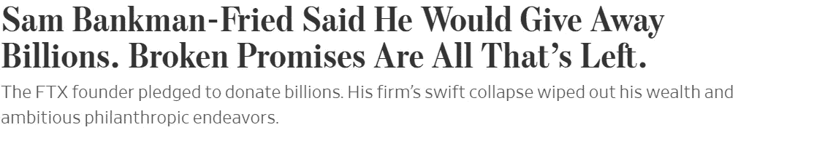

# 山姆·弗里德·班克曼在纽约时报的活动中鼓掌

> 原文：<https://medium.com/coinmonks/sam-fried-bankman-applauded-at-the-new-york-times-event-3dcd5534bbf?source=collection_archive---------18----------------------->

Sam Bankman-Fried at DealBook Summit, November 30,2022

在 11 月 30 日举行的纽约时报 DealBook 峰会上，FTX 加密交易所的创始人萨姆·班克曼-弗里德(SBF)不顾律师的建议，在网上出现了一次有争议的亮相，旁边还有其他演讲者，如马克·扎克伯格、迈克·彭斯、拉里·芬克和泽伦斯基总统。

在活动中，SBF 告诉采访者安德烈·罗斯·索金，他从未打算实施欺诈，并指责缺乏监督和糟糕的风险管理是 FTX 垮台的原因。据我所知，到目前为止还没有欺诈的证据。然而，事实仍然是，许多人更愿意看到 SBF 在法庭听证会上作证，而不是在重大活动中站在鼓掌的观众面前。

尽管在被证明有罪之前，SBF 是无辜的，但他却是历史上最大的盗窃案之一的关键人物。

[一份 FTX 11 月 10 日的资产负债表显示，加密交易所的流动资产和负债之间有 81 亿美元的缺口。据报道，FTX 用客户资金向其姊妹对冲基金 Aladema Research 提供了 100 亿美元的贷款。至少有](https://www.ft.com/content/0c2a55b6-d34c-4685-8a8d-3c9628f1f185)[10 亿美元的资金神秘消失](https://www.cnbc.com/2022/11/12/1-billion-to-2-billion-of-ftx-customer-funds-missing-report.html)。重组专家、FTX 新任首席执行官约翰·J·雷三世[在支持 FTX 向特拉华州地方法院提交的破产法第 11 章申请的声明中写道:](https://www.documentcloud.org/documents/23310507-ftx-bankruptcy-filing-john-j-ray-iii)

> *我有超过 40 年的法律和重组经验。我曾在历史上几起最大的公司破产案中担任首席重组官或首席执行官。我监管过涉及犯罪活动和渎职指控的案件(安然)。我监管过涉及新型金融结构(安然和住宅资本)和跨境资产回收和最大化(北电和海外船舶控股)的情况。我所经历的几乎每一种情况都存在内部控制、合规性、人力资源和系统完整性方面的某种缺陷。*
> 
> 在我的职业生涯中，我从未见过如此彻底的公司控制失败，以及如此完全缺乏可信的财务信息。从国外受损的系统完整性和有缺陷的监管监督，到控制集中在极少数缺乏经验、不老练和可能受损的个人手中，这种情况是前所未有的。

对于没有深入参与加密的人来说，NFT Twitter 传奇人物朋克 6592，[发表了一个关于 SBF 和 FTX](https://threadreaderapp.com/thread/1598274845816782848.html) 的精彩帖子，用外行的术语解释了当前的情况，没有太多令人困惑的细节。正如朋克 6592 所说:

> *我们现在应该对什么事情不感兴趣？*
> 
> *❎这如何影响 SBF 的“慈善”努力*
> 
> *❎sbf 如何看待 CeFi 或 crypto*
> 
> *❎sbf 对法规的看法*
> 
> *❎《哪里出错了》*
> 
> *❎“瑞士银行即将筹集新资本”*

总的来说，媒体在 Twitter 和其他地方受到批评，因为他们淡化了 SBF 在这家 320 亿美元的密码巨头破产中的作用。例如，这是《华尔街日报》上个月的头条新闻。

将 SBF 框定为一个失败的慈善家，对于被 SBF“失信”抹杀的 100 多万 FTX 用户来说，可能显得十分荒谬。

明确一点，上图是 deepfake。但是重点仍然存在。SBF 最近登上了《财富》的封面，被誉为可能的下一个沃伦·巴菲特，一副衣冠楚楚的天才模样。现在，记者们或许应该小心，不要过早地称赞 SBF 的良好意图。

用 Coindesk 首席洞察专栏作家大卫·z·莫里斯的话说:

> 山姆·班克曼·弗里德是一个历史上有名的骗子。

> 交易新手？尝试[加密交易机器人](/coinmonks/crypto-trading-bot-c2ffce8acb2a)或[复制交易](/coinmonks/top-10-crypto-copy-trading-platforms-for-beginners-d0c37c7d698c)