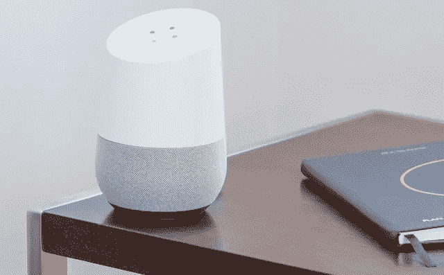
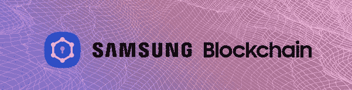
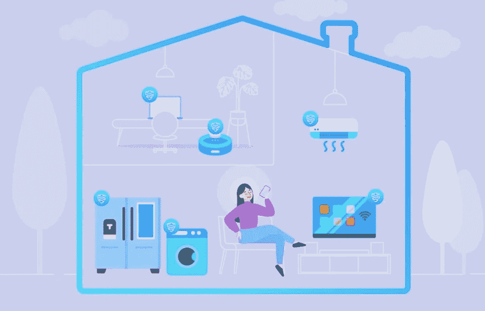

# 三星智能家居安全采用区块链。

> 原文：<https://medium.com/coinmonks/samsung-adopts-blockchain-for-smart-home-security-e7e29307e0?source=collection_archive---------46----------------------->

智能家居正变得越来越普遍，我们日常使用的许多设备都具有联网的优势，可以作为控制和验证我们日常活动的元素。然而，随着我们的连通性增加，我们在使用所有这些相互关联的项目的生态系统时，对保持内心平静的关注也增加了。

photo by [Thomas Kolnowski](https://unsplash.com/@tkolnowski?utm_source=unsplash&utm_medium=referral&utm_content=creditCopyText) on [Unsplash](https://unsplash.com/es/s/fotos/smarthome?utm_source=unsplash&utm_medium=referral&utm_content=creditCopyText)

随着家庭充满了互联设备，如电视、灯、空调、门铃、吸尘器、洗衣机、烘干机、冰箱和许多其他设备。它们中的每一个都成为恶意软件或计算机窃贼可能进入的入口。吸引人之处不在于捕捉该设备的原始动作，而在于它与其他设备通信的能力；每个元素都可能成为电脑窃贼的访问场所，他们可以安装软件，从一些连接的元素设法链接到另一个设备，在那里您拥有不仅仅是功能性的东西，我的意思是，例如他们可以访问我们的个人电脑，在那里我们有敏感和重要的数据。

在旧金山举行的 2022 年三星开发者大会(Samsung Developer Conference 2022)的开幕式上，三星宣布了一个新版本的 SmartThings，这是一个用于连接联网家庭设备的平台，将采用区块链技术来纠正现代家庭自动化中最大的数字不安全问题之一。了解到安全和隐私是用户的优先考虑，三星将其设备安全体验提升到一个新的水平。

三星认为保护必须是协作的、端到端的和实时的，因此它的方法在不断发展，以领先于威胁并确保用户的安全。因此，三星的智能设备受到三星 Knox 安全平台的保护，该平台提供经世界各地主要政府机构认证的国防级安全。

在一篇关于区块链的评论中，我们设法记住了它是一种与加密货币直接相关的技术，但不仅如此，因为它有更多的功能，新项目每天都在采用它，它被大量用于保护组件供应链、法律文件等的安全。基本概念是，区块链中可能发生的所有更改都由所有成员进行验证，记录存储在所有成员中；因此，要违反区块链，必须同时修改所有成员的记录。

三星 Knox Matrix 将作为用户的私人区块链系统，其中他们的连接设备通过多层相互监控来增强安全性。为了保护用户的智能家居免受未经授权的访问，并使登录过程更加方便，该层将在设备之间共享凭据，甚至在受信任的设备之间保护敏感信息。无论您的三星设备是基于 Android、Tizen 还是其他操作系统，三星 Knox Matrix 都将能够提供统一的安全 SDK。总而言之，三星将继续推进所有三星互联设备的通用安全标准。

因此，三星在其新的 Knox Matrix 平台上提出的是:一个交叉验证系统，可以防止未知软件在这些设备上安装自己并控制它。理论上，它不能，因为网络的其余部分会立即注意到它:它将缺少由该私有区块链生成的原始凭证。这看起来很复杂，但三星保证所有这一切都将是自动和隐形的。采用这种区块链技术是为了提高智能设备的安全性，允许它们彼此控制和共享访问数据。

就目前而言，该系统何时上市尚无日期，他们正在努力识别可以连接到该内部区块链的最大数量的元素，以服务于您的智能家居，因为他们的愿景不仅仅是品牌的硬件元素。

> 交易新手？试试[加密交易机器人](/coinmonks/crypto-trading-bot-c2ffce8acb2a)或者[复制交易](/coinmonks/top-10-crypto-copy-trading-platforms-for-beginners-d0c37c7d698c)