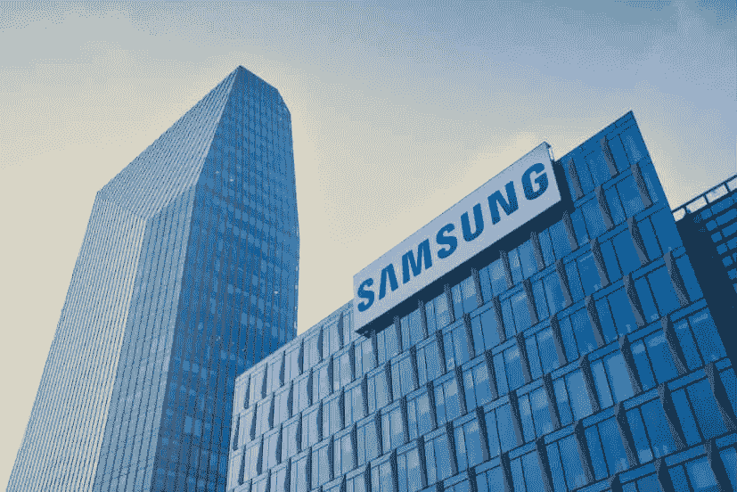

# 三星再次击败苹果，这次是通过区块链。

> 原文：<https://medium.com/coinmonks/samsung-beats-apple-once-again-this-time-via-blockchain-4e59df1c190e?source=collection_archive---------29----------------------->

这家韩国科技巨头正在考虑参与这一快速的技术进步，并在接下来的一年内建立自己的加密货币交易所。

三星不是韩国唯一一家打算在加密领域进行新投资的公司；据当地媒体报道，包括未来资产证券在内的其他六家主要上市公司预计将在 2023 年推出一个加密交易平台。这些公司正与韩国金融机构合作，以获得履行交易所职责的牌照。

# 三星看好 crypto

三星证券打算建立自己的交易所。这是这家被视为技术领域最大公司之一的公司如何融入加密行业的又一个例子。

在过去的一年里，三星推出了许多与此相关的项目。他们为自己的移动设备和电视创建了支持不可替换令牌(NFT)的钱包功能。

三星证券计划在 2023 年推出自己的交易所。三星证券部门的团队负责该项目，并正在开发这样一种服务，这自然是基于区块链的。

这再次说明了三星是如何投资加密市场的，以及加密货币对韩国人来说是一个多么严肃的话题。

# 南韩是区块链的支持者吗？

韩国对加密货币行业有着严格监管的历史。去年，超过 60 个平台被该国监管机构排除在加密货币交易之外。为了恢复经营，这些公司必须注册并遵守当地最大的金融监管机构金融情报室制定的规则。

去年，数十家交易所未能达到既定标准，被迫关闭。

然而，自从新任总统 Yoon Suk-Yeol 于 5 月上任以来，这个亚洲国家对加密行业变得更加开放。这位政治家是一名密码爱好者，他承诺对未能缴纳数字资产投资利润税的人提高罚款。

在这方面，大型本地公司推出自己的交易所的能力可以代表韩国向成为亚洲大陆加密货币中心的目标迈出了重要一步。

> 交易新手？试试[密码交易机器人](/coinmonks/crypto-trading-bot-c2ffce8acb2a)或者[复制交易](/coinmonks/top-10-crypto-copy-trading-platforms-for-beginners-d0c37c7d698c)