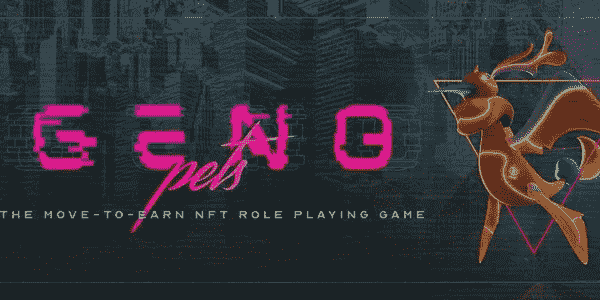
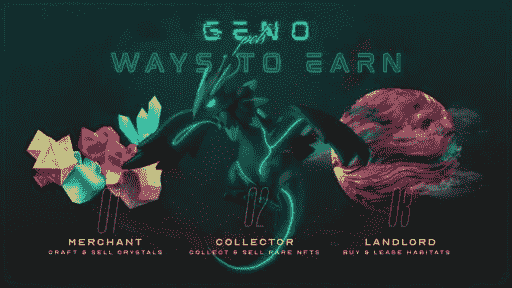

# 三星下一步投资 NFT 游戏 GenoPets

> 原文：<https://medium.com/coinmonks/samsung-next-invests-in-move-to-earn-nft-game-genopets-e378ce4fe967?source=collection_archive---------26----------------------->

上周[三星 Next](https://www.samsungnext.com/) 宣布投资 [GenoPets](https://www.genopets.me/) ，一款移动赚钱的 NFT 游戏。去年 10 月，这家初创公司筹集了 830 万美元，由 Konvoy Ventures 和潘迪拉资本公司牵头，阿拉米达研究公司、Animoca Brands 和许多其他公司参与。

你听说过像 Axie Infinity 这样的 [**即玩即赚游戏，这种游戏用加密代币奖励玩家的表现。基因宠物有相似之处，除了玩家会因为身体的移动而得到补偿。所以它是电子鸡、FitBit 和 crypto 的混合体。另一个**移动赚钱游戏 STEPN** 最近成为头条新闻。**](https://bit.ly/3IxySTO)

> 交易新手？尝试[加密交易机器人](/coinmonks/crypto-trading-bot-c2ffce8acb2a)或[复制交易](/coinmonks/top-10-crypto-copy-trading-platforms-for-beginners-d0c37c7d698c)

GenoPets 游戏尚未推出，最初将是免费的。到目前为止，有 25 万人在等候名单上。它的商业模式鼓励人们使用付费版本，让玩家进步更快，解锁更多功能。

> [踏入移动赚取 NFT 平台](https://bit.ly/3cceN9t)

每个玩家都有一个基因宠物 NFT，它可以根据活动升级，并且可以在市场上买卖。用户还可以根据**物理和虚拟活动**获得加密令牌。

游戏将包括购买虚拟土地的能力，T21，解锁高级游戏，当然，也可以买卖。

> “我们相信，将游戏的乐趣加入到我们简单的日常运动和长期健身目标中，是让我们享受我们都应得的蓬勃发展的生活方式的关键要素，”GenoPets 在一篇博客文章中说。

然而，为了持续下去，游戏将需要基于游戏性而不是加密令牌组学来生存。Axie Infinity 是第一款大型游戏，最近表现不佳，其象征性价格在 11 月达到顶峰，为 157 美元，目前约为 14 美元。就游戏内交易而言，它在 11 月单日的交易额就超过了 5 亿美元，尽管这是个例外。现在这个数字大约是每天 200 万到 300 万美元，每天 10 万笔交易，低于 11 月份的数百万笔。

> 加入 Coinmonks [电报频道](https://t.me/coincodecap)和 [Youtube 频道](https://www.youtube.com/c/coinmonks/videos)了解加密交易和投资

# 另外，阅读

*   [印度最佳 P2P 加密交易所](https://coincodecap.com/p2p-crypto-exchanges-in-india) | [柴犬钱包](https://coincodecap.com/baby-shiba-inu-wallets)
*   [8 大加密附属计划](https://coincodecap.com/crypto-affiliate-programs) | [eToro vs 比特币基地](https://coincodecap.com/etoro-vs-coinbase)
*   [最佳以太坊钱包](https://coincodecap.com/best-ethereum-wallets) | [电报上的加密货币机器人](https://coincodecap.com/telegram-crypto-bots)
*   [交易杠杆代币的最佳交易所](https://coincodecap.com/leveraged-token-exchanges) | [购买 Floki](https://coincodecap.com/buy-floki-inu-token)
*   [3Commas 对 Pionex 对 Cryptohopper](https://coincodecap.com/3commas-vs-pionex-vs-cryptohopper) | [Bingbon 评论](https://coincodecap.com/bingbon-review)