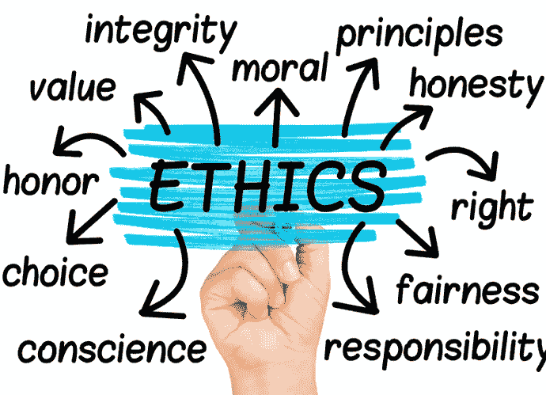

# 三明治攻击:伦理和影响

> 原文：<https://medium.com/coinmonks/sandwich-attacks-ethics-and-impact-ba394839a285?source=collection_archive---------31----------------------->

Image source: [My Own Business Institute](https://www.scu.edu/mobi/resources--tools/blog-posts/ethics-in-life-and-business/ethics-in-life-and-business.html)

鲍勃和查德是朋友，他们知道[以太坊](https://ethereum.org/)中的[智能合约](https://www.investopedia.com/terms/s/smart-contracts.asp)是如何运作的。

一天，他们根据最近听到的一条新闻，就[三明治袭击](https://coinmarketcap.com/alexandria/article/what-are-sandwich-attacks-in-defi-and-how-can-you-avoid-them)展开了争论。Chad 认为三明治攻击很有趣，也很道德，但是 Bob 不这么认为。鲍勃认为这是一种操纵，因此是不道德的。

并非所有人都认为对分散金融的三明治攻击是不道德的。有些人就像查德。他们认为这是适者生存的例子，在战争中，一切都是公平的。本文的标题[用闪贷攻击 DeFi 生态系统以获取乐趣和利润](https://www.smartcontractresearch.org/t/research-summary-attacking-the-defi-ecosystem-with-flash-loans-for-fun-and-profit/260?u=ulysses)，让我们先睹为快，了解大量用户对 DeFi 攻击的感受。

在本帖中，我将给出我认为三明治攻击不道德并对 DeFi 生态系统产生负面影响的原因。

## **了解道德和三明治攻击**

伦理是关于对错的道德原则。道德行为可以归结为道德上的良好行为，而不道德的行为被称为道德上不可接受的行为。

另一方面，在三明治攻击中，一个可能更聪明、更有 DeFi-悟性的用户，在另一个用户的事务上跑前跑后。这样做的后果是第二个用户损失了一定比例的资金。但是第一个用户从交易中获得了合理的利润。

大概没有什么是天生的错或对，它必须被建立。我将在以下段落中阐述一些观点。

## **三明治攻击的过程**

在三明治攻击中，有一个受害者和一个攻击者。一个是被征服者，另一个是征服者。被征服的问题在于，它会让你不开心和后悔。让别人有这种感觉是对的吗？

此外，攻击者最突出的一点是他们的意图。攻击者看到来自受害者的一个大的未决订单，并决定提前或推迟执行以获利。攻击者的目的是在受害者损失部分资金的同时，从潜在受害者的资金中获利。最后，他们从技术上窃取受害者的资金。拿不属于某人的东西是错误的。但是，什么是错的或对的必须被确立，并且许多人会同意偷窃是错误的。

一些人认为三明治攻击很有趣，因为它们是胜利的一方。如果他们是受害者呢？失去他们的基金还会有意思吗？有人喜欢失去资金吗？如果失去一个人的基金会让一个人感觉很糟糕，那么同一个人偷另一个人的基金是错误的。

## **对 DeFi 和用户的影响**

让我们假设爱丽丝是一个新的 DeFi 用户。如果她在交换 Uniswap 时损失了一定比例的资金，你认为她对 DeFi 的看法会发生什么变化？因为她是新来的，她会害怕，会回到特拉菲，在那里她了解她的魔鬼。

DeFi 还处于早期，攻击造成的坏名声会阻碍它的发展。

同样，爱丽丝将继续告诉其他人，她已经尝试了 DeFi，这是欺诈。这将不是一个关于 DeFi 的好消息，从而玷污了它的形象。

## 结论

卷入对 DeFi 的三明治攻击就像一个渔夫用化学物质污染了一条河。如果所有的鱼都被杀死了，那么他们将来怎么捕鱼呢？

人们不能继续损害他们的生活来源，并期望它成为商业的沃土。三明治攻击是不道德的，应该扼杀在萌芽状态，以帮助 DeFi 蓬勃发展。

> 交易新手？试试[密码交易机器人](/coinmonks/crypto-trading-bot-c2ffce8acb2a)或者[复制交易](/coinmonks/top-10-crypto-copy-trading-platforms-for-beginners-d0c37c7d698c)