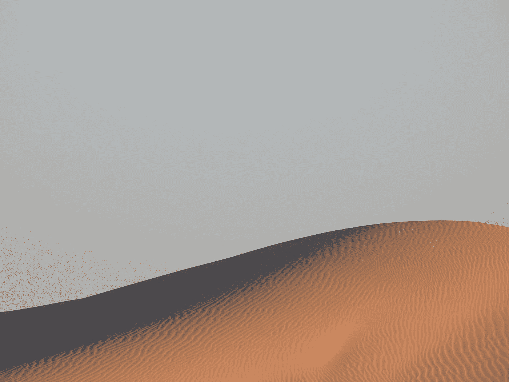

# 沙特咖啡公司在沙漠达沃斯(FII)宣布咖啡产量增长 700%

> 原文：<https://medium.com/coinmonks/saudi-coffee-company-announces-700-coffee-production-growth-at-davos-in-the-desert-fii-3b00297ac962?source=collection_archive---------6----------------------->

Photo by [Gantaro](https://unsplash.com/@gantaro?utm_source=medium&utm_medium=referral) on [Unsplash](https://unsplash.com?utm_source=medium&utm_medium=referral)

由沙特公共投资基金(PIF)牵头， [**未来投资倡议(FII)会议**](https://www.france24.com/en/live-news/20221023-growing-davos-in-the-desert-a-sign-of-saudi-clout) 从 2022 年 10 月 23 日开始的一周在沙特首都利雅得举行。这是该活动的第六届，自 2017 年由沙特王储穆罕默德·比·萨勒曼(MBS)发起以来。