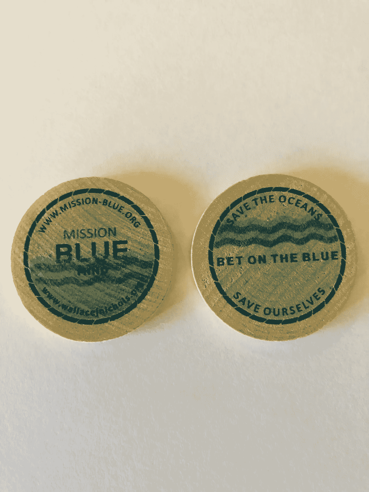

# 拯救海洋，符号化版本

> 原文：<https://medium.com/coinmonks/save-the-oceans-tokenized-version-ef4e138f49a7?source=collection_archive---------37----------------------->

一天，我的朋友利奥兴奋地打电话给我。利奥刚刚在收音机里听到了约翰·丹佛的一首名为“赌布鲁斯”的歌曲，他想和我谈谈用这首歌的名字来唤起人们对海洋困境的关注。

现在让我解释一下，我的朋友利奥是一个独特的、迷人的人，他与自然非常亲近，并且总是试图做出改变。仅供参考，利奥独自划着独木舟从俄亥俄河的源头来到墨西哥湾的莫比尔湾，历时三个月。

兴奋之余，利奥认为歌曲的标题是押在蓝色上，而不是蓝调，因为它实际上是标题。他想把“蓝色”解释为海洋。利奥也没有领会这首歌的要点，这首歌是关于从生活中的错误选择中获得忧郁，但他的灵感很棒。

忽略实际的歌词和歌曲的含义，不让他的热情和想法浪费，我发现 betontheblue.com 是可用的，并立即购买。然后，我们策划如何使用这个令人敬畏的名字来帮助人们意识到拯救对生命至关重要的世界海洋。

利奥已经意识到了两个试图在世界上做好事的伟大运动。mission-Blue[https://mission-blue.org/](https://mission-blue.org/)，一个由出色的西尔维亚·厄尔博士建立的组织，它正在建立一个海洋保护区和蓝色心灵[https://www.wallacejnichols.org/](https://www.wallacejnichols.org/)的网络，Wallace J. Nichols 博士关于我们与水的自然联系和亲近水的愿望的书/运动。

我们决定最好的计划是利用这个网络公司，尽我们所能帮助这些团体成长。Leo 还想加入他以前在酒吧喝酒时的一种广告方法，当你下次来的时候，某个当地酒吧会赠送一枚木制的五分镍币以获得一瓶免费啤酒。蓝色木制镍币的赌注就这样诞生了。

我想出了“拯救海洋，拯救我们自己”的口号和镍币本身的设计。这是一次真正的合作！我们都真诚地相信，如果我们不拯救海洋，那么其他事情都不重要了，所以我认为这个口号非常合适。

现在，快进几年，随着我对加密货币新发现的知识和欣赏，我想加入一个“赌蓝”令牌，以增加对这两个原始组织以及其他为地球做好事的团体的认识。

当然，这也是一个很好的机会来合并 NFT 的公司。这可能最终成为一个很好的资助机制，有助于减少污染和温室气体的这一举措和其他非常重要的举措。

让我们拯救海洋，拯救我们自己。

> 交易新手？试试[加密交易机器人](/coinmonks/crypto-trading-bot-c2ffce8acb2a)或者[复制交易](/coinmonks/top-10-crypto-copy-trading-platforms-for-beginners-d0c37c7d698c)