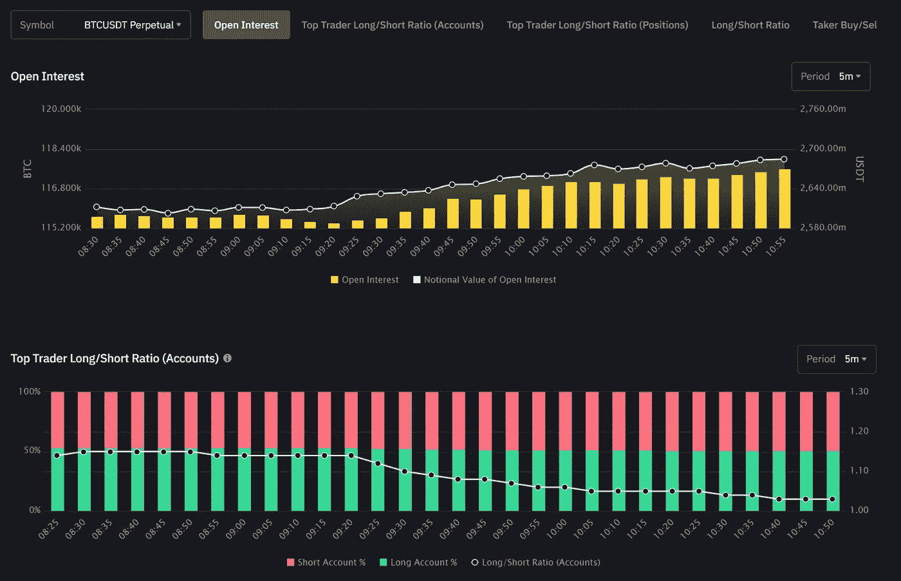
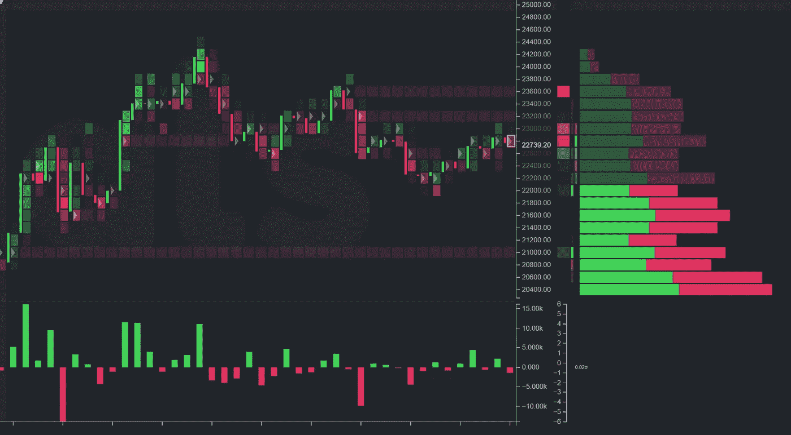
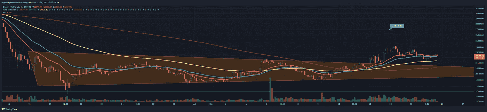

# 在这种混乱中拯救自己——是市场上涨的时候了

> 原文：<https://medium.com/coinmonks/save-yourselves-in-this-mess-its-time-for-market-to-move-up-9ead863c3beb?source=collection_archive---------20----------------------->

比特币/加密货币分析 7/24

又是一天，交易者将会陷入混乱..是的，我被骗走了 5 美元，因为那是我为了好玩而冒险进行的保证金交易。我们这里有一个价格上涨和多头退出或空头建立的图表，这取决于视角。

either longs are winning and shorts are walking away, or shorts are building up

下面的 Cignals 数据更加清晰地向我们展示了两个事实:a:没有太多的兴趣；b:已经出现了一个非常清晰的顶部。鉴于 FOMC 即将到来，尽管 4h 和 1d 指标相对乐观，但我认为这将以大幅回调告终。与此同时，我们上去吧。

cignals data will tell us more from order flow.

技术面看多，所以总的来说，我不知道我还能做些什么，除了说关注 FOMC。我怀疑目前很多人会相当理性地选择观望。现金为王。

right now is basically the saving grace for the market. [https://www.tradingview.com/x/BnjTNG2k/](https://www.tradingview.com/x/BnjTNG2k/)

市场可能无处不在，但是。随波逐流。

> 交易新手？试试[加密交易机器人](/coinmonks/crypto-trading-bot-c2ffce8acb2a)或者[复制交易](/coinmonks/top-10-crypto-copy-trading-platforms-for-beginners-d0c37c7d698c)