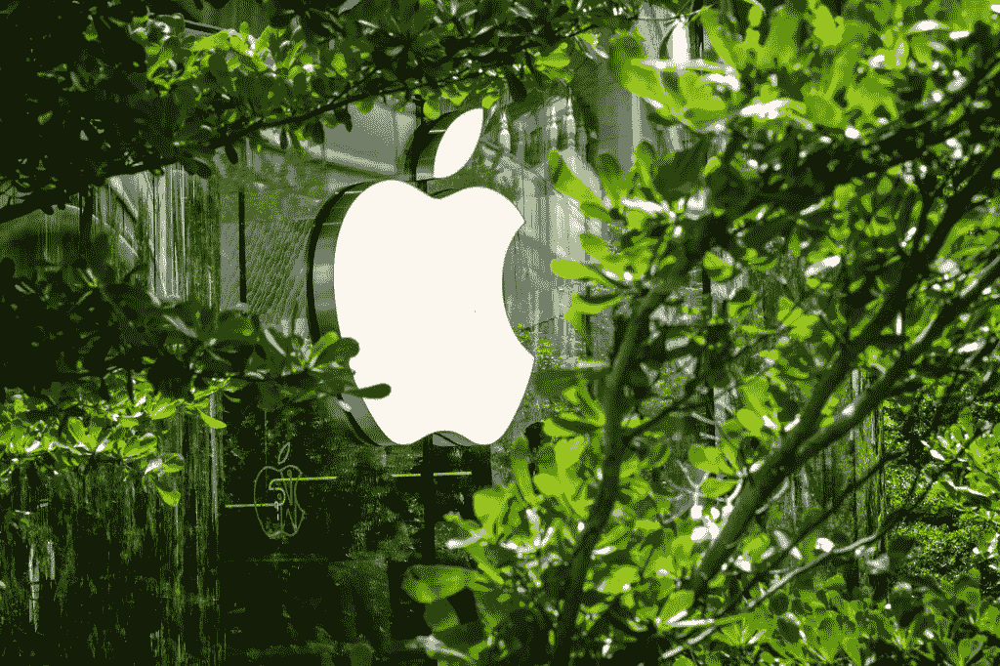
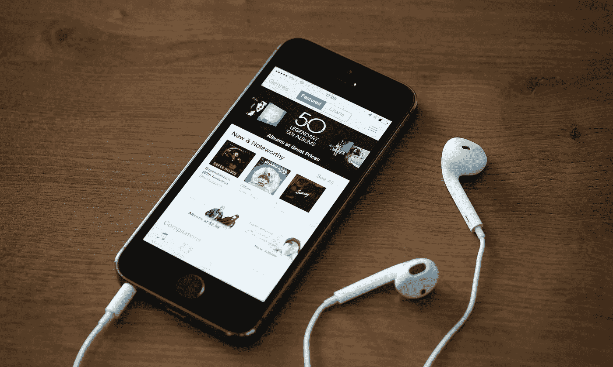
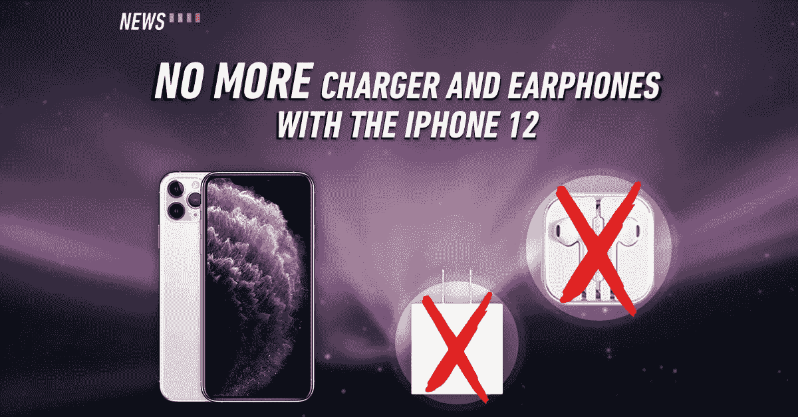
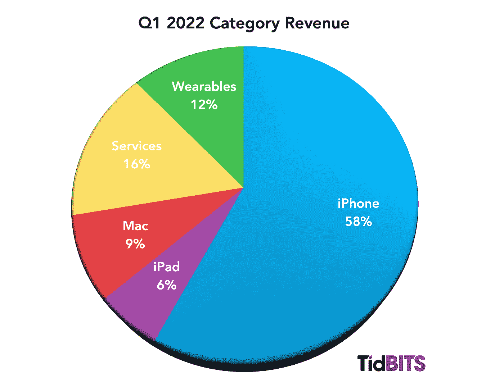

# 省钱而不是保护地球。

> 原文：<https://medium.com/coinmonks/saving-money-but-not-the-planet-f2ee5d4d7eda?source=collection_archive---------20----------------------->

Apple, one of the largest and most powerful brand in the world, is making big moves towards sustainability and saving the planet.

在令人垂涎的苹果 iPhone 14 发布会的前一天，巴西对苹果罚款 240 万美元，并禁止 iPhone 在该国销售。

为什么？

因为巴西政府认为苹果有歧视性，没有销售完整的产品。

早在 2020 年，当苹果公司告诉世界，他们将不再在包装盒内装运带充电器或耳机的 iPhones 时，我坦率地说是大吃一惊。

这些产品一点也不便宜，它们只是方便地没有配件，而配件对于使用手机来说是非常重要的！

我是说，你能不用充电器给手机充电吗？

当然，我们可能有旧的电缆和充电器躺在某个地方，但从逻辑上讲，它应该与你刚刚花了几千美元购买的新产品一起提供。

好吧，也许耳塞有道理。

当整个世界过渡到无线耳塞时，这种推理可能会发生(我认为它确实发生了)。

Do you remember when the iPhones used to come complete with charger, cable and even the earpiece?

“将充电器和耳机从 iPhone 包装盒中取出后，一个托盘可以多装 70%的设备。

托盘上的盒子越多，苹果就能一次向用户运送更多的手机。

该公司表示，因此，使用更小的盒子将使苹果公司每年减少 200 万公吨的碳排放。

这相当于让 50 万辆汽车无法上路。"

苹果也节省了相当大一部分。

移除充电器和耳机的成本接近 65 亿美元。

而是让用户为此买单！

从长远来看，这对地球来说是如何可持续的？

Was it the iPhone 12 that started shipping without the earpiece and charger?

想想吧。

这些配件必须单独购买，而不是和你昂贵的新手机一起到达。

这意味着额外的工作和物流，以包装，交付和运输给你。

这意味着花费更多的时间，完成更多的工作，更多的后勤工作。

我想苹果也能赚更多的钱。

我确信这对环境来说是更多的碳。

“那么让我们这样来看。苹果节省了运输费用，而且不必购买以前放在盒子里的充电砖和耳机。公众不仅没有省下任何钱，而且还不得不掏钱更换他们不再“免费”收到的想要的配件。"

The numbers speak for itself: the iPhone is a HUGE revenue maker for Apple.

我的意思是，我对苹果股价上涨或蒂姆·库克因提高苹果的利润而获得奖金没有任何疑虑。

他们是一家上市公司，完全有权利赚钱。

我所争论的是叙事。

以及他们是如何逃脱的。

苹果可能为他们公司节省了很多钱，但我不确定他们真的在拯救地球。

他们应该找到一种更好的包装方式，降低充电器的成本，并将充电器放回用户愿意花大价钱购买的千元产品中！

-

iPhones 应该和充电器一起卖吗？

-

# startups # business # startupx # growth # success # social media # culture # entrepreneurs # strategy # apple # iphone # apple watch # apple event # ipad # iphone 14 # iphone 14 pro #充电器#可持续发展#环境

> 交易新手？试试[加密交易机器人](/coinmonks/crypto-trading-bot-c2ffce8acb2a)或者[复制交易](/coinmonks/top-10-crypto-copy-trading-platforms-for-beginners-d0c37c7d698c)