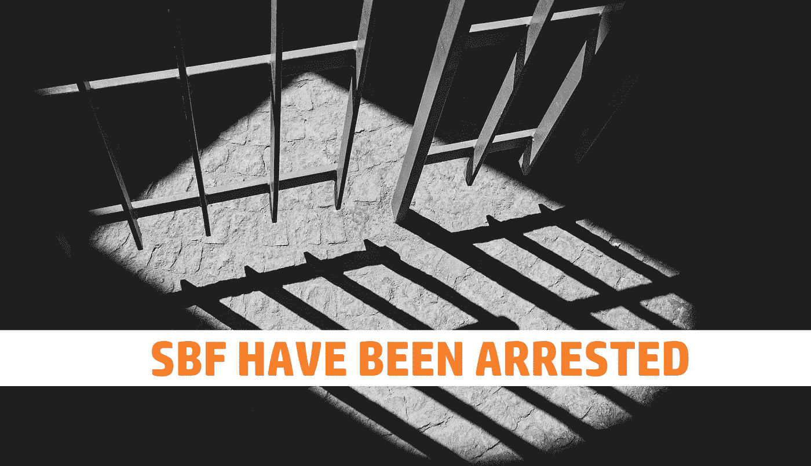
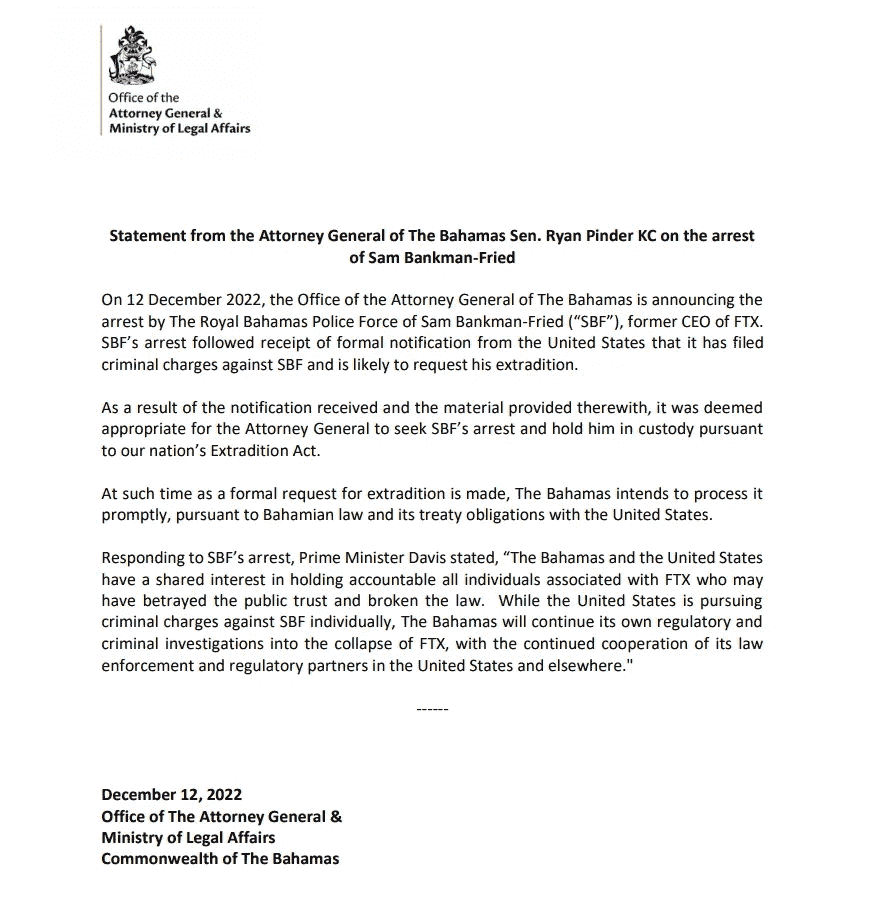
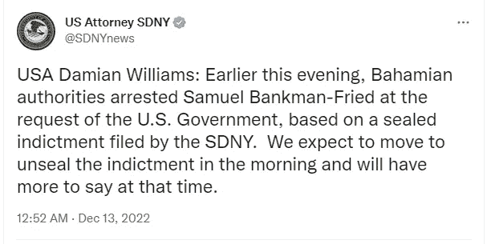
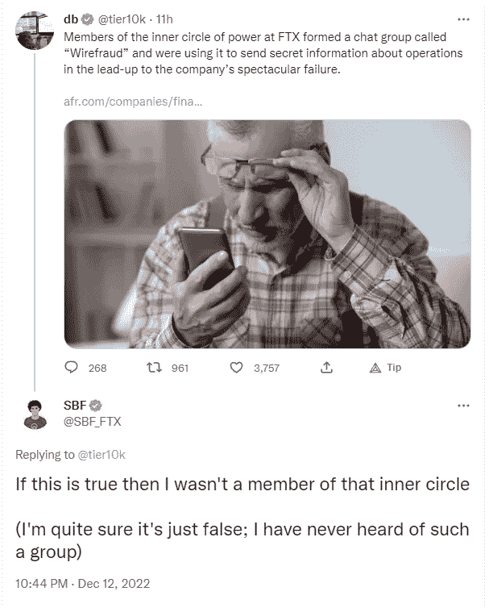

# FTX 前首席执行官 SBF 在巴哈马被捕

> 原文：<https://medium.com/coinmonks/sbf-former-ceo-of-ftx-has-been-arrested-in-the-bahamas-cd94f5bd4bb5?source=collection_archive---------24----------------------->

一个去睡觉，然后醒来，SBF 已被逮捕。仍然不确定这是不是一场梦。

# 在巴哈马被捕

根据多方消息，SBF 于 12 月 12 日被捕。巴哈马 AG 办事处也证实了这一点，它说:

> 2022 年 12 月 12 日，巴哈马总检察长办公室宣布巴哈马皇家警察部队逮捕了 FTX 前首席执行官 Sam Bankman-Fried (SBF)。SBF 是在收到美国的正式通知后被捕的，美国已经对 SBF 提出刑事指控，并可能要求引渡他

正如他们所表示的，这次逮捕是因为 SBF 在美国受到刑事指控。我猜美国要么比巴哈马工作得更快，要么有不同的标准。正如巴哈马通用汽车公司在早些时候在 circle jerk 视频中激烈发誓的那样，他们有最好的法规，并正在积极进行调查。看看整件事会有什么结果会很有趣。

据报道，SBF 聘请了重量级律师马克·科恩，他是为数不多的几个比 SBF 更令人发指甚至有过之而无不及的人之一——吉斯莱恩·麦克斯韦尔的辩护律师。此前也有报道称，阿拉米达前首席执行官卡罗琳·埃里森·斯蒂芬妮·阿瓦基安(Caroline Ellison Stephanie ava Kian)是美国证券交易委员会(SEC)的一名律师。我猜她是为了“了解敌人”的事去的。看看这两个人是否会在比赛中反目成仇将会很有趣。我想他们知道尸体埋在哪里。

# 指控

指控显然将在今天晚些时候正式提出，因为诉讼将在纽约南区进行。

《纽约时报》在其帖子中推测，这些指控可能包括电信欺诈、证券欺诈、洗钱和相关的共谋指控。如果你一直关注这个案例，这既不显得牵强，也不特别令人惊讶。然而，美国证券交易委员会也将在明天向 SDNY 法院提交对 SBF 的单独指控。

> 我们赞扬我们的执法合作伙伴，确保以联邦刑事指控逮捕萨姆·班克曼-弗里德。美国证券交易委员会(SEC)已授权对他违反证券法的行为提起单独指控，这些指控将于明日在 SDNY 公开提起。-Gurbir Grewalm SEC 官员

SBF 被捕前发出的最后一条推文是否认参加了 Signal 上的一个秘密聊天小组。《澳大利亚金融评论报》获悉，FTX 创始人 Sam Bankman-Fried 和 Zixiao“Gary”Wang，以及 FTX 工程师 Nishad Singh 和 Alameda Research 前首席执行官 Caroline Ellison 利用 Signal 上的一个聊天组，希望这些信息保持隐藏。

如果它会在法庭诉讼中发挥作用，我们只能等着瞧。但是尽管这个团体的名字。它似乎有一个更广泛的漏洞，而不仅仅是致力于电信诈骗。

总而言之，对 SBF 被捕最失望的人，大概不只是他自己。似乎是国会议员玛克辛·沃特斯(D-CA)，众议院金融服务委员会主席。

> 公众一直在急切地等待在国会宣誓后得到这些答案，而这次逮捕的时机剥夺了公众这个机会。虽然我很失望，我们明天将无法听到来自班克曼-弗里德先生，我们仍然致力于到底发生了什么

是的，因为之前的听证会总能触及问题的核心。

我想听听你对这次逮捕事件的看法。是不是太晚了，也许你根本没想到他会被逮捕？请在下面的评论区分享你的想法。如果你想支持我和我制作的内容，请考虑关注我，阅读我的其他帖子，或者为什么不两者都做。

网络上见！

图片提供:[https://unsplash.com/](https://unsplash.com/)

资源

1.  [https://news . bit coin . com/Bahamian-ag-and-prime-minister-announce-Sam-bankman-frieds-inn-in-the-Bahamas/](https://news.bitcoin.com/bahamian-ag-and-prime-minister-announce-sam-bankman-frieds-arrest-in-the-bahamas/)
2.  [https://www . coin desk . com/policy/2022/12/12/ftx-founder-Sam-bank man-fried-arrested-Bahamas-saids/](https://www.coindesk.com/policy/2022/12/12/ftx-founder-sam-bankman-fried-arrested-bahamas-says/)
3.  [https://www . nytimes . com/2022/12/12/business/ftx-Sam-bank man-fried-Bahamas . html](https://www.nytimes.com/2022/12/12/business/ftx-sam-bankman-fried-bahamas.html)
4.  [https://financial services . house . gov/news/document single . aspx](https://financialservices.house.gov/news/documentsingle.aspx?DocumentID=410026)

> 交易新手？尝试[加密交易机器人](/coinmonks/crypto-trading-bot-c2ffce8acb2a)或[复制交易](/coinmonks/top-10-crypto-copy-trading-platforms-for-beginners-d0c37c7d698c)