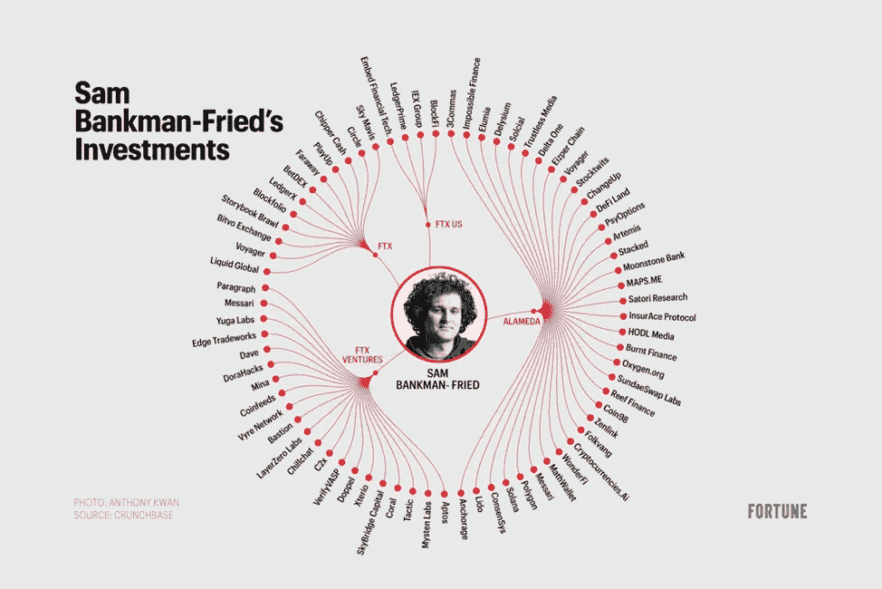

# SBF 投资状况

> 原文：<https://medium.com/coinmonks/sbf-investment-condition-178607fd886f?source=collection_archive---------21----------------------->

几天前，币安和 FTX 两大交易所之间的差异让加密货币感到惊讶。FTX 正在经历流动性短缺，它被要求出售其他项目的所有投资资产。
SBF 旗下的一些投资公司是:

1.  阿拉米达企业
2.  FTX。计算机输出缩微胶片
3.  FTX。美国
4.  FTX 投资公司

SBF 投资的几乎所有项目都经历了价格大幅下跌，这可能意味着一些项目未能推出。以下是在聚会前 1 天(2022 年 11 月 6 日)具有硬币效用且在 2022 年 11 月 12 日庆典前具备条件的项目汇总:

(Only some projects issue tokens and can be tracked by authors)

FTX 投资的大多数项目都经历了下降，但有些项目甚至略有回升，如 POLYGON (MATIC)和 VOYAGER (VGX)。由于 FTX 破产的多米诺骨牌效应，未来仍有可能出现下滑。

FTX 经历的事件提供了两种观点。

1.  第一种观点证明了 crypto 是**分散的**资产之一，因为它在 FTX 倒台后的影响如此之大，超出了通货膨胀和政府干预的影响(通货膨胀在 2022 年 11 月 10 日下降，这对市场来说应该是一个好信号)。
2.  第二种观点认为，由于全球前两大交易所引发的多米诺骨牌效应，crypto 将成为集中化的 T4。

> 交易新手？尝试[加密交易机器人](/coinmonks/crypto-trading-bot-c2ffce8acb2a)或[复制交易](/coinmonks/top-10-crypto-copy-trading-platforms-for-beginners-d0c37c7d698c)