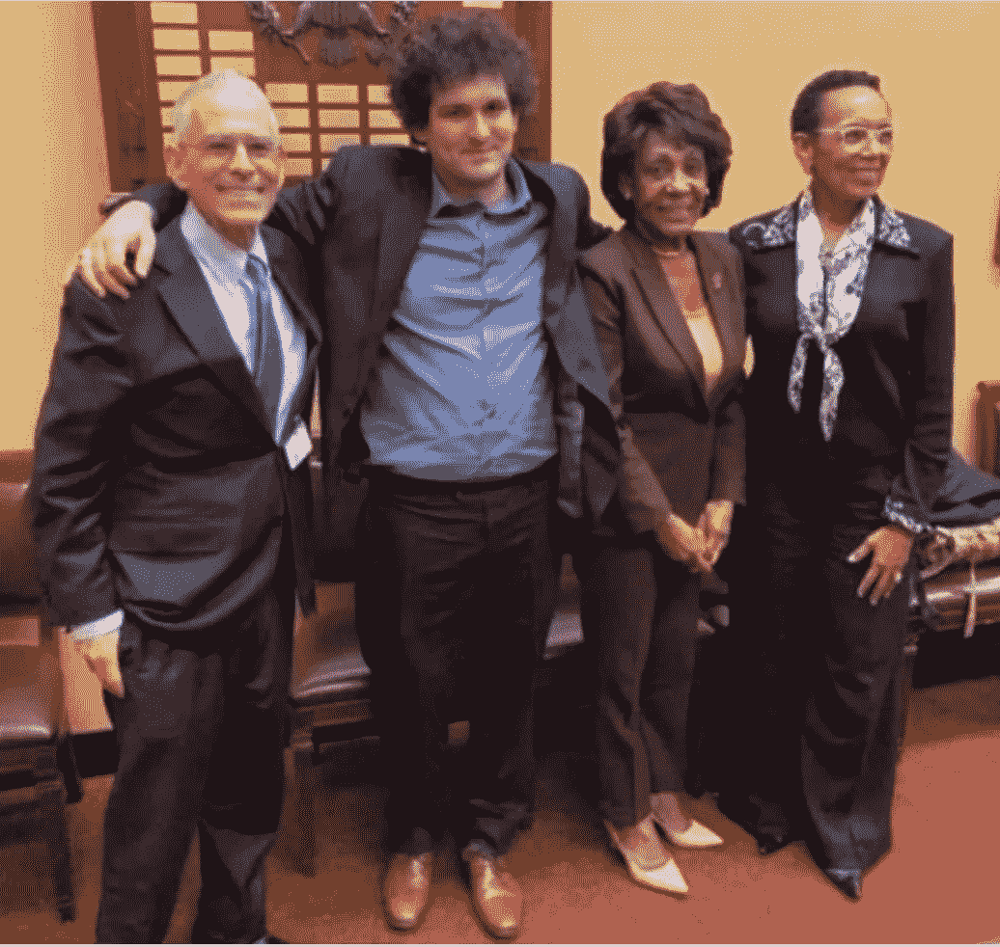
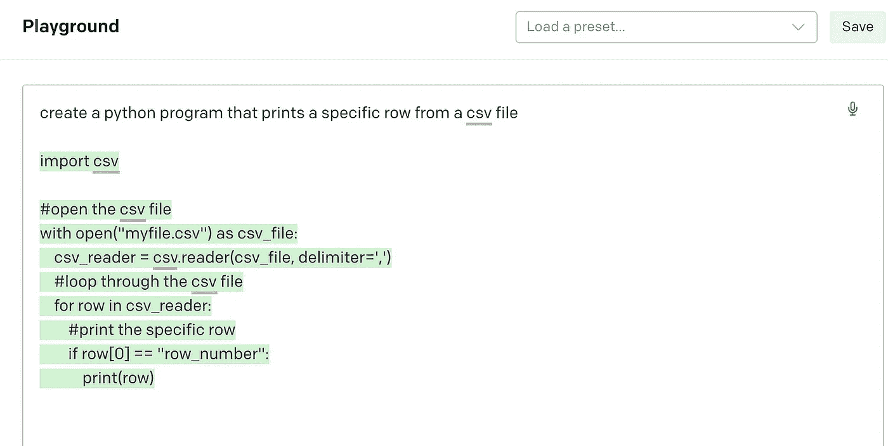
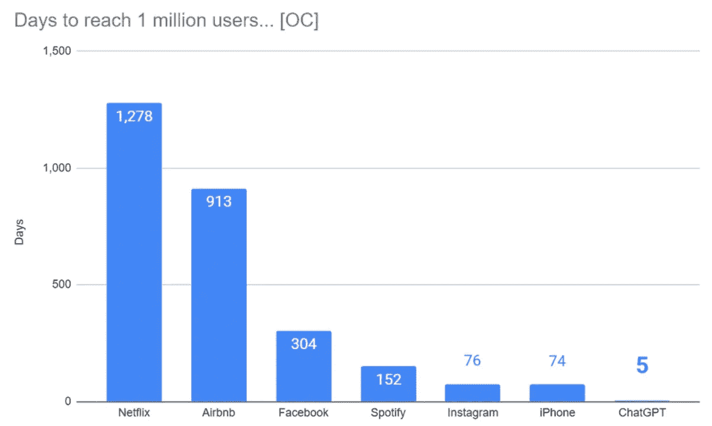
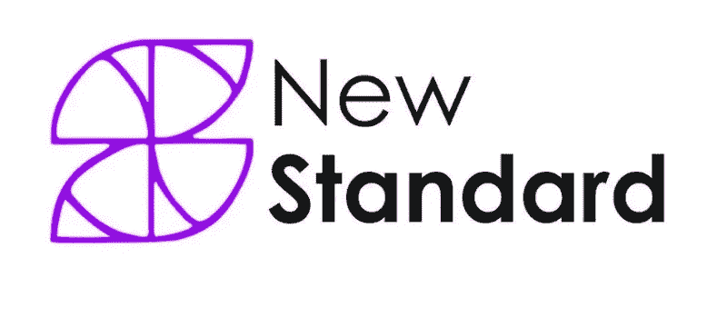
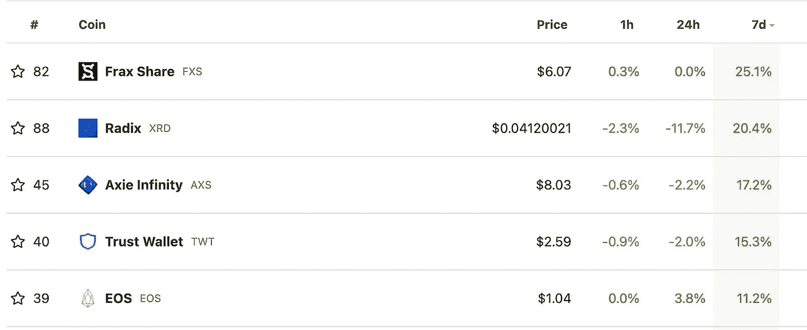

# 🆓SBF 可能不会被传讯，这就是原因！！！

> 原文：<https://medium.com/coinmonks/sbf-may-not-be-subpoenaed-this-is-why-c0b957340e1f?source=collection_archive---------22----------------------->

*   🗞️ **“拦路虎”未披露来自 SBF** 的*【贷款】*
*   🆓SBF 可能不会被传唤。
*   👩‍💻我正在摆弄的应用程序
*   💰本周硬币
*   📰在 web3 世界里
*   🙏🏻感激…

# 🗞️“the block”未能披露来自 SBF 的“贷款”

Block 是一家媒体公司，声称自己独立报道加密新闻，一年多来，Block 的首席执行官一直从[声名狼藉的萨姆·班克曼-弗里德的加密货币交易公司](https://www.axios.com/2022/12/09/bankman-fried-funded-crypto-news-site-block?stream=top&utm_source=alert&utm_medium=email&utm_campaign=alerts_all)秘密获得资金支持。消息公开后，该集团首席执行官已经辞职。

**为什么这很重要？—** 在 medium、substack、ghost 等平台的帮助下，我们进入了一个更加分散的媒体世界。我们开始看到传统媒体的衰落，这些媒体的主要目标是不惜一切代价实现利润最大化。Block 并不是唯一一家接受可疑组织支付的媒体公司，这样做是为了发布有利于可疑捐赠者的谎言。作为一个社会，我们可以从更加多样化的新闻饮食中受益。

# 🆓SBF 可能不会被传唤。

众议院金融服务主席 Waters [不打算传唤 Sam Bankman-Fried 在 FTX 崩溃听证会上作证。](https://www.cnbc.com/2022/12/07/ftx-maxine-waters-doesnt-plan-to-subpoena-sam-bankman-fried-to-testify-at-hearing-on-crypto-exchanges-collapse.html?utm_campaign=mb&utm_medium=newsletter&utm_source=morning_brew)

萨姆班克曼-弗里德和马克西姆·沃特斯

**为什么这很重要？—** FTX 应对与其运营相关的经济损失负责，包括但不限于因疏忽、违约、欺诈或任何其他法律理论导致的损失。

此外，FTX 应对因其疏忽、未能履行义务或任何其他违反合同或职责的行为而遭受的任何损失承担责任。根据具体情况，损害赔偿可能包括补偿性损害赔偿、惩罚性损害赔偿或其他形式的经济救济。

*   崩溃的 FTX 欠前 50 大债权人近 31 亿美元。
*   十大债权人 14.5 亿美元。
*   从小型个人投资者到机构投资者，数千人损失了数百万美元。

Maxime Waters 不打算传唤这个诈骗犯？？？ SBF 能够渗透并收买传统媒体、政治家、政府官员和金融顾问(他的父母在斯坦福大学教授治理课程，并为许多政治家提供过建议，这确实有所帮助),还有一项关于 SBF 及其与[加里·詹斯勒](https://en.wikipedia.org/wiki/Gary_Gensler)关系的调查，加里·詹斯勒是 SBF 的女友和阿拉米达首席执行官[卡罗琳·埃里森的密友。](https://en.wikipedia.org/wiki/Gary_Gensler)

[获得团体订阅](https://yarocelis.substack.com/subscribe?group=true)

有很多问题，为什么这个 SBF 和他的金融犯罪被 NYT 和其他媒体淡化。关于 SBF 能够四处走动、旅行和接受采访的问题很多，因为他确实犯了一个错误，就像他声称的那样。受害者和世界需要答案，现在就需要。

# 👩‍💻我正在摆弄的应用程序

**ChatGPT** 是 OpenAI 开发的一个原型[人工智能](https://en.wikipedia.org/wiki/Artificial_intelligence) chatbot，专门进行对话。聊天机器人是一个大型语言模型[经过微调](https://en.wikipedia.org/wiki/Transfer_learning)，具有监督和强化学习技术。经过微调的基础模型是 OpenAI 的 GPT-3 语言模型。

这项改进的革命性技术仍然有很大的误差，但它的进步是惊人的。我能够在几秒钟内创建 python 数据库搜索(见下文)。

询问 FTX 丑闻的最新消息，提示一份火鸡食谱，并且已经为任何事情和一切使用。

**chat GPT 会取代 Google 吗？不完全是，现在也不是，但在过去的三天里，我使用它的次数比谷歌还多，而且它更快、更有效、没有广告，可以吐出所有语言的文章、句子、代码、所有语言的回复以及整本书。这是真正的革命，而这仅仅是开始。**

[捐赠订阅](https://yarocelis.substack.com/subscribe?&donate=true)

ChatGPT 只用了 5 天就达到了 100 万用户。一个里程碑，花了网飞 1，278，FB 304 和 IG 76 天。

尽管埃隆·马斯克(Elon Musk)是该公司的首批投资者之一(2018 年将其出售)，山姆·奥特曼(Sam Altman)是该组织的首席执行官。约翰·舒尔曼先生似乎是推动 ChatGPT 发展和大规模采用的负责人。

[第 38 集@ open AI PPO/TRPO @ johnschulman 2 的共同创始人和发明者从人类反馈的 RL，调整 GPT-3 以遵循指令(InstructGPT)并使用互联网(WebGPT)回答长格式问题，人工智能对齐，AGI 时间线，等等！](https://twitter.com/TalkRLPodcast/status/1582385203246682116)

[Podcast . Apple . com TalkRL:强化学习播客:约翰·舒尔曼在苹果播客秀上](https://podcasts.apple.com/us/podcast/john-schulman/id1478198107?i=1000582997722)

## 本周的节目由以下人员为您带来:

[“营销做到了新的标准方式。3 个月内保证 3 到 5 倍的社区增长"](http://%22marketing%20done%20the%20new%20standard%20way.%203-5x%20community%20growth%20guaranteed%20in%203%20months%22/)

# 💰本周硬币

> *[*Frax 协议*](http://frax.finance/) *是第一个分数算法稳定核心系统。Frax 是开源的、无许可的、完全在链上的——目前在以太坊上实现(未来可能跨链实现)。Frax 协议的最终目标是提供高度可扩展的、去中心化的算法货币，以取代 BTC 这样的固定供应数字资产。**

# *📰在 web3 世界里*

*   *[宇迦实验室、Moonpay 卷入名人 NFT 代言诉讼](https://www.theblock.co/post/193746/yuga-labs-moonpay-named-in-celebrity-nft-endorsement-lawsuit?utm_source=cryptopanic&utm_medium=rss)*
*   *[以太坊合并接近三个月纪念日，指标看起来相当……](https://ambcrypto.com/ethereum-merge-approaches-its-3-month-anniversary-and-metrics-look-quite/)*
*   *谁将在国会关于 FTX 的听证会上作证？*
*   *[以太币和莱特币有所动作，比特币价格寻找更稳固的立足点](https://cointelegraph.com/news/ethereum-and-litecoin-make-a-move-while-bitcoin-price-searches-for-firmer-footing)*
*   *[巨大的壮举:2023 年 3 月将迎来押上赌注的以太退出，核心开发者同意](https://zycrypto.com/gargantuan-feat-staked-ether-withdrawals-are-coming-in-march-2023-core-developers-concur/)*
*   *[星巴克推出新的多边形 NFT 奖励计划测试版](https://dailyhodl.com/2022/12/09/starbucks-rolls-out-beta-testing-on-new-polygon-powered-nft-rewards-program/)*
*   *[币安之后，CryptoCom 披露储量证明](https://cryptopotato.com/after-binance-cryptocom-reveals-proof-of-reserves/)*

> *交易新手？试试[密码交易机器人](/coinmonks/crypto-trading-bot-c2ffce8acb2a)或[复制交易](/coinmonks/top-10-crypto-copy-trading-platforms-for-beginners-d0c37c7d698c)*