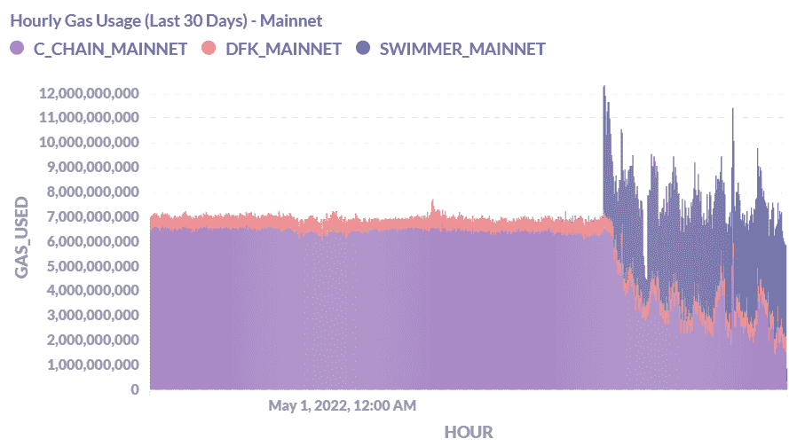

# 扩展解决方案:子网与侧链

> 原文：<https://medium.com/coinmonks/scaling-solutions-subnets-vs-sidechains-bcad92b59f20?source=collection_archive---------6----------------------->

Avalanche 今年在他们的生态系统中引入了子网，这是一种扩展网络以减轻 C 链负载的方法。Avalanche 上的第一个子网是 Defi 王国子网，它在推出后的短短几天内聚集了近 5 亿的巨大 TVL，相当于几个完整的第 1 层生态系统的 TVL。

[*DFK Chain TVL of $408.68m USD at its peak*, before tanking](https://defillama.com/chain/DFK)

游泳运动员 mainnet 今年也推出了 AVAX 子网，其愿景是成为专注于游戏的区块链。

[AVAX Transaction count pre-Swimmer mainnet launch](https://twitter.com/Gojo_Crypto/status/1524948403041361920?s=20&t=CWTd6JXreB3_TK7bgKD6NA)

最初，AVAX 上的大部分交易量来自 AVAX 上一款名为 Crabada 的游戏，交易发生在 C 链上。这是 C 链上拥塞的一个来源，因为游戏中的交易频繁发生并且数量很大。

在推出游泳者 Mainnet 后，大量的交易量从 AVAX C 链转移到子网，大大减少了 C 链上的拥塞。

[Swimmer Mainnet having the greatest gas usage on AVAX after its launch](https://twitter.com/coopernicus01/status/1528146955301421061/photo/1)

游泳运动员 Mainnet 还能够将子网的气体令牌定制为一个名为 TUS 的游戏内令牌，有效地帮助“燃烧”了 TUS。

子网似乎提供了过多的好处和可定制性，但是子网到底是什么？子网的概念似乎类似于 Polygon 提供的 PoS(Proof-of-stage)侧链，但有一些关键的区别，使它们彼此之间存在固有的差异。

# **缩放类型**

为了理解为什么需要子网或侧链，我们首先必须理解两种类型的区块链缩放。

缩放可分为水平缩放和垂直缩放。

[System Design — Horizontal and Vertical Scaling — GeeksforGeeks](https://www.geeksforgeeks.org/system-design-horizontal-and-vertical-scaling/)

**垂直扩展**需要通过向系统的核心处理单元添加更多的能力和内存来扩展网络，在这种情况下，这将通过提高每个单独事务的效率来扩展区块链的基础层。

**横向扩展**涉及向现有系统的框架中添加更多节点，这可以被视为将事务外包给另一层的一种方式，用于提高每个单独事务的效率*。*水平扩展解决方案的示例是 Eth 2.0 使用分片等方法。

在这个意义上，垂直扩展可能更容易实现，因为在虚拟机无法处理事务负载的示例中，所需要的只是向正在处理事务的虚拟机添加具有更大功率和内存的硬件，因为更大的内存将允许虚拟机处理增加的负载。

但是，这意味着扩展会受到可用硬件和内存的限制，这意味着系统可以处理的事务负载量会有一个上限。另一方面，水平扩展可用于几乎无限地扩展系统，就像在虚拟机的情况下，它的多个实例可用于几乎无限地增加和分散事务负载。

> 交易新手？试试[加密交易机器人](/coinmonks/crypto-trading-bot-c2ffce8acb2a)或者[复制交易](/coinmonks/top-10-crypto-copy-trading-platforms-for-beginners-d0c37c7d698c)

在这种情况下，可以观察到雪崩子网和多边形侧链是一种水平扩展形式，因为它们都使用不同的方法将事务负载分散到不同的链上，以允许其各个层进行扩展。然而，一个关键的区别是子网是一种扩展第 1 层雪崩网络的方法，而 Polygon 本质上是其第 1 层区块链(以太坊)的第 2 层解决方案。

# **多边形侧链**

Polygon 是构建在以太坊之上的第 2 层，旨在通过使用侧链和等离子体等扩展解决方案来帮助水平扩展以太坊。侧链本质上是一个独立的区块链，用于扩展以太坊之类的第 1 层。虽然 Polygon 现在已经扩展到包括多种扩展解决方案，如 rollups，但对于此分析，重点将放在侧链上。

[*Polygon’s complete suite of Ethereum-scaling solutions*](https://polygon.technology/)

## 机制

Polygon 的 PoS 是 EVM 兼容的以太坊侧链，顾名思义，侧链与主链并行处理交易。Polygon 的侧链共识机制就是利害关系的证明。它有自己的一套无权限验证器，因为侧链可以选择它们的共识机制，无论是 PoW 还是 PoA 等等。Polygon PoS 通过在其自身的区块链上进行交易和处理批量交易来帮助扩展以太坊，从而减少以太坊网络的负载并使其更快。

Polygon PoS 使用双 peg 机制在以太坊和其区块链之间进行传输，并定期将其状态发布到以太坊主链，这是一个称为检查点的过程。检查点还在资产撤销中提供“烧录证明”,这在多边形 PoS 链断开的情况下很有帮助，因为验证器将能够从保存在检查点中的最后一个好块分叉。

## 侧链的好处

## **共享安全**

Polygon 允许建立独立的以太坊链，因为它的共享安全模型是可选的。因此，各方不需要牺牲任何独立性或灵活性，其侧链的参数是高度可定制的。这种独立的链将由通过桥连接到主区块链的验证器来保护。

## **EVM 兼容性**

由于 Polygon PoS 也是 EVM 兼容的，这意味着开发人员可以更容易地将他们的 DApps 移动到 Polygon，也使 Polygon 能够从以太坊上已经建立的大型开发人员社区中受益，因为他们已经熟悉他们现有的工具，因为在 Polygon 中开发类似于在以太坊中开发。

## **以太坊生态系统互通**

Polygon 还表示，它正在努力成为“区块链互联网”,计划建立一个以太坊-可互操作的区块链及其独立的区块链的生态系统。

[Polygon’s envisioned ecosystem built around Ethereum](https://polygon.technology/)

这些区块链将用于分配以太坊主网络的负载，以降低交易成本并提高交易速度。自我主权链也将能够享受与以太坊主链的互操作性，即使他们选择退出 Polygon 的安全服务。

## 侧链摘要

Polygon PoS 为熟悉以太坊生态系统的开发人员提供了一个类似的开发环境，其侧链的使用允许近乎无限的可扩展性，这反过来有助于提高以太坊的吞吐量，而不会牺牲安全性。

# **AVAX 子网**

Avalanche 上的子网可以被视为独立于主 Avalanche 链(P、X、C 链)的区块链，可以充当第 1 层，甚至第 2 层。子网支持特定于应用的区块链，因为它们可以独立运行，并独立于主 Avalanche 网络处理事务。

## 机制

子网的工作原理是维护一组动态的验证器，这些验证器协同工作以对一组区块链的状态达成一致。这些子网与主雪崩网络并行处理，具有无限的可扩展性。子网由已经存在于主雪崩链上的一组验证器来验证，并且验证器可以由子网选择或者被激励来验证子网。

## 子网的优势

## **可定制性&合规性**

允许选择验证器的含义对于希望启动他们自己的区块链的企业可能是有用的，因为这允许他们在主网络上设置验证器以运行他们自己的区块链，因为这将减少任何验证器不当行为的机会，因为他们可以控制谁在他们自己的企业子网上验证交易。另一个含义是能够更加符合法规，因为允许子网选择它们的验证器允许它们对谁可以验证它们实施某些条件。这使得子网可能只允许通过 KYC/AML 检查的验证者，甚至是在某个 country⁴.的验证者这将允许希望符合本地规定的子网形成和选择它们的条件，以确保它们的区块链以这种方式建立。

## EVM 兼容性和代码灵活性

此外，子网是以太坊虚拟机(EVM)兼容的，这意味着它们允许将 EVM 上构建的协议或分散应用程序轻松迁移到它们自己的 subnets⁴.上此外，Avalanche 还创建了一个名为“CHAINRPC VM”的东西，它允许在子网上构建自定义虚拟机。如果必要的库可用，这些定制的虚拟机也可以用任何编码语言运行，这允许增强开发人员的灵活性。雪崩子网还使子网能够利用它们的雪崩共识机制，该机制允许安全验证和快速交易速度。

## **互操作性**

子网的另一个卖点是 subnets⁴.之间的互操作性 Avalanche 表示，在不久的将来，子网将能够在彼此之间传输令牌，而不需要任何网桥。这意味着子网将构成一个完整的生态系统，这将使不同区块链之间的流动性转移变得容易，这将使整个生态系统受益，因为用户可以在不同区块链之间无缝地移动资产，没有太多延迟。

## **灵活性&可定制性**

然而，子网的主要吸引力在于高度的灵活性和 customisability⁴.子网作为独立于主雪崩链的独立区块链运行，它们能够在各自的子网中选择自己的逻辑和 fee 结构。这允许创建特定于应用程序的子网，这也意味着子网用户不必支付 AVAX 令牌费用，但可以使用子网令牌支付子网费用。

这对于希望实现区块链技术的游戏尤其有用，因为这些子网将允许游戏使用它们的游戏内令牌作为子网中的气体。

在 DFK 子网的情况下，任何游戏内交易的汽油费，如从有限合伙人那里收获或进行互换，都是用本地令牌宝石支付的。

*Gas fees on the DFK subnet are the in game native token JEWEL*

这与游泳者 Mainnet 上的 Crabada 类似，它在 TUS 有一个气体令牌，这是一个游戏内令牌。

[TUS inflation % has been going down since the Swimmer Mainnet Launch](https://crabadatracker.app/tokenomics)

使用 TUS 作为 Swimmet Mainnet 的汽油代币有助于降低 TUS 代币的通货膨胀率，通过帮助代币保持其价值，这有利于克拉巴达的游戏内经济。

子网提供的特征可以帮助满足各种不同方的需求，因为可以有服务于不同方的需求和迎合不同方的利基的子网，从游戏到衍生甚至定义子网。

## 子网摘要

Avalanche 的子网允许网络水平扩展，因为 DApps 可以迁移到自己的子网，以便更好地控制自己的协议，同时从 Avalanche 网络中移除负载。像 Crabada 这样在主网络上承担大量事务的应用程序，当迁移到它们自己的子网时，将允许在主网络上有更快的网络速度，同时允许单个项目有更大的灵活性来满足它们特定的受众。

在 Crabada 迁移到 Swimmer Mainnet 之后，C 链上的事务总量显著下降，因为子网现在承担了大部分负载。

因此，子网是一种扩展网络并为项目提供特定应用区块链的创新方式，同时保持并确保主网络的拥塞保持在最低水平。

# ***子网 vs 侧链***

## ***验证器***

子网不同于多边形的位置，因为它们不需要自己的验证器集，因为它们可以从 Avalanche 主链上的验证器得到验证。这允许以相对较低的成本构建子网，因为他们只需要使用雪崩子网架构来迁移或构建他们的应用程序，而不需要他们锁定治理令牌来验证他们自己的事务。

## 费用结构和支付

雪崩子网的一个关键部分是允许子网所有者选择他们希望使用什么令牌作为气费的能力。这与 Polygon 上的 soverign sidechains 不同，因为他们仍然需要使用 MATIC 令牌来支付汽油费，以保护 Polygon 上的网络。虽然子网和侧链都可以提供灵活性和高度的可定制性，但子网可以被视为具有更多利基用例，如在 gamefi 中，因为子网中的气体令牌的价值可能比 Polygon 生态系统中的区块链更稳定。

这是因为如果游戏中的代币经济学设计得当，就有可能维持子网代币的价格，因为子网中的费用结构和条件已经被设置在最佳水平，以维持游戏中的经济性。另一方面，如果天然气令牌 MATIC 的价格以不稳定的方式移动，多边形生态系统中其他区块链的天然气价格可能会大幅波动。

## ***应用特定缩放***

Polygon 有时也会变得拥挤，即使它被认为是以太坊的扩展解决方案。一月份，由于 NFT 向日葵农民游戏的大量交易，Polygon 的交易费飙升。费用从不到 0.01 美元增加到几乎 0.5 美元，对于一个以高交易吞吐量和低交易 fees⁵.著称的网络来说，这是一个巨大的增长在一个链条上有大量交易的情况下，即使链条本身是一个侧链，汽油费仍然会激增。

可以说，像 Avalanche subnets 这样的模型将允许 NFT 向日葵农民拥有自己的游戏专用子网，该子网将与主链分离，因此不会降低主链的速度，因为所有交易都将在完全不同的区块链上处理。

## ***EVM vs VM***

Polygon 的互操作性愿景与以太坊生态系统紧密相连；因此，它将自己定位为与 EVM 兼容的区块链多链兼容也就不足为奇了。

然而，对于没有 Solidity 编程背景但希望进入该领域的开发人员来说，这可能不太有吸引力，因为他们可能希望继续用自己熟悉的语言进行开发或构建。因此，子网在这方面可能更有用，因为它们允许任何类型的虚拟机，并且还兼容多种不同的编码语言。

# **结论**

雪崩子网可能是下一个大规模的加密叙事。理论上，子网提供了许多好处，如对区块链的一个重要方面(即费用结构和验证要求)的灵活性和控制，以及与其生态系统内的其他区块链的无缝互操作性。

尽管有人怀疑它们与侧链的概念有何不同，但子网似乎是一种创新和令人兴奋的扩展解决方案，提供了巨大的灵活性。虽然看起来多边形侧链缩放在某些方面失败了，但可以注意到，他们也在开发其他形式的缩放，如 ZK 卷，这是一种相对较新的技术，也具有极高的可扩展性。Polygon 最近还开发了超网，其功能类似于子网，允许定制和构建应用特定的区块链。

未来很有可能是多链的，因此坚持单一的区块链并不好，而是拥抱一整套可能服务和迎合不同用户群需求的区块链。

## 参考

1.  [系统设计—水平和垂直扩展— GeeksforGeeks](https://www.geeksforgeeks.org/system-design-horizontal-and-vertical-scaling/)
2.  [多边形位置链——提交链而不是侧链？—精细数学](https://finematics.com/polygon-commit-chain-explained/)
3.  [什么是 Polygon (MATIC ),为什么它对以太坊很重要——解密](https://decrypt.co/resources/what-is-polygon-matic-and-why-it-matters-for-ethereum)
4.  [子网概述| Avalanche Docs(avax . network)](https://docs.avax.network/subnets)
5.  [多边形遭到一群向日葵农民的意外袭击](https://www.coindesk.com/tech/2022/01/06/polygon-under-accidental-attack-from-swarm-of-sunflower-farmers/)