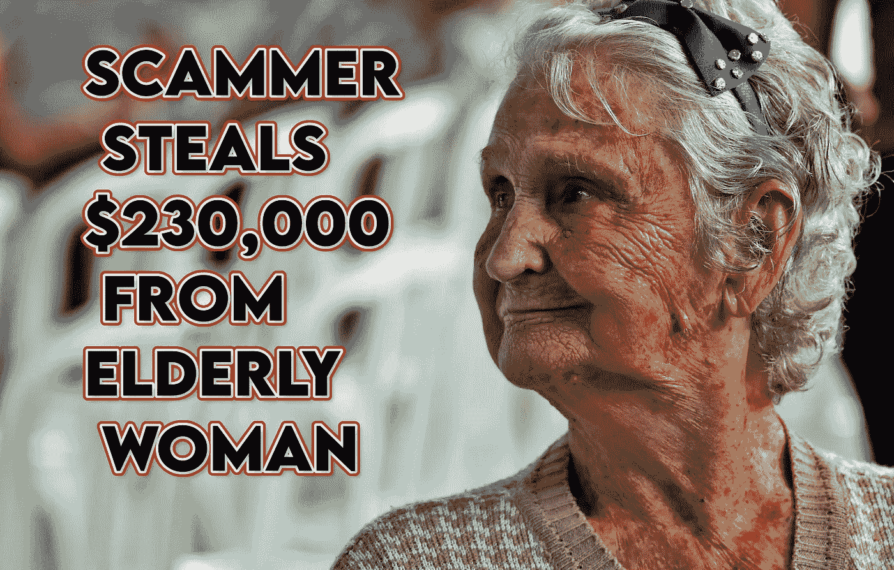

# 诈骗警报:电话诈骗者从芝加哥老年妇女那里拿走了 23 万美元的比特币和礼品卡

> 原文：<https://medium.com/coinmonks/scam-alert-phone-scammer-takes-230k-in-bitcoin-gift-cards-from-chicago-elderly-woman-256174eb4e9b?source=collection_archive---------20----------------------->

芝加哥的一名老年妇女害怕得要死，所以她将 23 万美元的比特币和礼品卡交给一名骗子，指控她贩毒和洗钱。

Photo by Vladimir Soares on Unsplash; modified with added text

为什么电话诈骗者喜欢和美国老年人聊天？答案是:他们很容易成为目标，而且会相信电话里完全陌生的人。