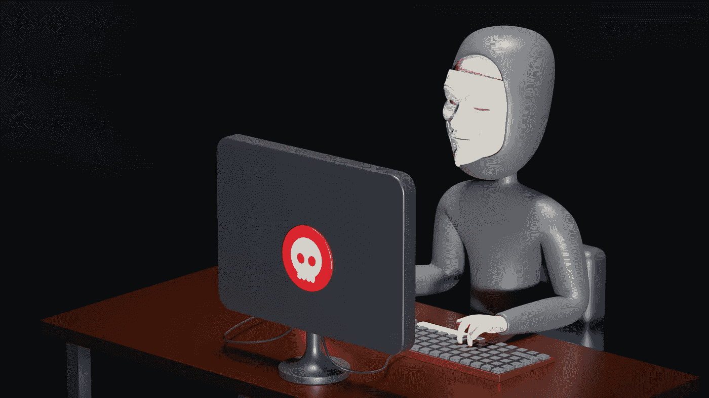

# 诈骗项目

> 原文：<https://medium.com/coinmonks/scam-projects-35ab12769273?source=collection_archive---------36----------------------->

我们中的许多人在密码世界中花费大量时间寻找刺激我们积极参与的项目，无论是从粉丝、乘数、合作者还是投资者的角度来看，然而，其中一个风险是找到一个骗局项目，许多人认为识别这些项目的唯一方法是冒风险。

photo by [Growtika Developer Marketing](https://unsplash.com/es/@growtika_developer_marketing_agency?utm_source=unsplash&utm_medium=referral&utm_content=creditCopyText) on [Unsplash](https://unsplash.com/es/s/fotos/fraude?utm_source=unsplash&utm_medium=referral&utm_content=creditCopyText)

考虑到每个人进行投资或研究的方式，我试着列出一个清单，前提是给我一个基本的方向，我可以确定允许我放弃或批准继续研究某个特定令牌的加密项目的主要特征。

不被骗的关键是不要再做新手，开始更多地了解假加密货币的基本特征是什么。

有迹象表明，即使他们不能提供 100%的保证，至少让我们能够确定进一步调查在这个问题上可能的合作或投资的性质或基础。

**1。-闭源加密货币**

一种值得尊重的加密货币呈现它的开放代码，任何用户都可以查看。同样，它允许对其进行修改或重新分发。这有助于社区为令牌的改进做出贡献。

目前有许多代码盗用，有时严重的项目不想显示他们的代码，原因很简单，但是，他们必须有替代方案，以便用户可以认证和访问事务，为此，在关闭代码的情况下，我们必须知道至少功能存在，事务可以被审计，以确保令牌是可靠的。

当涉及到假加密货币时，它们中的大多数不公开它们的代码，因为在许多情况下它并不存在，即它们没有交易代码库，也没有功能或与任何区块链的联系。

photo by [Markus Spiske](https://unsplash.com/@markusspiske?utm_source=unsplash&utm_medium=referral&utm_content=creditCopyText) on [Unsplash](https://unsplash.com/es/s/fotos/codigos?utm_source=unsplash&utm_medium=referral&utm_content=creditCopyText)

**2。-耸人听闻的优惠或新闻**

经常在生态系统中听到一系列关于一夜高回报甚至高固定回报的可能性的欺诈性报价，而没有任何支持来代表它。这些策略总是诱惑任何新手，甚至是需要钱的最有经验的人，幻想着以迅速的方式获得高利润率。

在许多情况下，你会看到这个项目是一个独特的投资机会，你的利润率可以翻倍，达到 100，200，300%。

同样，这些建议通常伴随着紧急呼吁:“抓住今年的最后一个折扣，现在就投资吧！

photo by [Markus Spiske](https://unsplash.com/@markusspiske?utm_source=unsplash&utm_medium=referral&utm_content=creditCopyText) on [Unsplash](https://unsplash.com/es/s/fotos/proyectos-ventas?utm_source=unsplash&utm_medium=referral&utm_content=creditCopyText)

**3。项目数据的准确性。**

项目的数据必须很好地工作，因为它是支持项目成功或失败的支柱，因此它必须具有一致性、逻辑性、透明性和支持性，所有这些都得到解释和支持。

为了确定项目的准确性，必须评估 4 个基本数据:

**白皮书:**它显示了其创建、运行和支持的所有条件，简而言之，它是一种总结，解释了特定密码项目的目标。它显示了团队成员，他们的背景，他们想要设计什么，他们计划如何设计，做什么，功能和支持。

另一方面，如果你遇到一份抄袭的白皮书，这也应该是一个值得怀疑的问题，因为这个信息对于每个令牌都是不可重复的。

**路线图:**代表了开发的不同阶段，在这里我们必须密切跟进，以证明每一个点都在工作和开发中，我建议始终注意拟议的日期，以进行持续的监控，许多项目会因为没有满足它们而失去忠诚度，这是一个重要的前提，知道他们对项目有多认真和投入。

**工作团队:**关于团队成员，缺乏关于创始人、开发团队的信息，甚至缺乏可核实的个人或专业档案的链接，这是可能存在欺诈的另一个迹象。请记住，大多数时候，欺诈性货币和方案不会公开披露创始人的信息，原因显而易见。如果他们的简介是可疑的，那么这个平台的可信度也是可疑的。

团队应该被很好地呈现出经过验证的账户，证明他们在加密世界中的活动，如果可能的话，你应该检查这样的人物，甚至尝试进行互动，以常识来评估团队每个成员的行为。

**官方页面:**官方页面必须对其网站进行验证，并发布关于项目的所有信息的内容，联系会议必须在 rrss 中明确且重要地出现。

同样，我总是检查和验证发起人的真实性，并利用重大项目，如果与现有项目有任何关系，应验证这种工作关系或参与。

**4。欺诈性社交网络、网站和电子邮件。**

如今，抄袭网站、社交资料、发送电子邮件和创建应用程序非常容易，只是为了欺骗那些没有意识到这一点的人。

嗯，许多骗子专门抄袭网页，这些网页的外观与原始网页非常相似，所以许多用户在不知道其真实来源的情况下访问它们。因此，在进入看似可信的页面时，请验证与网站的连接是否安全，最好是以“https”开头。

类似地，黑客攻击社交网络，或在这些平台上剽窃身份，在网络犯罪分子中也很流行。

除此之外，许多欺诈者还利用他们的天赋制作欺诈性的移动应用程序，这些应用程序通常从应用程序商店或 Play 商店获得，并提供代币兑换，利润非常好。

最后，你应该非常注意你在邮件中点击了哪些链接，因为许多链接可能以值得信赖的公司自居，而没有任何法律支持。

## **我的想法**

缺少这些信息是一个非常明显的迹象，表明该提议可能是一个骗局，因为没有办法确切知道加密的目的或动态。

在对代币下注时，请确保您拥有检查即将获得的加密货币透明度所需的所有信息。请记住，很多时候，无论它看起来多么像一个真实的项目，我们都必须从字里行间去想象那些产生差异的小细节。

重要的是，你要掌握足够的加密货币及其基本操作的知识，以避免陷入这些不具备上述共同特征的各种骗局和黑幕。

由于有太多的加密货币和代币可供选择，很难区分好的项目和坏的项目。因此，在缺乏制衡的环境下，加密货币世界成为骗子的沃土。所以，在插手任何技术之前，最需要考虑的就是知道不要投资什么。

> 交易新手？试试[密码交易机器人](/coinmonks/crypto-trading-bot-c2ffce8acb2a)或者[复制交易](/coinmonks/top-10-crypto-copy-trading-platforms-for-beginners-d0c37c7d698c)