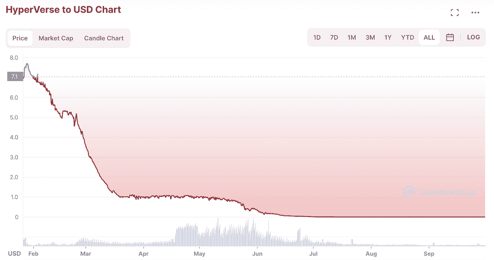
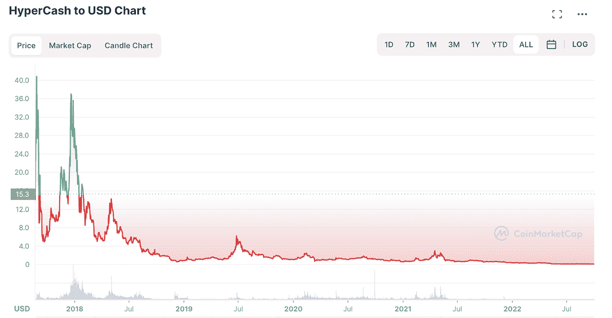
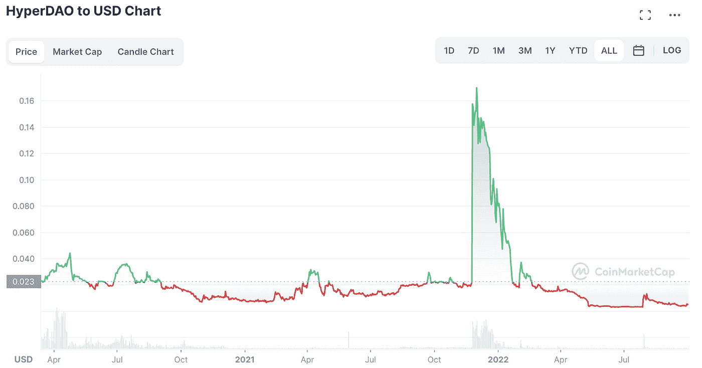
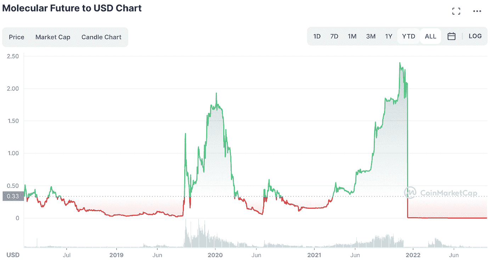

# ScamBuster —超高基金更新

> 原文：<https://medium.com/coinmonks/scambuster-hyperfund-update-2b6d20980487?source=collection_archive---------3----------------------->

Image source: [https://eps.msimasters.com/enregisterhpf/](https://eps.msimasters.com/enregisterhpf/)

大家早上好！欢迎回到 ScamBuster！

自从我在 2022 年 5 月发表第一篇分析以来，几个月过去了，这里我们有一个关于超基金/超储蓄 的小更新。

由于我已经在前一篇文章中强调并解释了这个项目是如何工作的，所以我就不多说了。

你可以在这里找到深层分析:

 [## ScamBuster —超高基金评论

### 那些在密码世界里的人很可能在 2021 年听说过 HyperFund。迄今为止，人们的意见非常不一…

medium.com](/@mikezillo/scambuster-hyperfund-review-55f60498aba0) 

***我已经和你分享了我对这个项目的疑惑，尤其是看着它的创始人的过去。***

今天似乎没有留下他的任何痕迹。2021 年末和 2022 年初，在更名为 Hyperverse 后，一些领导者开始离开 Hyperfund。

我已经看到他们中的一些人转向元乌托邦，然后又转向 MetFi。我最近写的评论也是关于 Metfi 的:

 [## ScamBuster — MetFi 评论

### 早上好，读者们，欢迎回到《诈骗犯》!在很长一段时间致力于其他文章一个新的…

medium.com](/coinmonks/scambuster-metfi-review-6a6aabb38cf4) 

从年初开始，大问题越来越多。大约从 3 月份开始，用户提现的问题开始出现。与此同时，Hyperverse 启动了一项新的营销活动，目前正在进行促销，以获得 400%的投资回报率。看来他们真的需要资金来吸引新顾客。

最糟糕的似乎是从 2022 年 5 月开始，当时提现似乎已经完全停止，许多用户抱怨这个问题。

方正 ***瑞安*** 时势不好。事实上，在 2021 年 12 月，他也遇到了加密货币交易所“区块链全球”的问题，该交易所于 2021 年 10 月倒闭，他与人联合创办了[。徐瑞安的名字在澳大利亚变得越来越有名和受欢迎。](https://behindmlm.com/companies/hyperfund/blockchain-global-fallout-confirms-hyperverse-execs-in-hiding/)

如果你想了解更多，你可以点击这里:

 [## 区块链全球损失攀升至 4890 万澳元

### 区块链全球投资者损失最初为 2100 万美元，现已攀升至 4890 万澳元(约 3480 万美元…

behindmlm.com](https://behindmlm.com/companies/hyperfund/blockchain-global-losses-climb-to-48-9-million-aud/) 

**Hyperverse coin(HVT)怎么样？**

我认为这张图表不需要进一步的评论。

只是为了与我在上一篇文章中给你带来的图表进行比较，现在让我们看看在 Hyperfund 生态系统中旧硬币上的情况是否发生了变化。

HyperCash 同样的情况。

HyperDAO？挺像的。

MOF？失踪的双胞胎。

***这一切让你想到了什么？***

在我看来，没有什么可补充的。对于那些仍然认为这些项目有前途的人来说，他们很可能会在这些项目上赔钱。

请记住，对任何向你提出的参与都要非常小心，尤其是当它看起来好得难以置信的时候。如果你不明白某件事，在拿你的资金去冒可能的骗局的风险之前，彻底研究它。

***HyperFund/Hyperverse/HyperNation/Hypereverything 一案能算结案吗？***

截至目前，我是这么认为的！

下次 ScamBuster 评论(或更新)再见！

> 交易新手？尝试[加密交易机器人](/coinmonks/crypto-trading-bot-c2ffce8acb2a)或[复制交易](/coinmonks/top-10-crypto-copy-trading-platforms-for-beginners-d0c37c7d698c)