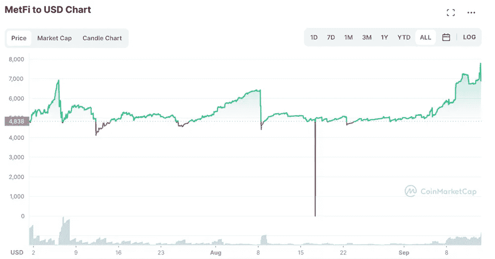
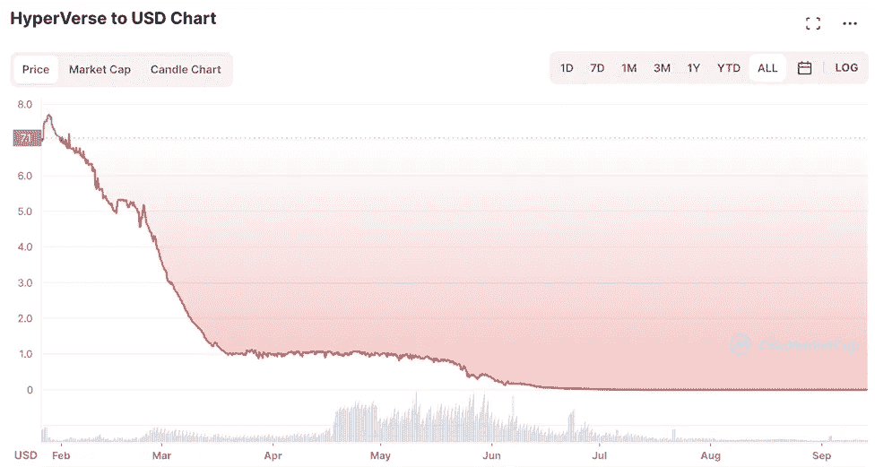

# ScamBuster — MetFi 评论

> 原文：<https://medium.com/coinmonks/scambuster-metfi-review-6a6aabb38cf4?source=collection_archive---------1----------------------->

Image source: [https://mobile.twitter.com/metfi_dao](https://mobile.twitter.com/metfi_dao)

当我联系那些给我带来非凡成果的人时。起初我开始怀疑，然后我开始反复核对信息。

几周前，有人向我提出了这项“业务”,一如既往，我做了调查，并决定与你分享，因为我发现了一些相关信息。

# **什么是 MetFi？**

M etFi 将自己定义为一个去中心化的自治组织(DAO ),立志成为世界上最好的元宇宙和 Web3 孵化器。

**主要约**围绕一个 ***巨大的 APY 对你的密码控股*** 。你得买 MetFi NFTs，附送 MFI 令牌。如果你持有这些代币并且不出售，你可以赚取高达 1000%的 APY。

这意味着理论上你应该能够在一年内让你的钱翻 10 倍。

> **MetFi 合法吗？自动方式真的能赚那么多钱吗？**

要回答这个问题，我们应该在 ***上寻找 MetFi 如何产生回报*** 的来源。目前我还没有发现任何官方报道，所以我们对此一无所知。让我怀疑的原因是，基于**应该**产生收益的业务，收益是非常不可持续的。

很好奇的是，看看有多少发起人是**其他著名违约公司 *Hyperverse/Hyperfund* 或 *Onecoin* 的前发起人**。

我发现它是因为我在社交媒体上看到一些前 Hyperverse 推动者，他们现在正在推广 MetFi，并且还参加了一个主要欧洲领导人的私人培训，只是为了启动这个项目。

根据[https://behind MLM . com/MLM-reviews/metfi-review-1000-a-year-NFT-cash-grab-Ponzi-scheme/](https://behindmlm.com/mlm-reviews/metfi-review-1000-a-year-nft-cash-grab-ponzi-scheme/)，从 8 月份的更新来看，*前****one coin****发起人*如 Staffan Liback 和 Stephan Steinkeller 也出席了会议。该网站截图的 Youtube 视频似乎已经消失，但要了解更多细节，请尝试阅读上面的链接。

**你在 MetFi 开始做什么？**

MetFi 立即要求你建立一个帐户，以赚取巨额利润。你会在他们的网站上看到多个视频和指南，解释它是如何运作的。MetFi 要求您通过 BUSD 购买 NFT。作为回报，获得一个免费的 MFI 令牌，它会留在你的钱包里，积累大量的利润(类似的事情也发生在 Hyperverse)。没有数据解释你购买的任何资产或可用于投资的产品。它如何设法在你的钱包里产生利润也值得怀疑。

尽管有人表示没有人在经营 MetFi，但 MetFi 的所有者通过一个不和谐的聊天群与投资者沟通。

# **MFI 令牌**

M FI 代币被凭空创造出来，为 MetFi 生态系统提供燃料。你可以在 LBank 和 PancakeSwap 上交易代币。

图片来源:【https://coinmarketcap.com/it/currencies/metfi/ 

这些交易所基于人们需要提供流动性的流动性池。

> 你听说过秘密世界里的地毯拉吗？

大多数情况下，当骗子使用他们无用的代币从池中取走所有流动性时，就会发生这种情况。 ***同样的事情随时可能发生在 MFI 身上。Metfi 是发行者，因此他们基本上可以接受任何金额，将其转储到分散的交易所，让 MFI 的价值崩溃，同时有效地从所有池中移除流动性。***

这种代币让我想起了著名的超级代币 HVT…所有的推广者都说它是可持续的…好吧，让我们看看发生了什么:

surouce coinmarketcap.com

好像塌了。

我在一年前的“*ScamBuster—Hyperfund Review*”中提到了 Hyperfund 崩溃，看起来我的水晶球工作得很好。

# **MetFi 的薪酬计划**

Image source: [https://metfi.io/earn-program](https://metfi.io/earn-program)

MetFi 在币安美元(BUSD)经营一个十级投资计划。BUSD 是代表与美元挂钩的币安稳定货币。

***MetFi 的十个投资层级是:***

**虾** : 100 BUSD
**蟹** : 200 BUSD
**章鱼** : 400 BUSD
**鱼** : 800 BUSD
**海豚** : 1600 BUSD
**鲨鱼** : 3200 BUSD
**虎鲸** : 6400 BUSD

**这些层级与 NFT 投资头寸相对应。**

**当 MetFi 分支机构投资时，他们会收到一定数量的 MFI 代币。 **MFI 代币随后存放在 MetFi，承诺每年投资回报率，每日计算和支付。****

****虾层**:获得价值 10 美元的 MFI 代币，以 100%的年投资回报率进行投资。
**:获得价值 20 美元的小额信贷代币，承诺投资年回报率为 200%。
**:获得价值 40 美元的 MFI 代币，投资于承诺的 300%年投资回报率。
**Fish tier** :获得价值 80 美元的 MFI 代币，以 400%的年投资回报率进行投资。
**海豚等级**:获得价值 160 美元的 MFI 代币，以 500%的年投资回报率进行投资。
**鲨鱼等级**:获得价值 320 美元的 MFI 代币，投资承诺年投资回报率为 600%。
**Orca tier** :获得价值 640 美元的 MFI 代币，投资承诺年投资回报率为 700%。
**鲸鱼等级**:获得价值 1280 美元的 MFI 代币，以 800%的年投资回报率进行投资。鲸鲨等级:获得价值 2560 美元的 MFI 代币，承诺年投资回报率为 900%。
**:获得价值 10，230 美元的 MFI 代币，投资承诺年投资回报率为 1000%。********

******MetFi 不在其网站上公布当前的内部 MFI 交易值。******

******MetFi 的 MLM 方面支付招募附属投资者的费用。请注意，当 MetFi 在 BUSD 寻求投资时，MLM 的佣金和奖金是在 tether (USDT)支付的。******

# ********快速启动奖励********

******快速启动奖励是在新招募的代销商的前三十天支付的。要获得快速启动奖励的资格，MetFi 分支机构必须招募至少五家投资级别为 4 级或更高(鱼级)的分支机构。******

******一旦该条件得到满足，如果一个附属机构仍然在他们的第一个三十天的期限内，他们将获得由个人招募的附属机构投资的所有 BUSD 的 10%的快速启动奖励。******

# ********剩余佣金********

******MetFi 通过 **3×10 矩阵**支付剩余佣金。一个 3×10 的矩阵将一个分支机构放在矩阵的顶部，在它们的正下方有三个位置:这三个位置形成矩阵的第一级。******

****通过将这三个位置中的每一个分成另外三个位置(9 个位置)来生成矩阵的第二级。****

****矩阵的第三级到第十级以同样的方式产生，每个新的级容纳的位置是前一级的三倍。****

****每个 MetFi 投资层对应于其自己的 3×10 矩阵层，总共有十个 3×10 矩阵层。每个矩阵中的职位都是通过直接和间接招募已经投资于该特定投资层级的附属机构来填补的。****

********

****图片来源:[https://sites.google.com/site/programmaairbitclub/](https://sites.google.com/site/programmaairbitclub/)****

****对于加入 MetFi 分支机构矩阵(任何层级)的每个人，将获得:****

****BUSD 投资的 5%;以及在 BUSD 投资时进行的任何额外 MFI 象征性投资的 1%。****

****请注意，MetFi 分支机构只能从他们个人投资的矩阵层级中获利。****

# ******匹配奖金******

****MetFi 分支机构从支付给个人招募的分支机构的剩余佣金和每日 ROI 金额中获得 50%的匹配。****

****要获得相应的奖金，MetFi 分支机构必须招募五家投资级别均为 4 级或更高级别(鱼级)的分支机构。****

********

# ****MetFi 将如何向前发展？****

****这是一个好问题。在 MetFi 证明其投资回报的来源之前，看起来新投资者的钱正在被使用。因为没有官方的财务报告，所以很难有一个官方的答案，但是可以做一些假设。****

****在任何情况下，你都可以肯定，世界上任何一个加密项目都不可能每年给你带来 1000%的投资回报。****

*****还记得 Terra Luna 和 Celsius 吗？*尽管数十亿美元流入他们的项目，但他们无法维持每年 19%的增长率，最终破产。那么，MetFi 如何维持这些超高的 APY 呢？****

****为了让 MetFi 看起来更好，价值约 250 万美元的 25，005 个 LP 令牌在 2022 年 6 月 9 日锁定了一份智能合同。但是锁定没有价值的代币并不意味着什么。****

********

# ******他们的营销******

********

****Image source: [https://metfi.io/earn-program](https://metfi.io/earn-program)****

****我喜欢所有这类“高 APY 项目”，把一切都押在有保证的轻松获得和高回报上。一切都是被动的，什么都不做。****

*******很好听吧？谁不想什么都不做每年赚 10x？*******

****然后，他们利用网络营销计划，这是大大增加收入所必需的。****

****目标受众永远不变。刚进入这个行业的人或完全陌生的人，他们有一些技能或没有技能，并且信任朋友、家人等。****

****通常，在其他项目中已经有关系网的大领导会首先被叫来推广这些新项目。在 MetFi 中，我们可以找到 OneCoin、Hyperverse、Meta Utopia 等公司的前领导人。****

# ******我最后的想法******

****在 MetFi 用官方和经审计的报告证明给发起人和投资者的报酬的来源之前，我已经决定离开。到目前为止，可以假设这可能是另一个庞氏骗局，因为这些骗局有许多共同的危险信号。****

****当我们接触到新的投资机会时，我们总是会问:****

*******这钱从哪里来？回报是可持续的吗？他们总是保证它还是它是可变的？*******

****这些只是可能帮助你理解项目的可持续性或合法性的一些问题。****

****通过这篇文章，我希望已经澄清了 MetFi 的问题。我们必须时刻关注并尽可能核实呈现在我们面前的所有投资机会，以避免陷入可能的骗局，永远不再看到我们的钱。****

****请在下面的评论中告诉我你的想法。****

****对于任何问题，请写在评论中，我会全部回复！****

****下次复习再见！****

> ****交易新手？试试[加密交易机器人](/coinmonks/crypto-trading-bot-c2ffce8acb2a)或者[复制交易](/coinmonks/top-10-crypto-copy-trading-platforms-for-beginners-d0c37c7d698c)****