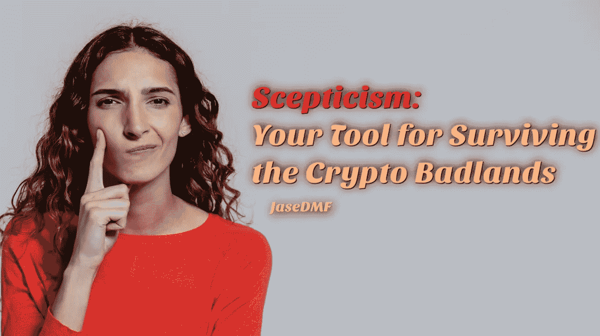

# 怀疑论:你在加密荒地生存的工具

> 原文：<https://medium.com/coinmonks/scepticism-your-tool-for-surviving-the-crypto-badlands-c41ee24d4260?source=collection_archive---------35----------------------->

Image by [Pavel Danilyuk](https://www.pexels.com/@pavel-danilyuk/) on [Pexels](https://www.pexels.com/photo/a-woman-in-red-long-sleeve-shirt-8637960/) (modified)

亲爱的读者:

我希望我有更好的消息给你，但是这个世界现在是一个非常混乱的地方。

只要食品、住房和能源价格的增长速度快于工资，中产阶级在未来的几个月和几年里就注定要经历一段痛苦的时期。富人将继续做富人最擅长的事情:保持富有…