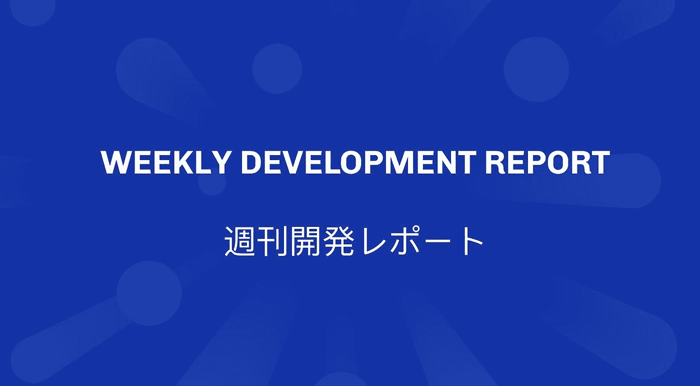
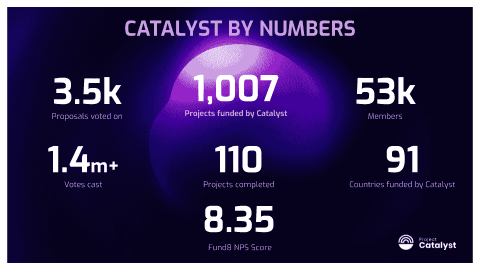
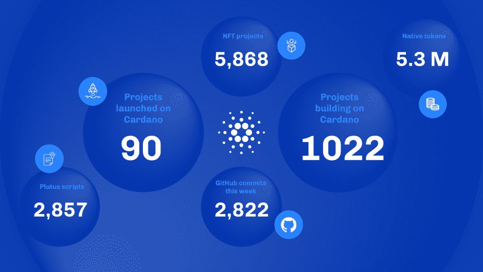
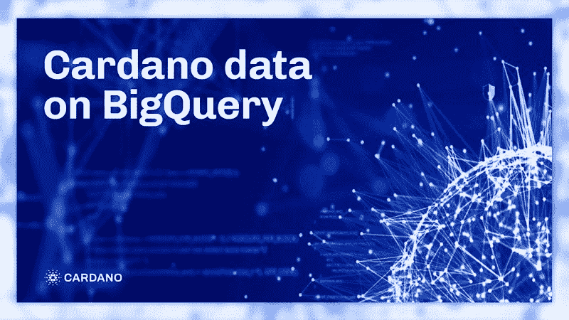
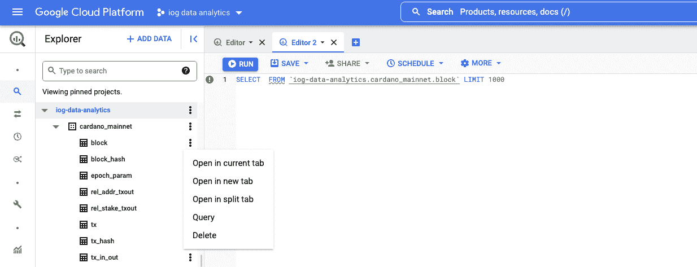

# SCEZ——熊市中的 CARDANO 你应该如何对待你的 ADA！

> 原文：<https://medium.com/coinmonks/scez-cardano-in-a-bear-market-what-you-should-do-with-your-ada-b7f445b88d2d?source=collection_archive---------3----------------------->

# 查尔斯·霍金森说，随着网络的扩大，卡尔达诺需要更多的开发人员

为了支持所有这些工作和网络扩展，他强调需要更多的人力，他说

> “你必须允许生态系统中的一组人成长和进化到这些人能够参与的程度。”

为此，他宣布建立一个注册网站，

> “因此，无论谁想以某种身份成为这个基于成员的组织的一部分，都可以注册，然后要么向该组织支付会费，要么为该组织做一些工作，或者两者兼而有之。”

他补充说:

> “这是一方面。另一方面，我们需要让更多的人为卡尔达诺工作。”

# 星座和谨慎的方法

除了卡尔达诺系统发展所需的人力资源之外，其创始人还强调:

“你必须有一个星座，让你能够朝着正确的方向前进。有些是权力下放，有些是弹性，有些是效率和成本，有些是用途和效用。”

Hoskinson 承认 Cardano“在智能合约的市场推广方面很慢”，但它“错过了许多今天正在发生的 DeFi 事情。”他认为这是一个好处，“随着 DeFi 市场的崩溃和指数损失的发生。”

> 交易新手？试试[加密交易机器人](/coinmonks/crypto-trading-bot-c2ffce8acb2a)或者[复制交易](/coinmonks/top-10-crypto-copy-trading-platforms-for-beginners-d0c37c7d698c)

# 卡尔达诺的未来会怎样

谈到下半年，Hoskinson 说，这是“反思的时候，是辩论的时候，是清理的时候，是真正深入挖掘并让每个人都在正确的位置上的时候”，这是他的公司将做的事情。

> “有了 Vasil 和 Vasil 的流水线技术，我认为你们有足够的空间在 Cardano 上开发许多有趣的东西，”他说，指的是开发人员开发分散的应用程序。

最后，Cardano 创始人说[熊市](https://finbold.com/guide/bear-market-definition/)是最终确定生态系统基础的最后要素的最佳时机，因为:

> “熊市是每个人都变得更加合作的地方。更多的人愿意加入并与你一起工作，人们实际上拿起了电话。牛市是疯狂的。偷猎正处于历史最高水平，人们非常敌视，使用极其负面的语言，不人道的事情发生。”

然而，根据他的说法，“有一件事是始终不变的——卡尔达诺社区会一直存在下去。”

正如 [Finbold](https://finbold.com/) 报道的，Cardano 开发者输入输出(IOHK)团队早些时候表示，他们正在努力工作，为备受期待的 Vasil hardfork 做最后的润色和[准备。](https://finbold.com/cardano-sets-stage-for-vasil-hardfork-as-mainnet-upgrade-countdown-begins/)

# 截至 2022 年 7 月 1 日的每周发展报告

## 核心技术

本周，**节点、分类帐和共识团队** [发布了 node v.1.35.0](https://twitter.com/InputOutputHK/status/1540711787468795904) ，这将是 mainnet Vasil 硬分叉的最终候选版本。该节点版本将支持使用新的普路托斯功能，包括节点和 CLI 对参考输入、内联基准、参考脚本、辅助输出和普路托斯 V2 原语的支持。普路托斯·V2 代码测试(包括新的 CIPs，它显著提高了智能合同的性能)取得了成功，并在性能和降低成本方面取得了积极的成果。

## 钱包和服务

本周，代达罗斯团队继续测试新的兼容 Vasil 的 cardano-node 和 cardano-wallet 组件。他们还修复了与硬件钱包功能相关的问题，并发布了 cardano-node 的测试版，该版本将 UTXOs 存储在硬盘或 SSD 上，而不是 RAM 上。

关于 **Lace** lightwallet 平台开发的工作正在进行中。该团队完成了第一轮测试，报告了社区对钱包 UX 的积极反馈。该团队还在 6 月的 360°节目上讨论了 Lace，观看它以了解最新更新。

**Adrestia** 团队升级了 Adrestia 组件以兼容 Vasil，继续为生产准备 cardano-js-sdk，并对 DB Sync 之上的新 HTTP API 进行了一些改进。

## 智能合同

本周，普路托斯团队致力于测试改进，并为未来的硬分叉准备普路托斯基础设施。他们还研究了 plutus 链索引和性能问题，修复了模拟器中的内存问题，纠正了模拟器的 minting 策略行为，并减少了真实网络中 PAB 内存的使用。最后，他们致力于建筑设计记录的引导。

本周， **Marlowe** 团队修复了 Isabelle build 作为 CI 检查，修复了 Marlowe Playground 中一个托管示例的警告标签崩溃和模板参数顺序，并添加了 [tarball.js](https://www.essentialcardano.io/development-update/tarball.js) 绑定。他们还为 Marlowe CLI 添加了 Merkleization 支持，并出版了 Marlowe 先锋讲座和关于使用 Marlowe CLI 的测验。

## BASHO(缩放)

本周， **Hydra** 团队使用 quickcheck-dynamic 完成了基于模型测试的第一个高峰，并确定了进一步的开发步骤。他们还修复了几个与配置设置相关的错误，并发布了 hydra-node v.0.6.0。这是 hydra-node 的第一个版本，支持竞争，并完成了原始论文中建议的基本 Hydra Head 协议。

## 管理

本周， **Project Catalyst** 关闭了 Fund9 的提案提交。有超过 1，000 个提案提交给 QA。社区投票将于八月举行。

# 迄今为止的统计数据

# 这就是为什么 WingRiders 现在是领先的卡尔达诺 DeFi 协议

根据 [**DeFi Llama**](https://defillama.com/chain/Cardano) ，WingRiders (WRT)目前是 Cardano(TVL)总值锁定的领先 DeFi 协议。该协议目前拥有 42%的主导地位，锁定了 5177 万美元。

紧随其后的竞争对手 Minswap 的 TVL 为 4073 万美元，比 3 月 28 日达到的峰值 2.1153 亿美元下降了 81%。

## WingRiders 让自己在竞争中脱颖而出

WingRiders 是一家自动化做市商(AMM)分散式交易所(DEX ),运行在 Cardano 的 eUTxO 第 1 层上。

这带来了超越会计模型指数的几个**好处，正如在以太坊上看到的，包括确定性费用，以及由于使用了丰富的数据值，可以可靠地处理多个操作的灵活环境。**

# **市场动荡和 DeFi 在其中的作用**

**随着 Terra 的内爆和正在进行的全行业流动性危机的展开，DeFi 被指责为一个促成因素。**

**但卡兰塔里持哲学观点说，DeFi 作为一种创新和新颖的技术，让用户面临“一定程度的内在风险”尽管如此，接受这种风险的另一面是赚钱的潜力。**

> ***“DeFi 正在推动引领未来金融系统的尖端技术，无论何时你面对这种级别的创新，都存在一定程度的内在风险。当然，还有赚钱的潜力。”***

# **BigQuery 上的 Cardano 数据**

****

## **查询 Cardano 数据**

**数千个分散的节点维护着卡尔达诺网络，每个节点都保存着区块链的完整副本。因为区块链的大小随着链中新事务和数据的增加而不断增加，所以同步整个区块链历史的时间也相应增加。**

**[Cardano DB Sync](https://docs.cardano.org/cardano-components/cardano-db-sync/about-db-sync) 是 Cardano 的核心组件之一，它提供了从 Cardano 区块链查找和查询历史信息的便捷方式。DB Sync 作为客户机连接到本地节点，并与链上活动同步。然而，使用 DB Sync 需要更深入的技术知识来运行节点和本地数据库服务器。**

**为了满足提供更简单的数据查询替代方案的需求，出现了几种解决方案。根据技术专长、软件要求和需求，用户可以从大量旨在简化数据查询的社区驱动的解决方案中进行选择。[Cardano block chain Insights](https://twitter.com/InsightsCardano)例如，使用 Google Data Studio 在可视图表和仪表盘中提供[区块链数据。](https://datastudio.google.com/u/0/reporting/3136c55b-635e-4f46-8e4b-b8ab54f2d460/page/k5r9B) [Scrolls](https://github.com/txpipe/scrolls#readme) 和 [Blockfrost](https://blockfrost.io/#introduction) 是其他旨在优化区块链数据处理的解决方案之一。**

## **BigQuery 是如何工作的？**

**确保您登录到您的 [Google Cloud Platform](https://console.cloud.google.com/) 帐户，并启用了 BigQuery API。然后，开始很简单:**

*   **打开或创建 Google BigQuery 或 Data Studio 项目**
*   **访问[日志分析数据集](https://console.cloud.google.com/bigquery?project=iog-data-analytics&supportedpurview=project&ws=!1m4!1m3!3m2!1siog-data-analytics!2scardano_mainnet)**

**您现在可以查询卡尔达诺区块链数据。**

# **询问**

**使用数据集非常简单。您可以选择任何感兴趣的表，然后单击“查询”获取详细信息:**

****

## **图一。日志数据分析仪表板**

**也可以将查询到的数据导入 [Google Data Studio](https://datastudio.google.com/) 。这将允许您创建各种图表和图形来可视化事务或块统计信息。在这里查看一些 [Cardano 区块链见解示例](https://datastudio.google.com/u/0/reporting/3136c55b-635e-4f46-8e4b-b8ab54f2d460/page/k5r9B)。**

## **数据更新流程**

**在使用 BigQuery 时，您应该注意以下几点:**

1.  **每两个小时从 DB Sync 获取和复制一次数据。**
2.  **数据仅更新到数据库同步中当前块高度之前的大约最后 20 个块。这对于防止链叉情况下的滑轮回滚至关重要。**

## **费用**

**通常，在 BigQuery 上查询数据的成本是每处理 1 TB 数据 5 美元。还有每月 1tb 数据的免费配额。要了解更多信息，请查看 [BigQuery 定价](https://cloud.google.com/bigquery/pricing)详情。重要的是要注意到，Cardano 数据表是按纪元编号划分的，这使得可以查询所选确切纪元的数据，从而减少了处理的数据量，从而降低了成本。**

**欢迎来到“智能合约变得简单”,我们将为您带来所有最新的 Cardano 新闻。智能合同变得容易是一个友好的工具来创建智能合同，NFT，本地令牌和卡尔达诺区块链交易。这是一个完整的 REST api 解决方案，面向加密开发者、爱好者和企业家。**

**别忘了用 SCEZ pool 来赌你的 ADA:[https://smartcontractsez.com/pool/](https://smartcontractsez.com/pool/)**

**并查看共产特区的最新功能:
[https://smartcontractsez.com/](https://smartcontractsez.com/)**