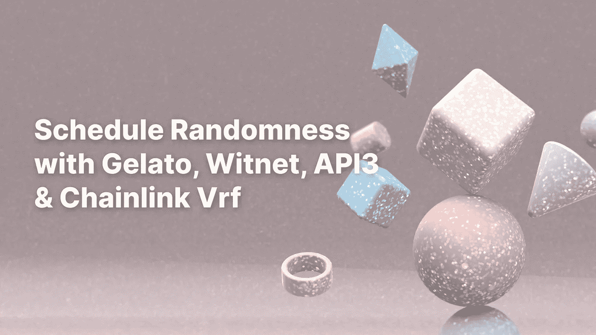

# 利用意式冰淇淋和威特网、API3 和 Chainlink Vrf 实现日程随机性

> 原文：<https://medium.com/coinmonks/schedule-randomness-with-gelato-and-witnet-api3-chainlink-vrf-1ebc0aac37d?source=collection_archive---------7----------------------->

了解如何将意式冰淇淋与 Witnet、API3 和 Chainlink Vrf 结合使用，以实现随机性的自动化



Schedule the randomness

# 目录

[**web 中的随机性 3**](#bf36)
- [当前解决方案](#91bb)
- [自动化和随机性](#abd1)
[**展示案例项目**](#070d)- [步骤 1)意式冰淇淋为司仪](#3ff0)
- [步骤 2)API 3 qrg 为随机组件](#cf36)-[步骤 3)](#3ff0) [Witnet](#97e8)

从轮盘赌到动作冒险游戏，随机性在游戏世界中扮演着重要角色。它适用于任何动态创建对手或场景的场景，以及那些用户需要“即时”随机性的场景。

这与我在 20 世纪 80 年代的记忆大相径庭，当时游戏远没有那么令人愉快，因为一切都是可预测的——如果你的角色去执行一次任务，下次你玩这个任务时就会完全一样。你可以想象，这很快变得很无聊。

然而，随机性在 web3 生态系统中还有许多其他用途，例如:

**DAOs &公众参与** **流程:****最大的 web3** 特色之一就是**社区**带动项目的存在。从长远来看，我认为成功的项目将是那些拥有强大而活跃的社区的项目。在这种情况下，需要随机性来确保奖励和参与过程的公平性。

**NFT 一代:**在过去的 5 年里，我们看到了非传统艺术和数字艺术的指数级增长。在某些情况下，NFT 收藏有随机特征，影响价值。

**彩票:**除了传统的彩票游戏，DeFi 生态系统还允许创新，如“无损失”彩票。

由于区块链的性质，矿工可以创建/丢弃块，并“重新滚动”骰子，直到找到一个特定的值，没有可操纵的随机性不能在链上创建。

> 在所有情况下，尤其是在出现大额金额的彩票和 NFT 生成中，必须使用不可操纵的随机数。

## 当前解决方案

当前大多数解决方案都使用 Oracle 离线。我们必须请求数字，这些数字(一旦可用)将使我们能够执行我们的定制逻辑。在本文中，我们将探索:

*   **证人网**
*   **API3 QRNG**
*   **链环 VRF**

在本文中，我将展示如何结合意式冰淇淋实现这三种解决方案。

## 自动化和随机性

智能合约中对自动执行方法的需求与日俱增。然而，“大爆炸”将会发生，当区块链技术将扩展到非区块链业务。

例如，所有过程(无论是哪个行业)都要接受质量控制，其中**依靠随机抽样来运行控制**以确保不存在偏差。

由于在区块链通过神谕获取随机数的特殊性，需要两种方法:

*   一个向神谕请求随机数
*   第二个是当号码可用时的回拨。Chainlink Vrf 和 API3 QRNG 执行你契约中的回调代码，然而 Witnet 不执行。

> 意式冰淇淋通过创建一个任务来处理这种情况**，它将检查随机数何时可用，并执行任何自定义逻辑**。运行一次后，此任务将被取消

在我们的展示项目中，我们将为 Witnet、Chainlink 和 API3 演示这个用例。

# **展示案例项目**

让我们想象一下，我们经营一家汽车工厂，我们的主要装配机器有 20 个部件。虽然我们做定期维护(自动化的另一个例子)，我们被要求每 10 分钟运行一次随机质量控制。这看起来是这样的:

1.  选择 2 个组件，每个组件可以每小时控制一次。
2.  选择控制级别:快速、中等或密集
3.  从 500 名员工中挑选一名来负责质量控制

为了运行防篡改质量控制并避免偏差，我们的系统必须为所有步骤生成随机结果。


Landing page

回购可以在[这里](https://github.com/donoso-eth/schedule-the-randomness)找到

我们将使用**意式冰淇淋作为仪式的主持人**协调所有要运行的任务，比如调用 oracles、检查结果是否可用以及更新组件数组。等等..Goerli 上部署的 dapp 在[https://gelato-vrf . web . app](https://gelato-vrf.web.app)上直播

主要合同“ScheduleTheRandomness”可在此处找到[。以太扫描验证的日志位于:](https://github.com/donoso-eth/schedule-the-randomness/blob/master/hardhat/contracts/ScheduleTheRandomness.sol)

 [## ScheduleTheRandomness |地址 0x 6a 0c 105 a 74 ed 3359 addd 877049 BC 129 e 224 b 48 c 0 |以太扫描

### 总共 3 个交易中的最近 3 个//spdx-license-identifier:unlicense pragma solidity ^0.8.0；导入…

goerli.etherscan.io](https://goerli.etherscan.io/address/0x6a0C105A74Ed3359ADDd877049BC129e224b48c0#code) 

## 步骤 1)意式冰淇淋作为仪式的主人

我们将使用冰淇淋来运行计划，每 15 分钟我们将做质量控制。为此，我们必须:

a)连接意式冰淇淋基础设施，首先，我们必须复制`IOPS.sol`和`OpsReady.sol`这两个文件都可以在

[](https://github.com/donoso-eth/schedule-the-randomness/tree/master/hardhat/contracts/gelato) [## 随机时间表/安全帽/合同/在多诺索-eth/随机时间表的冰淇淋

### 在 GitHub 上创建一个帐户，为 donoso-eth/schedule-the randomness 开发做贡献。

github.com](https://github.com/donoso-eth/schedule-the-randomness/tree/master/hardhat/contracts/gelato) 

b)复制文件后，我们可以插入导入并继承合同:

c)创建一个定时任务:

该任务将检查 15 分钟是否已经过去，以及旧的控制是否仍在运行`checkQualityPlanIsActive()`，然后运行`doQualityControl()`方法，在该方法中，控制流从请求随机数的不同调用开始。

gelato 的一个非常有趣的用法是，一旦随机数可用，就执行自定义逻辑。在 Witnet 的情况下，我们必须这样做，因为 Witnet 不提供回调，但我们也可以在 Chainlink 或 API3 中实现它，以便对回调的执行有更多的控制。

> 我们可以使用**意式冰淇淋来创建对随机预言机的请求**，以及**控制回调执行**


## **步骤 2)** API3 QRNG 为随机成分

在这一步中，我们将使用[**API3 QRNG**](https://docs.api3.org/qrng/)by[API3](https://api3.org/)生成 2 个要控制的随机分量。

a)我们需要将 API3 基础设施连接到我们的合同中，这意味着:
-有必要将`npm i @api3/airnode-protocol`和`import “@api3/airnode-protocol/contracts/rrp/requesters/RrpRequesterV0.sol";`添加到您的合同中。

-我们必须继承契约，并在构造函数中传递相应链的 airnode 地址，地址可以在这里找到。

b)为了取回 QRNG，我们必须资助 airnode。为此，我们必须创建并资助一个 ***赞助商钱包*** ，要么通过*[API3 管理 CLI](https://docs.api3.org/airnode/v0.7/reference/packages/admin-cli.html) 要么通过从合同地址中派生出赞助商钱包地址:
- `npm i @api3/airnode-admin`派生出赞助商钱包
-调用 deriveSponsorWalletAddress()*

*xpub 和 airnode 参数可以在 API3 提供者部分[这里](https://docs.api3.org/qrng/reference/providers.html)找到*

> *API3 QRNG 快速回顾:**我们设置并连接了基础设施**，并且**创建了(&资助)一个赞助商钱包**来支付交易。现在我们将设置参数和各自的方法*

*c)设置参数。我们需要将以下参数传递给我们的契约*

*`**endpointIdUint256**` 和`**endpointIdUintArray256**` 也可以在 API3 提供者部分[这里](https://docs.api3.org/qrng/reference/providers.html)找到*

*d)在最后一步中，我们将需要创建两个方法`airnodeRrp.makeFullRequest()`和一个回调函数，在我们的例子中是请求中定义的`fullfillRandomComponents()`。*

*API3 extract snippet*

## *步骤 2:随机控制类型的 Witnet*

*在此步骤中，我们将请求一个介于 1 和 3 之间的随机数来代表三种不同的控制类型(快速、中等、密集)。为此，我们将通过 [Witnet oracle](https://witnet.io/) 使用 [**随机性合同**](https://docs.witnet.io/smart-contracts/witnet-randomness-oracle/randomness-contract) 。*

*a)我们需要将 API3 基础设施连接到我们的合同中:
`npm i witnet-solidity-bridge`和`import “witnet-solidity-bridge/contracts/interfaces/IWitnetRandomess.sol";`。*

*b)为了与随机性契约进行交互，我们需要在我们的契约中创建它的一个实例。首先，我们必须复制我们正在处理的链地址[(契约地址)](https://docs.witnet.io/smart-contracts/witnet-randomness-oracle/contract-addresses)。在这个特殊的例子中，我们在 Goerli 上，所以我们将通过部署传递 Goerli 的随机性契约地址。之后，在构造函数中，我们将创建一个随机契约的实例*

*c)我们将向 Witnet 请求一个随机数*

*d)不像 API3 和 Chainlink Vrf Witnet 不提供回调，但是，Randomness 契约提供了`isRandomized()`，一个返回随机数是否可以检索到的方法。一旦`isRandomized()`为真，我们称之为`witnet.random(3,0,latestRandomizingBlok);`*

> *我们将使用意式冰淇淋创建一个“动态”任务，该任务将检查`isRandomized()`何时返回 true，然后将检索随机数并继续控制流*

*在下图中，我们可以看到两个任务，第一个任务每 15 分钟运行一次，用于总体质量控制，第二个任务仅在等待 Witnet 随机数时才处于活动状态。*

**

## *第三步:Chainlink Vrf 选择员工*

*我们的最后一步是挑选一名员工来运行控制。为了做到这一点，我们将使用 [Chainlink Vrf](https://chain.link/vrf) 来获得 1 到 500(员工总数)之间的一个随机数。*

*a) Chainlink Vrf 要求我们为 link 创建一个受资助的订阅，稍后我们的合同(消费者合同)将使用该订阅来支付请求随机数的费用。你可以在这里做那个*

**

*创建订阅并获得资金后，您可以作为消费者添加您的合同。*

**

*将您的合同作为消费者添加到订阅后，我们可以继续进行设置*

*b)我们需要将 Chainlink Vrf 基础设施纳入我们的合同，这意味着:*

*——`npm i @chainlink/contracts`，还有*

```
*import “@chainlink/contracts/src/v0.8/interfaces/VRFCoordinatorV2Interface.sol”; 
import “@chainlink/contracts/src/v0.8/VRFConsumerBaseV2.sol”* 
```

*-继承契约，并在构造函数中传递相应链的订阅 ID 和 VRF 协调器地址。地址可以在这里找到(在我们的例子中是 Goerli)*

*c)现在我们的融资机制已经准备好，契约基础设施也已经连接好，我们必须编写我们的请求和回调方法`COORDINATOR.requestRandomWords()`和`fullfillRandomwords()`。当调用`requestRandomWords(),`时，Chainlink Vrf 为我们提供了设置不同参数的能力。代码和参数可以在这里找到:*

# *结论*

*在我个人看来，本文中提到的所有技术(意式冰淇淋网络、Chainlink Vrf、Witnet 和 API3 QRNG)都非常易于使用和学习。*

*一步一步，web3 社区正在以一种非常有效的方式解决区块链固有的问题。**以同样的方式，意式冰淇淋网络解决了预定任务**的问题，这里分析的三种 **Vrf 技术**提供了一种**非常高效的方式来创建和消耗链上随机数**。*

*当处理随机性时，意式冰淇淋网络可以以不同的方式使用，从在特定时间点调用随机数，到一旦随机数已经被传递，等待满足其他条件以便执行附加逻辑。*

*在我们的 showcase 项目中，为了简单起见，我们已经连续执行了三次随机调用，但是我们也可以并行执行随机调用，并创建一个任务来检查这三个数字是否都已经可用，并执行自定义逻辑。*

*展望未来**,我们可以预见，通过提供一种非常优雅的方式来调度随机数请求和编排回调和执行逻辑，像意式冰淇淋网络这样的自动化协议是 Vrf 生成解决方案的完美匹配**。*

*感谢您的阅读！！*

*如果您有任何问题或意见，请发微博给我*

# *资源*

***API3** [API3](https://api3.org/)
[API3 qrg](https://docs.api3.org/qrng/)
[air node addresses](https://docs.api3.org/qrng/reference/chains.html)
[API3 提供者](https://docs.api3.org/qrng/reference/providers.html)
[API3 管理 CLI](https://docs.api3.org/airnode/v0.7/reference/packages/admin-cli.html)*

***Witnet** [Witnet oracl](https://witnet.io/)e
[随机性合同](https://docs.witnet.io/smart-contracts/witnet-randomness-oracle/randomness-contract) t
[Witnet 合同地址](https://docs.witnet.io/smart-contracts/witnet-randomness-oracle/contract-addresses)*

***链环 Vrf** [链环 Vrf](https://chain.link/vrf)
[链环龙头](https://vrf.chain.link/)
[VRf 协调人地址](https://docs.chain.link/docs/vrf/v2/supported-networks/) s*

***意式冰淇淋
T24[意式冰淇淋网](https://www.gelato.network/)T27[意式冰淇淋 OPS UI](https://app.gelato.network/)***

> *交易新手？尝试[加密交易机器人](/coinmonks/crypto-trading-bot-c2ffce8acb2a)或[复制交易](/coinmonks/top-10-crypto-copy-trading-platforms-for-beginners-d0c37c7d698c)*