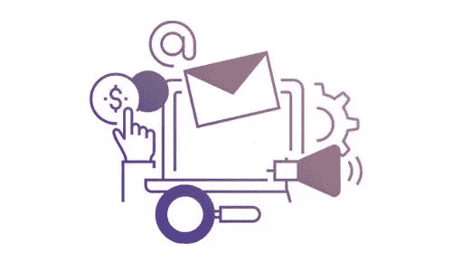

# 为您的 DeFi 应用寻找最佳的 DeFi 营销解决方案

> 原文：<https://medium.com/coinmonks/scrape-the-best-defi-marketing-solutions-for-your-defi-application-288ca7b4742b?source=collection_archive---------31----------------------->

在营销和广告加密或区块链项目的工业水平，最好的结果得到了证实。根据 DappRadar 的报告和估计，人们可以很容易地承认成功的项目和技术。现在有一种金融体系可以替代传统的金融体系。在安全性、透明性、无权限控制以及没有中介等方面，都不是什么好东西。所有这些功能都包含在分散的区块链平台中，可以成为 DeFi 应用程序。

Source:Appdupe

除了 DeFi 之外，没有其他平台或项目可以与所有基本标准相竞争。因此，为了更好地传播这些不朽的概念，我们需要使用营销解决方案来推广它们。有抱负的企业家可以寻找和狩猎营销解决方案提供商的有利可图的机会。有顶尖的商业巨头[为您提供 DeFi 营销服务](https://www.appdupe.com/defi-marketing-services?utm_source=medium&utm_medium=article&utm_campaign=monika)。

因此，立即从这篇文章中获取智慧，并通过营销 DeFi 项目展示您的反馈。现在，真正了解营销将如何带领你的企业建立自己的帝国。

## 🔥**DeFi 项目的上市前阶段**

在推广 DeFi 项目之前，需要使用某些工具。这些是:

🔗**需求的深度分析**:DeFi 项目必须经过严格的审查以了解需求。专家小组将通过评估营销计划的项目需求来完成这一步。这些需求将决定你的 DeFi 项目的目标。

🔗**用热门话题提升品牌:**营销 DeFi 项目的首要阶段是确保您的 DeFi 应用程序是否是热门网站。在 DeFi 相关的网站上提高你的项目的知名度对于获得知名度是至关重要的。

🔗**内容创作和推广:**搜索引擎优化的作用就是发布内容，获得排名。通过以文章或博客的形式发布信息内容来与其他网站竞争是有意义的。内容创作者在设计能让主题得到认可的信息方面起着至关重要的作用。

🔗**绩效控制:**至此，营销需求告一段落。调整工具、创建营销策略、内容和推广是重要的方面。有许多方法甚至可以通过记录回应来跟踪营销策略的执行情况。

🔗**整体优化:**通过注意网站、内容和营销解决方案的表现，人们可以很容易地了解受众基础的实力。在验证正确解决方案的几次启动和经验试验后，整体性能将达到最佳。

> 交易新手？试试[密码交易机器人](/coinmonks/crypto-trading-bot-c2ffce8acb2a)或者[复制交易](/coinmonks/top-10-crypto-copy-trading-platforms-for-beginners-d0c37c7d698c)

Source: gettyimages

## 🔥**为 DeFi 营销机构的 DeFi 项目提供营销解决方案**

📢**网站开发**:开发一个吸引人的网站和令人难以置信的内容的需求会抓住用户的注意力。登陆网页是首要考虑的方面。因此，对这个网站给予最大的关注将会给观众群带来反馈。

📢**DeFi Coin**:DeFi 业务涉及将其项目在最顶层平台上市。所以获得人气和知名度是一件容易的事情。

📢**公共关系**:媒体的存在可以在短时间内将你的生意推向巅峰。利用正确的公共关系策略会让用户知道你在做什么。你可以通过多种渠道与他们交流，了解他们的需求。

📢**内容营销**:通过有效的内容来推广 DeFi 的产品和应用。内容创作者将负责这一步。有专家通过使用正确的工具和获得市场来推广 DeFi 产品。

source:gettyimages

📢电子邮件营销:电子邮件营销的重要性在于它可以帮助你接触到数十亿人。使用群发邮件的电子邮件营销可以做到这一点。你可以向不同的人发送电子邮件，并向众多做出回应的人跟进。

📢**视频营销**:甚至通过视频宣传 DeFi 项目也能即兴发挥，增强你的营销。因为图片比文字更能说明问题，这是一句众所周知的名言。除了解释，给他们看视频也有意义，还能增加用户群。

📢社交媒体频道:你一定不能忽略现在在人们生活中起着至关重要作用的这一部分。人们可以在社交媒体渠道上找到数十亿活跃用户。脸书、Reddit、Instagram、Twitter 和 LinkedIn 等社交网站是推广 DeFi 项目的最佳选择。

📢影响者营销:雇佣已经是名人的最佳影响者也是正确的手段。这些有影响力的人会有他们的追随者，他们作为品牌大使来推广 DeFi 的产品。

## 🔥**结论**

此后，我总结了我的想法，即全球 DeFi 项目是引人注目的应用程序。虽然有几个区块链平台，但分散的应用程序和项目，如 Pancakeswap、Sushiswap 和 Avalanche，在密码行业产生了影响。

营销的最终解决方案是找到目标受众，并着眼于他们进行扩张。用有利可图的营销策略征服世界确保了这些与 DeFi 相关的产品和服务的推广。[抓住最好的 DeFi 营销服务核心](https://www.appdupe.com/defi-marketing-services?utm_source=medium&utm_medium=article&utm_campaign=monika)并拓展您的业务。

> *加入 Coinmonks* [*电报频道*](https://t.me/coincodecap) *和* [*Youtube 频道*](https://www.youtube.com/c/coinmonks/videos) *了解加密交易和投资*

# 另外，阅读

*   [Bookmap 评论](https://coincodecap.com/bookmap-review-2021-best-trading-software) | [美国 5 大最佳加密交易所](https://coincodecap.com/crypto-exchange-usa)
*   [密码交易机器人](/coinmonks/crypto-trading-bot-c2ffce8acb2a) | [硬币门评论](https://coincodecap.com/coingate-review)
*   最佳加密[硬件钱包](/coinmonks/hardware-wallets-dfa1211730c6) | [Bitbns 评论](/coinmonks/bitbns-review-38256a07e161)
*   [新加坡十大最佳加密交易所](https://coincodecap.com/crypto-exchange-in-singapore) | [购买 AXS](https://coincodecap.com/buy-axs-token)
*   [红狗赌场评论](https://coincodecap.com/red-dog-casino-review) | [Swyftx 评论](https://coincodecap.com/swyftx-review)