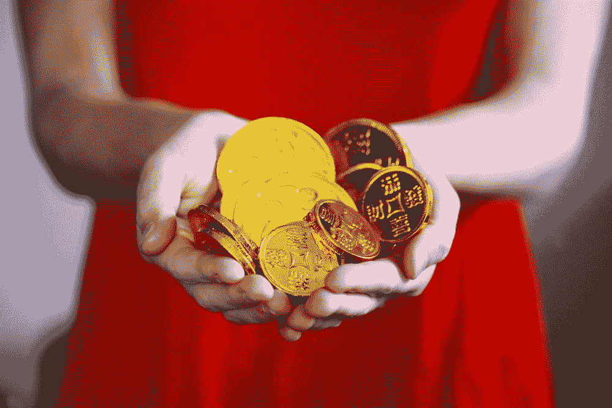

# SEC 因推广加密货币对金·卡戴珊罚款

> 原文：<https://medium.com/coinmonks/sec-fined-kim-kardashian-for-cryptocurrency-promotion-1b1b99b233f0?source=collection_archive---------51----------------------->

金·卡戴珊(Kim Kardashian)因推广一种加密货币被美国证券交易委员会(SEC)罚款 126 万美元，结果证明这是一种欺诈行为。

这位真人秀明星在她的社交媒体账户上推广加密货币，敦促她的数百万粉丝投资该货币。然而，加密货币被证明是一个骗局，购买它的投资者损失惨重…