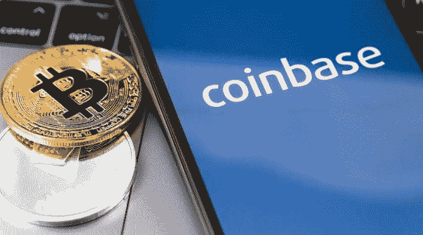
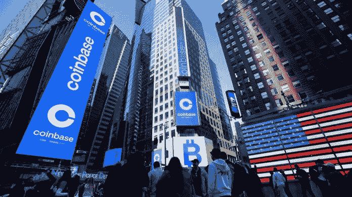

# 据报道，美国证券交易委员会对比特币基地展开调查，指控其交易“未注册证券”

> 原文：<https://medium.com/coinmonks/sec-reportedly-launches-investigation-into-coinbase-alleging-trading-of-unregistered-securities-584534bf8cfa?source=collection_archive---------54----------------------->

据报道，美国证券交易委员会已对比特币基地展开调查，并指控该交易所交易未注册证券。

彭博社报道援引多名消息人士的话说，调查将调查比特币基地是否允许其美国投资者交易本应登记为证券的数字资产。这是一项独立于上周报道的内幕交易调查的调查。

专家表示，由于调查的结果，比特币基地可能面临巨额罚款，甚至可能被要求在美国注册一家交易所。这样的结果，可能会使比特币基地很难以目前的商业模式运营。

比特币基地否认在其网站上列出了任何证券。7 月 25 日，比特币基地首席法律顾问保罗·格雷瓦尔在推特上表示，他对比特币基地不允许证券出现在平台上的“严格的尽职调查程序”充满信心。当美国证券交易委员会开始调查 XRP 是否是一个安全的，这是一个正在进行的案件时，比特币基地也将 XRP 除名。

据报道，美国证券交易委员会已对比特币基地展开调查，并指控该交易所交易未注册证券。

彭博社报道援引多名消息人士的话说，调查将调查比特币基地是否允许其美国投资者交易本应登记为证券的数字资产。这是一项独立于上周报道的[内幕交易](https://bumblebeecrypto.com/2022/07/22/former-coinbase-product-manager-accused-of-insider-trading-and-fraud/)调查的调查。

专家表示，由于调查的结果，比特币基地可能面临巨额罚款，甚至可能被要求在美国注册一家交易所。这样的结果，可能会使比特币基地很难以目前的商业模式运营。

比特币基地否认在其网站上列出了任何证券。7 月 25 日，比特币基地首席法律顾问保罗·格雷瓦尔在推特上表示，他对比特币基地不允许证券出现在平台上的“严格的尽职调查程序”充满信心。当美国证券交易委员会开始调查 XRP 是否是一个安全的，这是一个正在进行的案件时，比特币基地也将 XRP 除名。

报道中的调查也影响到了比特币基地的投资者。调查的消息传出后，比特币基地的股票下跌了 20%以上。凯西·伍德的方舟投资管理公司也出售了超过 140 万股比特币基地股票，价值超过 7500 万美元。

报道中的调查也影响到了比特币基地的投资者。调查的消息传出后，比特币基地的股票下跌了 20%以上。凯西·伍德的方舟投资管理公司也出售了超过 140 万股比特币基地股票，价值超过 7500 万美元。

来源:BumbleBeeCrypto.com

> 交易新手？试试[密码交易机器人](/coinmonks/crypto-trading-bot-c2ffce8acb2a)或者[复制交易](/coinmonks/top-10-crypto-copy-trading-platforms-for-beginners-d0c37c7d698c)