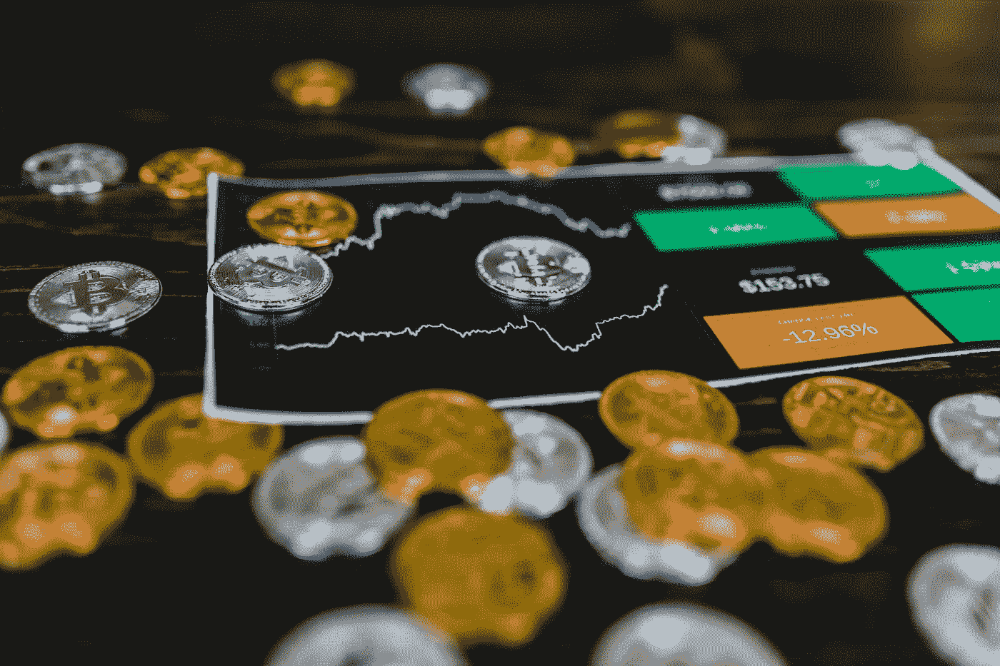

# SEC 与 Ripple Labs:历史、现状和影响

> 原文：<https://medium.com/coinmonks/sec-versus-ripple-labs-history-status-and-implications-95d48ef4c94a?source=collection_archive---------37----------------------->

作者:[克里斯托弗·h·卢，医学博士](https://www.drchrisloomdphd.com/book-online)

Photo by [RODNAE Productions](https://www.pexels.com/photo/selective-focus-photo-of-silver-and-gold-bitcoins-8369648/)

***注:*** *博文由*[*Jasper AI*](https://www.jasper.ai/)*概述并部分撰写，是一个软件平台，是一个 AI 驱动的文案生成器和写作助手。*

***背景***

2020 年 12 月，SEC 对 Ripple Labs (XRP)采取行动，指控其出售价值 13 亿美元的未注册…