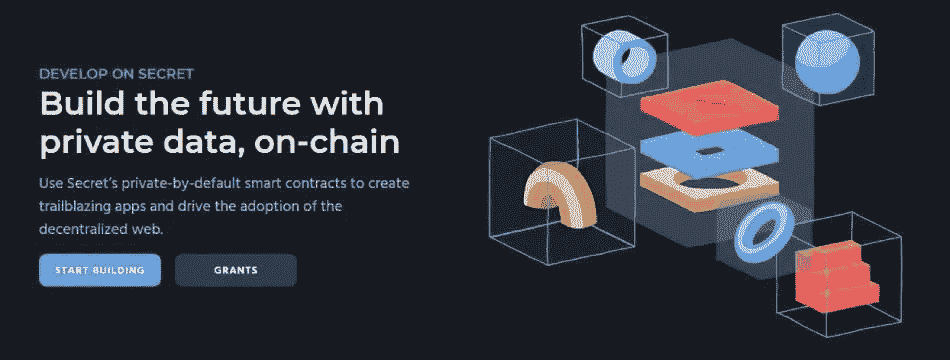

# 秘密网络，区块链，用缺失的隐私元素驱动 Web3 空间

> 原文：<https://medium.com/coinmonks/secret-network-the-blockchain-powering-the-web3-space-with-the-missing-element-of-privacy-488b383e0426?source=collection_archive---------36----------------------->

[Source](https://scrt.network/)

***秘密网络使用户在 Web3*** 中的数据有了隐私

> 从顶级交易者那里复制交易机器人。免费试用。

# 尽管区块链网络给世界带来了积极的转变，但它仍然缺少一些东西

到目前为止，我们一直对使用来自 DEFI、游戏、社交媒体、NFTs 等的区块链驱动的 Dapps 感到兴奋，因为这是开创 Web3 时代的新事物。

这是令人兴奋的赚取加密做不同的活动，无论是赌注或提供 LP 指数，贷款和赚取利息，赚取加密的书面内容(取决于喜欢的内容吸引读者)。

尽管现实生活中有更多的艺术家使用 crypto 作为 NFT 出售他们的艺术或音乐创作，从而获得有保证的版权保护。

因此，这项颠覆性技术改变了一切，赋予用户对其数据、内容和资产的所有权，他们可以在没有银行等中间人的情况下直接放贷，或者在没有中央交易所的情况下直接进行 P2P 交易。

存储在区块链中的记录是不可篡改的，因此区块链有可能减少腐败，提高透明度和效率等

然而，它缺乏一个非常重要的功能，这可能会损害用户的利益，因为区块链是如此透明，以至于用户没有隐私。

# 你在区块链记录的所有互动，所有人都看得见——没有隐私！！

因此，每个人都可以看到您的余额、您的交易，并了解您购买的 NFT、您的 Web3 数字身份、您在 DEFI 中的借贷头寸以及许多此类敏感的个人财务和非财务信息。这会让用户在使用 Web3 平台时感到不舒服。

每个人都有金融隐私的权利，随着越来越多的用户使用各种 Web3 应用程序，区块链的采用越来越多，区块链这种缺乏隐私的空白将会更加明显，并被用户感受到。缺乏隐私限制了我们的表达自由，因为我们觉得我们在区块链中的所有交互都将被任何人看到。

***这就是为什么空间中需要像秘密网络这样专注于隐私的区块链。***

Video explaining how the transparent nature of public Blockchains offers no privacy to users as their data in Blockchain is public and how Secret Network equips users with customizable or programable privacy. This means users have control over their data equipped with ways to share only that portion of the data they want to disclose to someone they trust.

# 注重隐私的区块链秘密网络为用户提供可定制的隐私

Secret Network 的隐私功能是通过设计默认存在的。由于它是使用 Cosmos 的 Tendermint SDK 构建的，因此它是一个可扩展的、符合 IBC 标准的区块链，具有免私人许可的智能合同，所有内置框架都可以构建具有隐私功能的可扩展 dapps。

Secret Network 赋予用户“可定制隐私”的权利，用户可以在必要时与他们信任的任何一方分享他们选择的部分数据。用户对他们的数据拥有真正的所有权，只有那些他们选择与之共享数据的人或团体才能看到这些数据。

[Source](https://scrt.network/). Secret empowers users with true ownership over their data with its data privacy features.

## Secret Network 为用户提供数据隐私保护的方式

秘密网络的保密技术通过使用可信执行环境(TTE)技术、几种加密方案和独特的密钥管理技术而成为可能。

因此，默认情况下，用户数据在秘密网络中被加密。加密的数据包括输入和输出的详细信息，只有拥有查看密钥和查看详细信息许可的人才能看到。用户可以通过查看密钥和许可证与可信方共享数据。

例如，用户可以通过共享他们的查看密钥和许可证，向政府共享必要的数据，以用于税收目的。

Video explains how the Secret Network with its privacy element adds value to the Web3 space and will increase user adoption. As otherwise Blockchains are so open, keeping universally visible records of every transaction and activity of a user in Blockchain that users will be afraid to freely use Web3 dapps with that haunting feeling of being watched.

# 秘密网络的隐私保护功能带来了新的使用案例…

[Source](https://scrt.network/). Secret Network’s private and permission-less smart contracts makes it possible for developers to build privacy powered dapps with novel use cases…

Secret Network 的隐私功能支持在其他公共街区不可能出现的新颖用例。因此，用户的数据交易以加密的形式发送出去，使得加密的信息和通信成为可能。所有这些交易数据都以加密形式存储，从而实现了加密数据存储。

在秘密的 dapps 中，隐私贷款是可能的，在那里用户的附属资料是保密的。

秘密 NFT 的内容和所有权细节是私有的，默认情况下这些细节对公众是不可见的。

Secret Network 的隐私功能允许创建加密的数字艺术品和收藏品，允许用户拥有一个秘密的数字身份，并使用户有可能在担保细节被加密和保密的情况下进行秘密借贷。

## Secret Network 智能合同使用私有元数据运行的特殊能力

Secret Network 为 Web3 空间提供了隐私保护，使用户可以自由使用空间，分散用户对数据的所有权。

Secret Network 的私有智能合同是使用基于 Rust 的智能合同编译工具包 CosmWasm 创建的，该工具包嵌入了具有计算私有元数据能力的智能合同。这就是为什么可以创建秘密的 NFTs，其中 NFT 的所有权和内容细节是私有的。

# 秘密网络的性质不允许交易的前置/MEV

秘密网络的另一个明显的优点是，由于其默认的私有性质，这里没有前端运行/ MEV。这是因为秘密网络的内存池是加密的。即使是在网络中验证事务的验证器也看不到事务数据，所以所有的转换都在块中处理，而验证器不会在前面运行事务。这导致了转换的即时终结，因为验证器不会通过优先处理那些首先获得较高费用的事务来进行区分。

一般来说，在以太坊这样的公共区块链中，所有的交易数据都是可见的，验证者根据交易能获得多少费用来选择他们首先在块中包含什么交易。高价值交易将首先被包括在该块中，因此首先被处理。这一过程被称为前端运行或 MEV，其中验证程序创建一个提取最大可提取价值(MEV)的块，方法是对要包含在该块中的交易进行重新排序，以便从中获取或提取最大价值。

在 Secret Network 中不会发生这种情况，因为 mempool 中的所有数据都是加密的，所以验证器只是按照它在 mempool 中的顺序处理事务，而不参与 MEV，所以事务终结会立即发生，没有延迟。

**了解关于秘密网络的更多信息-:**

自 2020 年初以来，Secret Network 的隐私保护智能合同一直存在于 mainnet 中；该网络包含各种 dappss，这些 dapp 是 Web3 隐私去中心化应用程序，用于提供 DEFI、游戏、通信、liquid staking、NFTs 焦点 dex 等类别的服务…

**密网的 Dapp 生态系统可以在这里探索******——:****

** [## 保护隐私的分散式应用程序|秘密 dApps

### 查看在金融、游戏和访问领域的秘密网络上实时运行的隐私保护 dApps 的完整列表…

scrt.network](https://scrt.network/ecosystem/dapps) 

[Source](https://docs.scrt.network/secret-network-documentation/secret-network-overview). Secret Network’s Ecosystem

Secret Network 拥有一个活跃的社区和 100 多名专注的开发人员。

我写这篇文章的身份是一个秘密特工，传播关于 Web3 隐私和隐私协议的需要，秘密网络给 Web3 空间带来隐私。

[Image Source](https://scrt.network/)

任何人只要对 Secret Network 感兴趣，并希望参与到传播 Secret Network 如何通过向其网络灌输急需但缺失的隐私元素来增强用户和开发者的意识的探索中，就可以成为一名[秘密特工](https://scrt.network/get-involved/become-secret-agent)。

***更多关于*** [***秘密特工的任务就在这里***](https://scrt.network/get-involved/become-secret-agent) ...
[https://scrt . network/get-contained/been-secret-agent](https://scrt.network/get-involved/become-secret-agent)

谢谢你阅读我的帖子…

***您可以通过这些链接了解更多关于秘密网络的信息-***

**首页:***[*https://scrt . network/*](https://scrt.network/)*

***官秘博客:**[*https://scrt . network/Blog*](https://scrt.network/blog)*

***推特:***[*https://twitter.com/secretnetwork*](https://twitter.com/secretnetwork)**

****文档:**[*https://build . scrt . network*](https://build.scrt.network)**

> **加入 Coinmonks [电报频道](https://t.me/coincodecap)和 [Youtube 频道](https://www.youtube.com/c/coinmonks/videos)了解加密交易和投资**

# **另外，阅读**

*   **[加密交易机器人](/coinmonks/crypto-trading-bot-c2ffce8acb2a) | [OKEx vs 币安](https://coincodecap.com/okex-vs-binance)**
*   **[币安 vs FTX](https://coincodecap.com/binance-vs-ftx) | [最佳(SOL)索拉纳钱包](https://coincodecap.com/solana-wallets)**
*   **[如何在 Uniswap 上交换加密？](https://coincodecap.com/swap-crypto-on-uniswap) | [A-Ads 评论](https://coincodecap.com/a-ads-review)**
*   **[加密货币储蓄账户](/coinmonks/cryptocurrency-savings-accounts-be3bc0feffbf) | [YoBit 评论](/coinmonks/yobit-review-175464162c62)**
*   **[Botsfolio vs nap bots vs Mudrex](/coinmonks/botsfolio-vs-napbots-vs-mudrex-c81344970c02)|[gate . io 交流回顾](/coinmonks/gate-io-exchange-review-61bf87b7078f)****