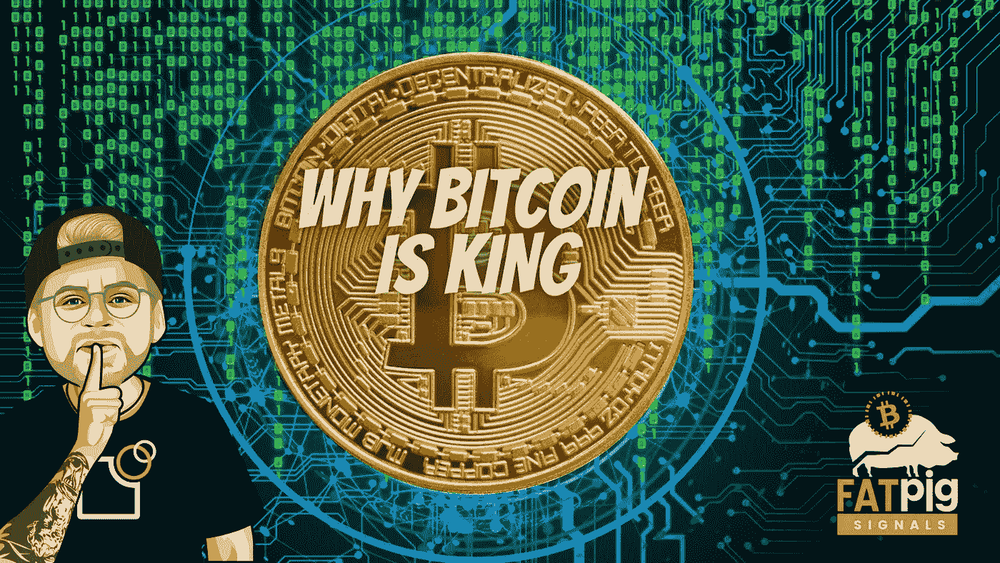

# 揭秘:NFT 的比特币、美元币和稳定币交易即将上线？

> 原文：<https://medium.com/coinmonks/secret-nfts-dollar-and-stablecoin-transactions-soon-on-bitcoin-858730ef9d3c?source=collection_archive---------6----------------------->

如果不那么悲伤的话，这几乎会很有趣。在欧洲议会，一些政治团体正在全力以赴破坏欧洲的数字未来。政客们想要的是控制而不是创新，他们试图在数字空间建立之前就摧毁它的隐私。所谓的云母条例容纳的炸药比人们想象的要多。