# 安全多方计算(sMPC) —无需共享的协作

> 原文：<https://medium.com/coinmonks/secure-multi-party-computing-smpc-collaboration-without-sharing-f92b4a6e3ceb?source=collection_archive---------2----------------------->


A computer party on new years eve… The year 2000

分析大数据的下一步是共享数据，这将引导我们进行创新。分享数据可以让我们创造出让我们的生活变得更轻松的产品(上帝保佑自动驾驶汽车、医疗保健提示，以及那些完美总结了我们深夜复杂的思想流的 tik-Tok 等等。).

这一切都很好，直到我们被背叛，有人与黑暗面分享我们的数据(咳……2020 年美国大选)。这就是为什么隐私是至关重要的，也是为什么许多组织开始接受隐私增强技术(PET)的原因。隐私技术是一个广泛的领域，从零知识证明到环签名，今天，我们将只关注安全多方计算(sMPC)。

**💻** [**什么是安全多方计算？**](#a3ac)

**💼** [**用例**](#3444)

**💰** [**姚的百万富翁问题**](#409b)

**🔐** [**同态加密**](#1cbc)

**👨‍👦‍👦** [**【阈值签名】**](#6c75)

**📪** [**浑然不觉的转移**](#3444)

**🏬** [**不同的 MPC 实现**](#5748)

**📚** [**附加资源**](#0374)

# 什么是安全多方计算(sMPC)？

对 MPC 的简单描述是，它是一个软件解决方案，允许多方就一个答案进行合作，而不会互相泄露他们的数据。

> 安全多方计算(MPC)使一组相互不信任或不信任任何公共第三方的独立数据所有者能够联合计算一个依赖于他们所有私有输入的函数。
> 
> -安全计算，姜维

# 用例

多方计算已经存在很多年了，在区块链和密码领域之外有一些应用，包括广告优化、机器学习等。下面是几个值得注意的使用 MPC 的案例。

**甜菜的私人拍卖**


Photo by [Nick Collins](https://unsplash.com/es/@webdesignnewcastle?utm_source=medium&utm_medium=referral) on [Unsplash](https://unsplash.com?utm_source=medium&utm_medium=referral)

该技术的首次大规模商业应用是在丹麦的密封投标甜菜拍卖中用于保护隐私。

在这种类型的拍卖中，最高出价者获胜，但支付第二高出价者提出的价格。

MPC 使甜菜种植者能够在不透露他们愿意向当时唯一的丹麦甜菜加工商 Danisco 支付多少的情况下进行投标。

[https://CSRC . NIST . gov/CSRC/media/events/meeting-on-privacy-enhanced-cryptography/documents/toft . pdf](https://csrc.nist.gov/csrc/media/events/meeting-on-privacy-enhancing-cryptography/documents/toft.pdf)

**薪资不平等**

波士顿市和波士顿妇女劳动力委员会(BWWC)需要确定不同性别和种族在不同就业级别(从高管到入门级)的薪酬不平等现象。为了防止任何人的工资在这项研究中暴露，波士顿大学创建了一个工具，允许雇主私下提交工资数据。这项工作间接导致国会将安全多方计算作为一项考虑因素纳入“2017 年学生知情权法案”。

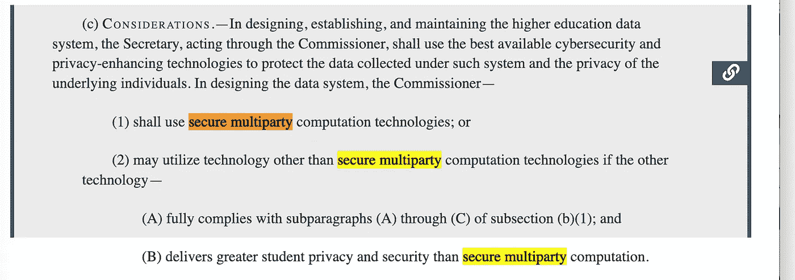

Captured from the Congress bill: [https://www.congress.gov/bill/115th-congress/senate-bill/2169/text](https://www.congress.gov/bill/115th-congress/senate-bill/2169/text)

[](https://thebwwc.org/wage-gap-studies) [## 数据—波士顿女性劳动力委员会

### 在一个女性占一半以上居民和一半劳动力的城市，波士顿的薪酬平等不仅是一个重要的问题

thebwwc.org](https://thebwwc.org/wage-gap-studies) 

**密钥管理**

今天，许多保护加密资产的公司依赖于 MPC 技术，包括 PayPal、脸书、比特币基地和 BNY 梅隆公司(基于他们收购或宣布与 Curv、Unbound 等 MPC 公司的关系)。).

> **关于加密资产的一些信息…**
> 
> 加密资产用密钥对(公钥和私钥)表示。加密钱包地址是从公钥导出的，而公钥是从私钥导出的。
> 
> 问题是你不能逆向操作，你不能使用地址或公钥来导出私钥。拥有私钥的任何人都可以证明加密资产的所有权并签署交易(这实质上意味着他们可以花费/发送加密)。
> 
> 因此有这样一句话，“不是你的钥匙，也不是你的硬币”。

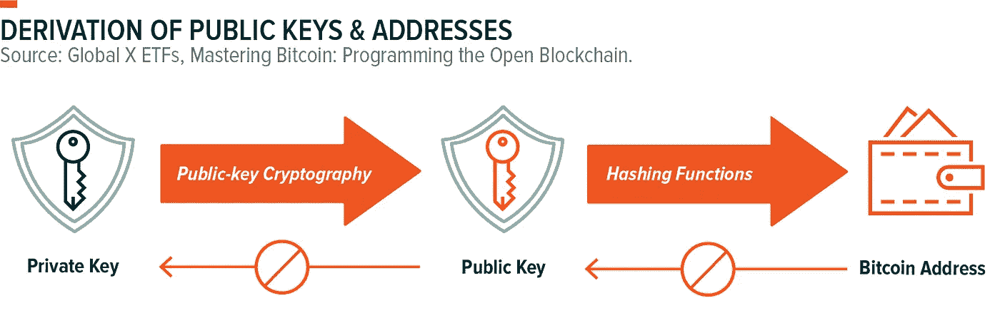

Image from [https://www.globalxetfs.com/bitcoin-the-basics/](https://www.globalxetfs.com/bitcoin-the-basics/)

MPC 用于防止加密密钥的“单点破坏”,任何设备或团体都不能单独拥有或使用加密密钥。每一方(机器或实体)使用他们的“拼图”为交易联合产生一个单一的签名

***剧情转折:*** *在这个解决方案中从来没有实际的按键，他们使用的变量是模仿一个按键的一部分动作。*

***另一个剧情转折:*** *代表一个键的各个片段的变量从来不会组合在一个地方。相反，他们使用同态加密来共同创建类似的密钥块并对交易进行签名。*

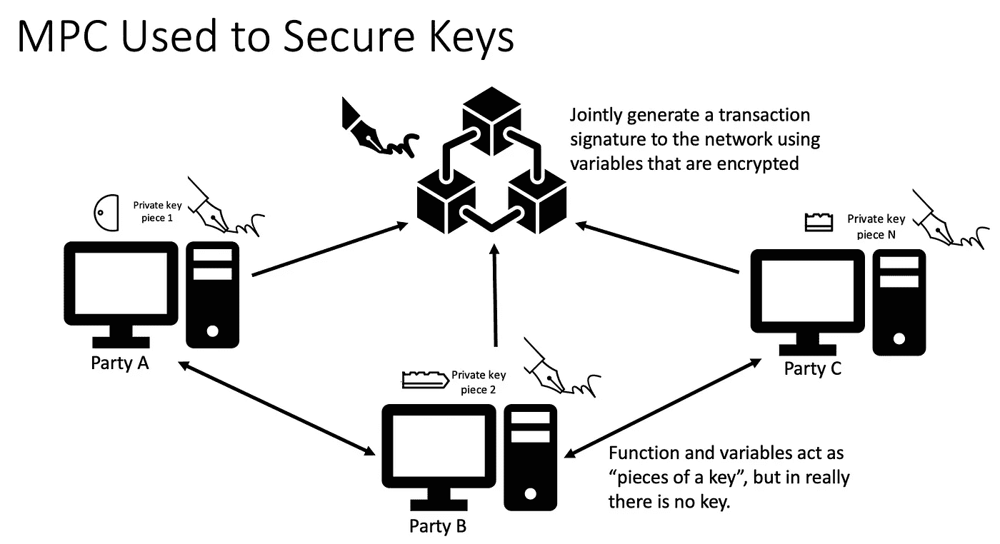

下面是一些在加密资产领域解决 MPC 问题的开源库:

**unbounded 的实验性 MPC 实施——目前在 Archieve(自 2021 年起)**

[](https://github.com/unboundsecurity/blockchain-crypto-mpc) [## GitHub-unboundsecurity/区块链-crypto-mpc:保护加密签名密钥和种子…

### 因此，从 2021 年 9 月 1 日开始，将发生以下变化:未绑定将为此停止维护…

github.com](https://github.com/unboundsecurity/blockchain-crypto-mpc) 

**ZenGo 的 MPC 过信号**

[](https://github.com/ZenGo-X/mpc-over-signal) [## GitHub — ZenGo-X/mpc-over-signal:运行由 signal 支持的 mpc 协议的安全传输

### 这个库提供了一个高级接口，用于连接到信号服务器，并使用它与…

github.com](https://github.com/ZenGo-X/mpc-over-signal) 

**曾戈的 MPC ECDSA**

[](https://github.com/ZenGo-X/multi-party-ecdsa) [## GitHub—ZenGo-X/multi-party-ECD sa:{ t，n}-threshold ECDSA(椭圆曲线…

### {t，n }-门限椭圆曲线数字签名算法的 Rust 实现。— GitHub …

github.com](https://github.com/ZenGo-X/multi-party-ecdsa) 

**金牛座集团——使用实施 CGGMP**

[](https://github.com/taurusgroup/multi-party-sig) [## GitHub—Taurus group/multi-party-SIG:门限签名协议的实现

### 多方门限签名的 Go 实现:ECDSA，使用 Canetti 等人的“CGGMP”协议…

github.com](https://github.com/taurusgroup/multi-party-sig) 

# 姚的百万富翁问题

1982 年，姚提出了"姚的百万富翁问题",鲍勃和爱丽丝想知道谁更富有，但却不想透露他们的财富。为了解决百万富翁问题，姚提出了一个基于乱码电路的两方计算(2PC)协议。

姚的百万富翁问题——爱丽丝和鲍勃的平均净资产是多少？

在这个场景中，我们将尝试找出 Alice 和 Bob 之间的平均财富。我们不希望鲍勃或爱丽丝透露他们的财富，这就是 sMPC(安全多方计算)发挥作用的地方。

1.  爱丽丝和鲍勃将他们的财富分成秘密股份，这些股份是随机的，所有加起来都是他们的财富(即，爱丽丝的秘密股份 200 万美元+600 万美元+-300 万美元= 500 万美元)

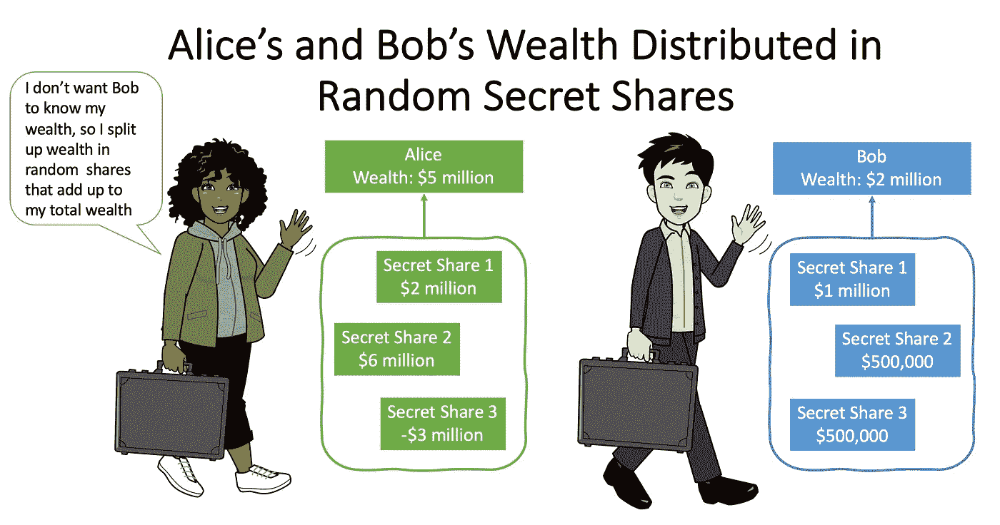

2.Alice 和 Bob 随机地将他们的份额分发给彼此，此时，这些份额对彼此来说毫无意义。

3.Alice 和 Bob 将他们所有的股份相加(即 Alice 的股份包括 Bob 的秘密股份 500，000 美元和她的股份 200 万美元和 600 万美元，加起来总共是 850 万美元)。

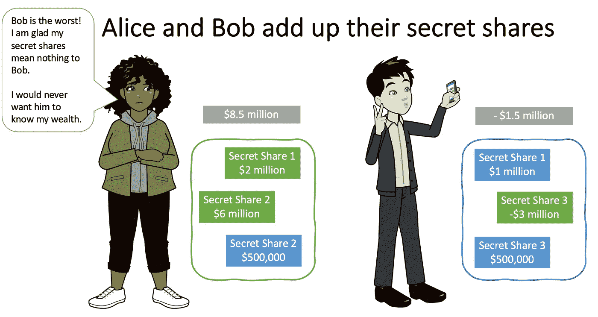

3.Alice 和 Bob 将他们在步骤 2 中的结果(他们的股份相加的结果)结合起来，计算他们的平均工资。

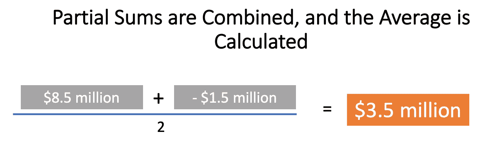

> 免责声明:这是一个过于简化的 MPC 和姚百万富翁问题的解释。

# 同态加密

为了保护隐私，我们需要在不解密和查看的情况下处理加密的数据，这就是同态加密的用武之地。

> 同态加密允许对[加密的](https://www.techtarget.com/searchsecurity/definition/encryption)数据执行数学运算(布尔运算和算术运算),而不会危及加密。


## 同态加密的目标

在允许对加密数据进行有限次数的加法或乘法运算后，它必须提供一个结果，该结果与没有加密时的结果相同。

> “所以，基本上，任何人都可以进来，他们可以把手伸进手套里，操纵锁着的盒子里的东西。他们拉不出来，但可以操纵；他们可以处理它。他们可以拿原材料，在盒子里生产出一条项链或什么东西。你知道，他们完成后，[有私钥的人]必须带着秘钥来打开它，只有他们才能从中提取成品。”
> 
> 克雷格·金特里博士


## 同态加密的类型

同态加密有三种，*部分*同态(PHE)、*有点*同态(她)、以及*完全*同态加密(FHE)。它们因对加密数据执行的数学运算的类型和频率而异。

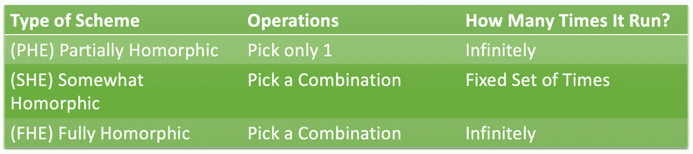

**部分同质(PHE)**

PHE 只允许对加密值执行选择的数学函数。这意味着只有一个操作，或者加法或者乘法，可以对加密数据执行无限次。这种运算只能是加法或乘法。

***选你的毒:*** *挑一个操作，可以无限使用*

```
Ciphertext 1 + Ciphertext 2 + Ciphertext 3 +… + Ciphertext N
```

PHE 的几个例子是 RSA 加密(乘法同态*)、pallier 加密(加法同态)和 ElGamal 加密(乘法同态)。

*   *RSA 基于取幂运算:C = (m^x) (mod n)，其中 m 是消息，x 是密钥。指数法则说(a^n)(b^n)=(ab)^n.这意味着用相同的密钥加密的两个密文相乘相当于将明文的乘积提高到密钥的幂。*

**有点同形(她)**

她支持一定复杂度的有限运算(例如，加法*或*乘法),但是这些运算只能执行一定的次数。

例如，某种同态加密算法可以支持多达四次加法或乘法的任意组合。但是，任何一种类型的第五次操作都会产生无效结果。

***选择你的毒药:*** *选择一个操作组合，并使用它一定次数。*

```
Ciphertext 1 + Ciphertext 2 x Ciphertext 3 + Ciphertext 4
```

**全同态(FHE)**

使用全同态加密，您可以拥有所有操作的组合，并无限地运行它们。主要的 FHE 方案基于 LWE(带误差的学习)、环 LWE、NTRU 和近似 GCD 问题。

***选你的毒:*** *挑一个操作组合，无限使用*

```
Ciphertext 1 + Ciphertext 2 x Ciphertext 3 x … + Ciphertext N
```

Craig Gentry 博士提出了第一个基于[格密码](/cryptoblog/what-is-lattice-based-cryptography-why-should-you-care-dbf9957ab717)的 FHE 方案。看看克雷格·金特里博士关于 FHE 的论文:

https://crypto.stanford.edu/craig/craig-thesis.pdf

遗憾的是，FHE 在性能和存储要求方面有局限性，而且它仍在不断改进中。你不能拥有一切！

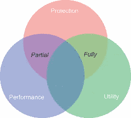

From Science Direct ([https://www.sciencedirect.com/topics/computer-science/fully-homomorphic-encryption](https://www.sciencedirect.com/topics/computer-science/fully-homomorphic-encryption))

## 开源同态加密

**拉蒂戈**

[](https://github.com/tuneinsight/lattigo) [## GitHub—tune insight/la ttigo:Go 中基于格的同态加密库

### Lattigo 是一个 go 模块，它实现了基于带错误的环学习的同态加密原语和…

github.com](https://github.com/tuneinsight/lattigo) 

**微软海豹突击队**

[](https://www.microsoft.com/en-us/research/project/microsoft-seal/) [## 微软海豹突击队:快速易用的同态加密库

### 由开源同态加密技术支持的微软海豹突击队提供了一套加密库…

www.microsoft.com](https://www.microsoft.com/en-us/research/project/microsoft-seal/) 

**围护**

[](https://gitlab.com/palisade/palisade-release) [## 栅栏/栅栏释放 GitLab

### 这是栅栏点阵密码库的稳定版本。当前版本是 1.11.7(发布于…

gitlab.com](https://gitlab.com/palisade/palisade-release) 

**HElib**

[](https://github.com/homenc/HElib) [## GitHub — homenc/HElib: HElib 是一个开源软件库，实现了同态…

### HElib 是一个实现同态加密的开源软件库。它以…支持 BGV 计划

github.com](https://github.com/homenc/HElib) 

# 阈值签名

> 门限签名(TSS)允许各方共享数字签名消息的能力。

门限签名需要被授权代表群组生成签名的各方的子集([访问结构](https://en.wikipedia.org/wiki/Access_structure))。仅当阈值(t/n，t =签名者阈值，n =签名者总数)的签名者在消息上签名时，该消息才被认为已签名。

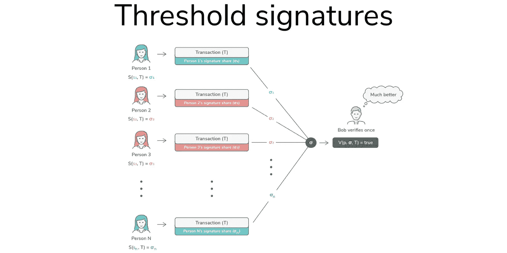

Source: [https://blog.keep.network/threshold-ecdsa-safer-more-private-multi-signatures-51153f3e9ed2](https://blog.keep.network/threshold-ecdsa-safer-more-private-multi-signatures-51153f3e9ed2)

门限签名方案的例子有 El Gamal、Schnorr 和多重签名。多重签名具有额外的特征，揭示了产生它们的组成员的身份。

**TSS 和沙米尔秘密共享方案(SSSS)听起来很相似…**

TSS 和 SSSS 是相似的，因为它们需要来自群体的一定数量的参与者在秘密上合作。TSS 和 SSSS 的最大区别在于，由一个集中的“交易商”来处理秘密份额的生成过程和重组。为了保证加密货币的安全，SSSS 的“经销商”将生成所有的密钥份额，将它们分发给所有不同的方，并在签名时，在一个地方重新生成私钥。有了 TSS，私钥永远不会在一个地方。

[](https://blog.coinbase.com/threshold-digital-signatures-1d467054acd4) [## 阈值数字签名

### 作者:卡桑德拉·哈特，阿拉什·阿夫沙尔

blog.coinbase.com](https://blog.coinbase.com/threshold-digital-signatures-1d467054acd4) 

查看 Rosario Gennaro 关于门限签名以及如何与 RSA 签名一起使用的讲座:

# 遗忘转移

在我们进入不同协议的实质之前，我们要回顾一下什么是遗忘转移，相信我，当我们进入姚的乱码电路协议时，这一切都联系起来了。

不经意传输基于 Diffie Hellman 密钥交换协议*。遗忘传输允许发送者发送两条秘密消息作为 OT 机器的输入，而不知道哪条消息将被接受。接收者会选择他们想要接收的消息，而不让发送者知道。

> 什么是 Diffie Hellman 密钥交换协议？*
> 
> Diffie Hellman 是一种端到端的加密密钥交换方法，它允许双方通过向每一方提供足够的信息来获得相同的秘密，而无需共享该秘密，从而实现安全通信。

[](/insatiableminds/diffie-hellman-and-why-its-needed-df558e808fea) [## Diffie Hellman 和为什么需要它

### Diffie Hellman 是一种端到端的加密密钥交换方法，它允许双方通过提供…

medium.com](/insatiableminds/diffie-hellman-and-why-its-needed-df558e808fea) 

现在让我们来看看爱丽丝和鲍勃关于遗忘转移的故事…

***Bob 生成了 2 个 El Gamal 公钥，Alice 可以用它来加密她的两条消息。***

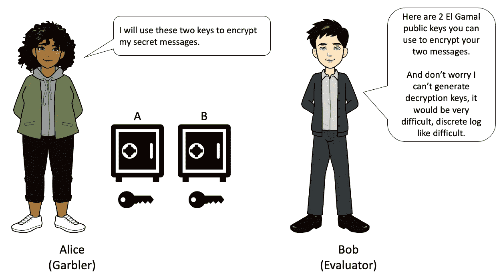

Alice 使用 Bob 发送的公钥加密她的两条消息，并将消息发送给 Bob。

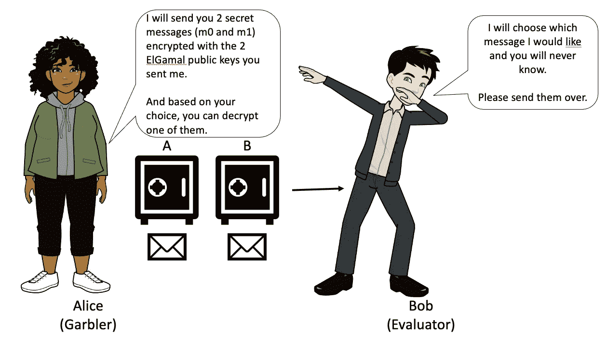

Bob 使用他的选择密钥来解密他所做的选择。他无法解密另一条信息，爱丽丝也永远不会知道他的选择。

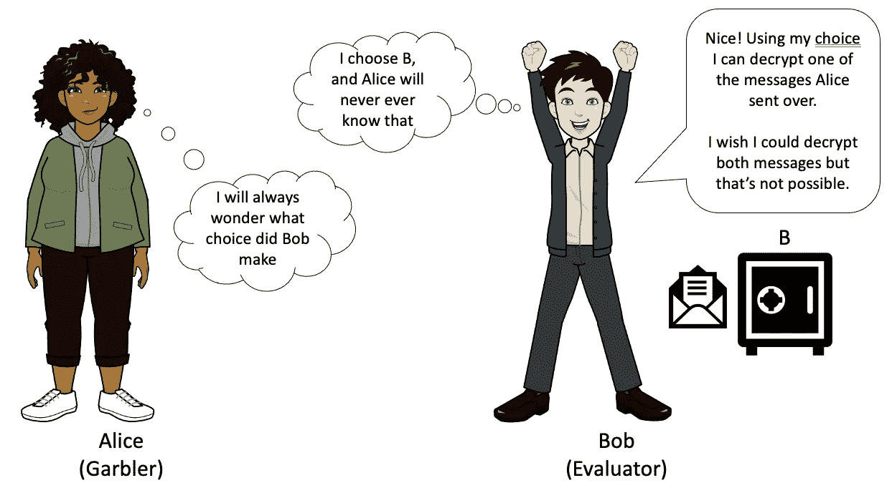

瞧啊。这是遗忘转移的高级别，请参考下面的资源以获得更深入的理解。

## 斯坦福大学关于不经意传输和混乱电路的讲座

以下是斯坦福大学关于不经意传输和乱码电路的讲座:

[https://crypto.stanford.edu/cs355/18sp/lec6.pdf](https://crypto.stanford.edu/cs355/18sp/lec6.pdf)

## 关于 ADI 工程的 3 部分博客

[](https://ez.analog.com/ez-blogs/b/engineerzone-spotlight/posts/garbled-circuits-part-3-oblivious-transfer) [## 混乱电路第 3 部分:不经意传输

### 在乱码电路系列的第 2 部分中，我们看到私下评估任意函数是可能的…

ez.analog.com](https://ez.analog.com/ez-blogs/b/engineerzone-spotlight/posts/garbled-circuits-part-3-oblivious-transfer) 

## 比尔·布坎南教授 OBE 关于疏忽转移的视频

# 不同的 MPC 实现

目前使用的 MPC 算法相当多，有姚协议、Gennaro & Goldfeder、Lindel、Doerner、MPC CMP、PSI (Private Set Intersection)等。

## 姚议定书

姚的协议是最简单的 MPC 形式，它引入了乱码电路。它是为“诚实但好奇”(半诚实)的情况而构建的，在这种情况下，各方遵循协议来创建和评估电路，但可能会在交换过程中尝试学习额外的信息。还有恶意的场景或拜占庭式的对抗，这是这个特定协议没有考虑到的。

***姚的乱码电路协议是如何工作的？***

Yao 的协议用一个“混淆器”和一个“评估器”解决了双方隐私保护计算混淆器获取结果并像混洗一样混淆它们，评估器从混洗的输入中得出结果。

在进入乐趣之前，我们需要首先把我们需要评估的函数转换成一个门电路。

**盖茨**

任何离散的、固定大小的功能都可以用逻辑门(与、或、非、异或等)来实现。)并且可以表示为真值表。查看[https://byjus.com/jee/basic-logic-gates/](https://byjus.com/jee/basic-logic-gates/)深入了解盖茨镇。

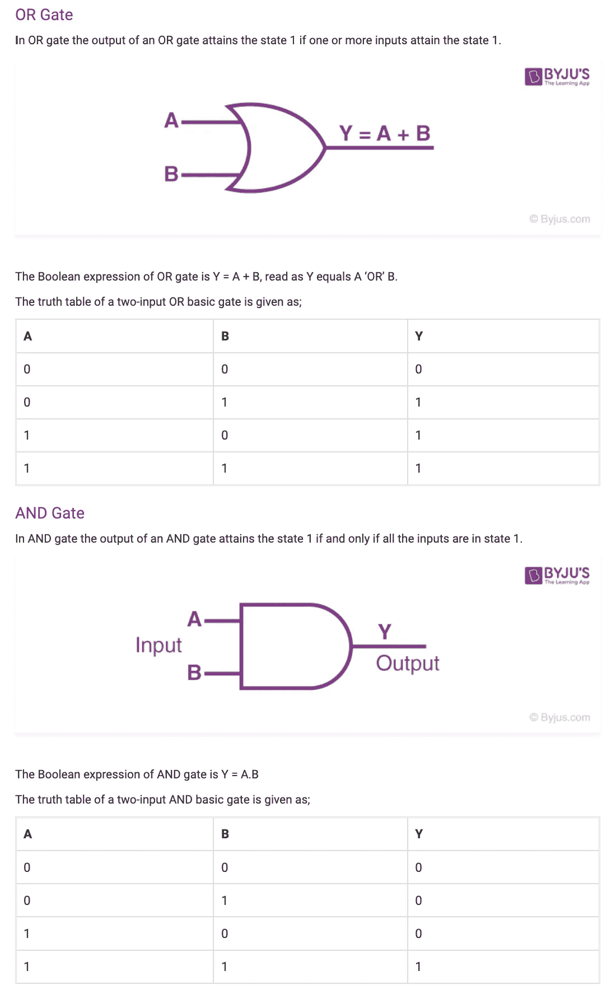

Screenshotted from [https://byjus.com/jee/basic-logic-gates/](https://byjus.com/jee/basic-logic-gates/)

使用上面的图像，表达式 AB + BC + AC 在电路中看起来会像下面的图像。

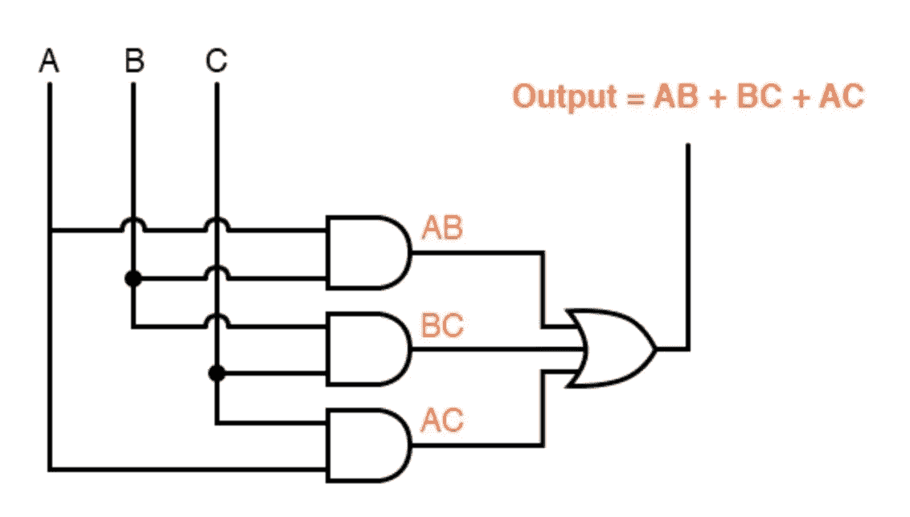

现在的目标是加密电路，这样我们就不会知道电路的输入和输出，但仍能产生一个输出，用作下一个门的输入。

**电路混乱**

加密电路的真值表被称为“乱码电路”在混淆电路中，我们有一个评估器和一个混淆器，名称说明了一切，混淆器是混淆电路的人，评估器是评估电路的人。下面是乱码电路的故事:

***爱丽丝通过将她的功能转换成电路来创建她的“真值表”***

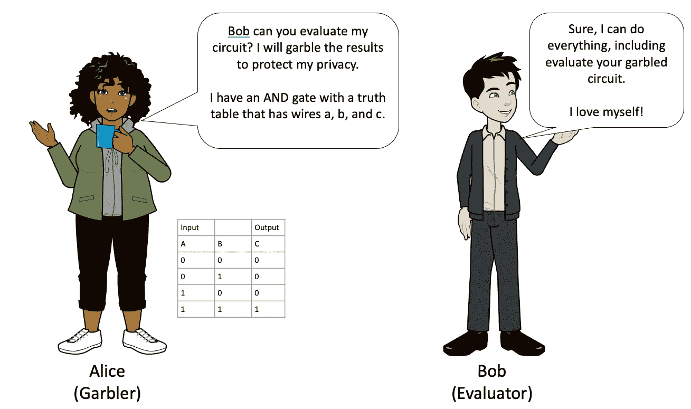

***爱丽丝篡改她的真值表并加密她的输出密钥***

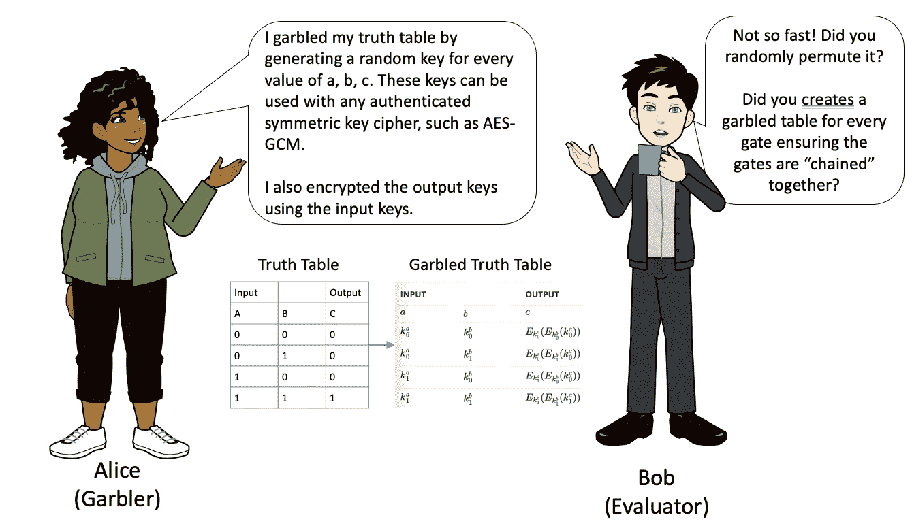

***爱丽丝发送了乱码电路和她的加密密钥，现在鲍勃几乎准备好评估***

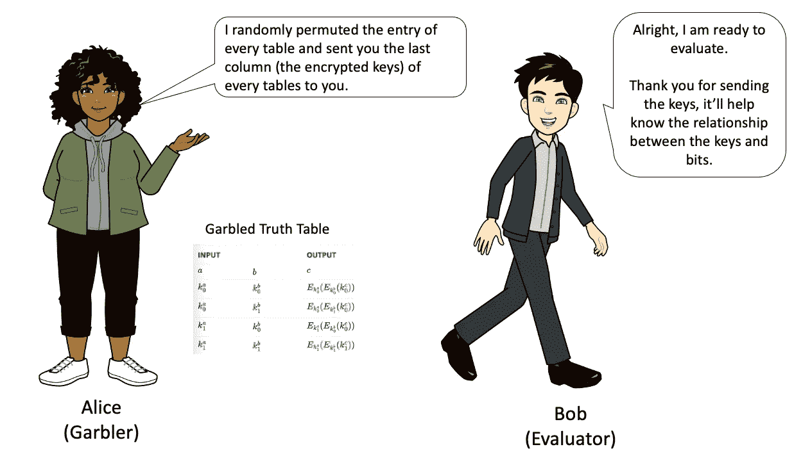

爱丽丝让鲍勃把他的钥匙寄给她

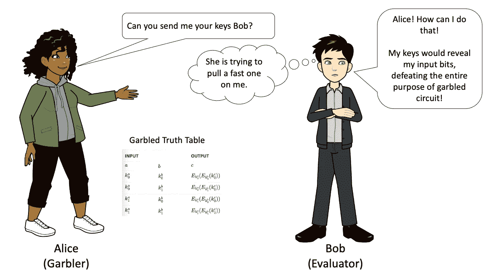

***鲍勃不能发送他的钥匙，所以爱丽丝提议使用不经意传输***

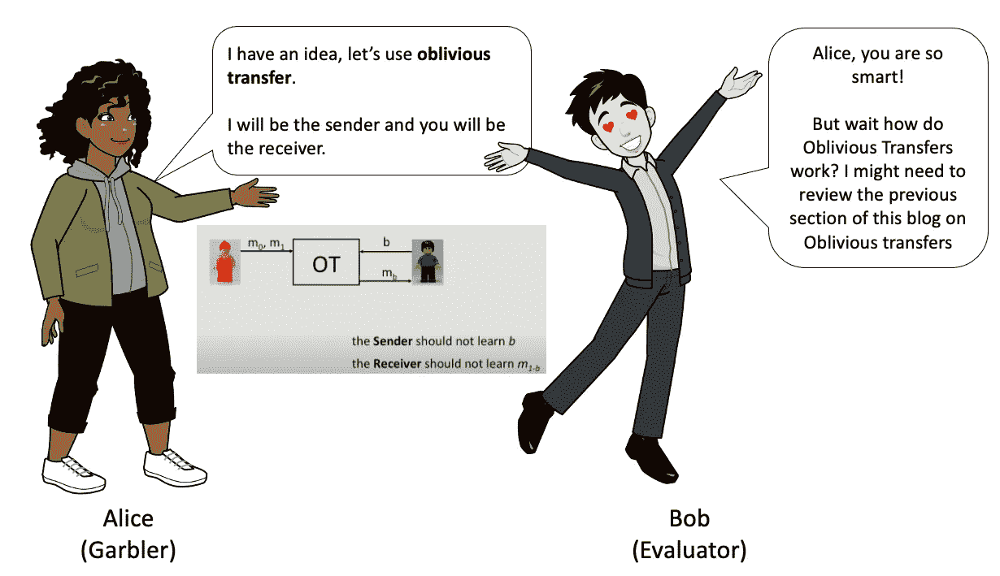

查看 Ku·鲁汶·科西克研究中心对乱码电路的介绍:

[https://www . esat . kule uven . be/cosic/blog/introduction-to-garbaged-circuit/](https://www.esat.kuleuven.be/cosic/blog/introduction-to-garbled-circuit/)

[](https://ez.analog.com/ez-blogs/b/engineerzone-spotlight/posts/how-and-why-to-garble-your-circuits) [## 如何(以及为什么)扰乱你的电路

### 你遭遇海难，被困在一个偏僻的小岛上，需要逃离。另一个幸存者发现了一个废弃的空气…

ez.analog.com](https://ez.analog.com/ez-blogs/b/engineerzone-spotlight/posts/how-and-why-to-garble-your-circuits) 

## 私有集合交集

我们中的许多人已经与 Google 的 MPC 实现进行过交互。当谷歌 Chrome 通知你你的密码被泄露时，他们使用 MPC，具体来说是 PSI。

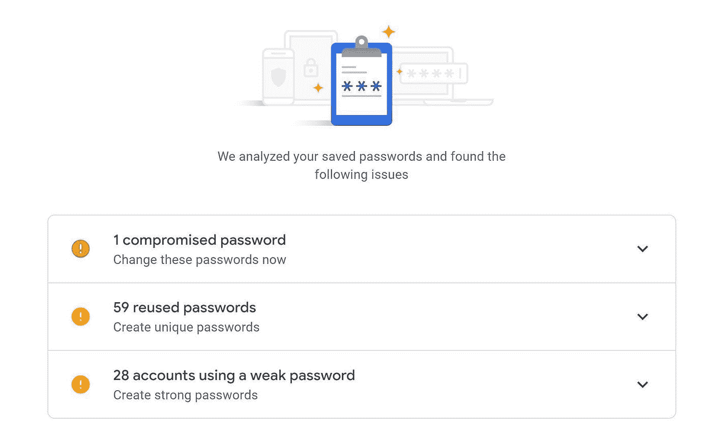

他们不会读取您的密码。相反，他们使用他们的 MPC 实现，私有连接和计算，他们交叉引用您的加密密码与一个加密的妥协密码列表。

下面是谷歌在 PSI 上的一个很好的视频:

这张信息图澄清了 MPC 中的几个难懂的概念:

[https://storage . Google APIs . com/gweb-uni blog-publish-prod/documents/private _ join _ and _ compute . pdf](https://storage.googleapis.com/gweb-uniblog-publish-prod/documents/private_join_and_compute.pdf)

## MPC CMP(统一通信非交互式、主动式、阈值 ECDSA)

MPC CMP 基于 Gennaro(城市学院，纽约市立大学)和 Goldfeder(康奈尔)以及 Lindell & Nof 协议。它是由 Ran Canetti(波士顿大学)、Nikolaos Makriyannis(耐火砖)和 Udi Peled(耐火砖)设计的。MPC CMP 解决以下问题:

*   **签名轮数减少(性能):**签名生成需要 4 轮，而之前需要 8 轮。
*   **非交互式(冷钱包支持):**签名生成回合中的 3 个回合在签名消息已知之前在预处理中完成，考虑到非交互式属性，其中不需要所有机器同时在线。
*   **可识别的中止(责任)**:在失败的情况下，识别错误的/恶意的签名者。
*   **主动安全(自适应对手安全):**针对自适应对手保护长期安全。适应性对手是允许动态进化的对手，有适应性在线对手(中等对手)和适应性离线对手(强对手)。
*   **UC (Universal Composable)安全性:**它使用了全局随机预言模型的 UC 框架、强 RSA、Paillier 加密的语义安全性以及 ECDSA 的存在性[不可伪造性](https://crypto.stackexchange.com/questions/77445/existential-unforgeability-vs-strong-unforgeability)的增强变体。

> **关于轮次的注释**
> 
> 各方在一系列回合中交换信息，以计算给定消息的签名。因为 CMP 利用并行加密作为提交方案，所以它降低了循环复杂性并支持并发签名。
> 
> pallier 承诺和 ZK(零知识)证明的结合，允许各方在预签署阶段结束时确信份额是格式良好的，这意味着不需要额外的回合。

**线上和线下签约轮次**

CMP interactive(在线签署)要求双方运行预签署阶段，然后是签署阶段，总共 4 轮。非交互式(脱机签名)不同，因为签名随机数在消息签名之前是已知的。为了证明安全性，我们依赖于关于基础(无门限)方案的不可伪造性的假设。

下面是 MPC CMP 和其他 MPC 算法之间的比较:

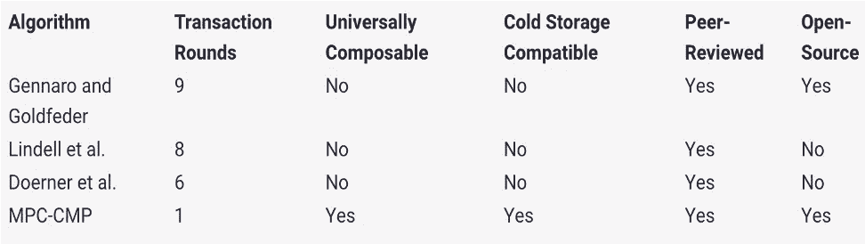

查看白皮书，了解有关实施的更多详细信息:

[](https://eprint.iacr.org/2020/492) [## UC 非交互式主动阈值 ECDSA

### 论文 2020/492 Ran Canetti、Nikolaos Makriyannis 和 Udi Peled 关于 Gennaro & Goldfeder 和…的抽象建筑

eprint.iacr.org](https://eprint.iacr.org/2020/492) 

或者观看介绍视频:

或者详细视频:

# 如果你喜欢这个帖子，那么你可以请我喝咖啡，先谢谢你了！

[](https://www.buymeacoffee.com/mindegg)

# 上钩了？了解更多关于 MPC 的信息

**ZenGo 的 MPC 介绍视频——约会游戏**

**ZenGo 的 2020 年 MPC 预测**

[](https://zengo.com/2020-mpc-predictions/) [## 我们的 2020 年多部分计算(MPC)预测

### 在 ZenGo，我们的核心技术之一是安全多方计算(MPC)。MPC 钱包允许独立方…

zengo.com](https://zengo.com/2020-mpc-predictions/) 

**MPC 联盟**

[](https://www.mpcalliance.org/) [## MPC 联盟

### MPC 是一项颠覆性技术，在多个行业显示出巨大的前景。我们是一群行业先锋，拥有…

www.mpcalliance.org](https://www.mpcalliance.org/) 

**实用 MPC — PDF 书**

[https://www . cs . Virginia . edu/~ Evans/pragmatic MPC/pragmatic MPC . pdf](https://www.cs.virginia.edu/~evans/pragmaticmpc/pragmaticmpc.pdf)

**MPC 牛逼**

[](https://github.com/rdragos/awesome-mpc) [## GitHub - rdragos/awesome-mpc:多方计算资源和链接的精选列表。

### 多方计算资源和链接的精选列表。- GitHub - rdragos/awesome-mpc:一个多…

github.com](https://github.com/rdragos/awesome-mpc) 

**Meta 的 MPC 简介**

[](https://privacytech.fb.com/multi-party-computation/) [## 多方计算的价值

### 安全多方计算(MPC)使企业能够通过共享加密的和难以理解的数据来共同学习…

privacytech.fb.com](https://privacytech.fb.com/multi-party-computation/) 

**Nigel Smart 的多方计算:从理论到实践演讲**

**fastapi 变成 FastEnclaves 的地方:🦹‍♀️ 🦸‍♂️分钟 MPC👩‍🚀**

[](https://github.com/ObliviousAI/FastAPI-Enclave-Services) [## GitHub-ObliviousAI/FastAPI-Enclave-Services:这是 FastAPI for enclave 的主页…

### 需要帮忙吗？联系我们:FastAPI 是 Python 最热门的 API 框架，用于快速和安全的 API 开发。在这个…

github.com](https://github.com/ObliviousAI/FastAPI-Enclave-Services) 

**耶胡达的安全多方计算**

[](https://eprint.iacr.org/2020/300) [## 安全多方计算(MPC)

### 论文 2020/300 Yehuda Lindell 安全多方计算(MPC)抽象协议使一组参与者能够…

eprint.iacr.org](https://eprint.iacr.org/2020/300)