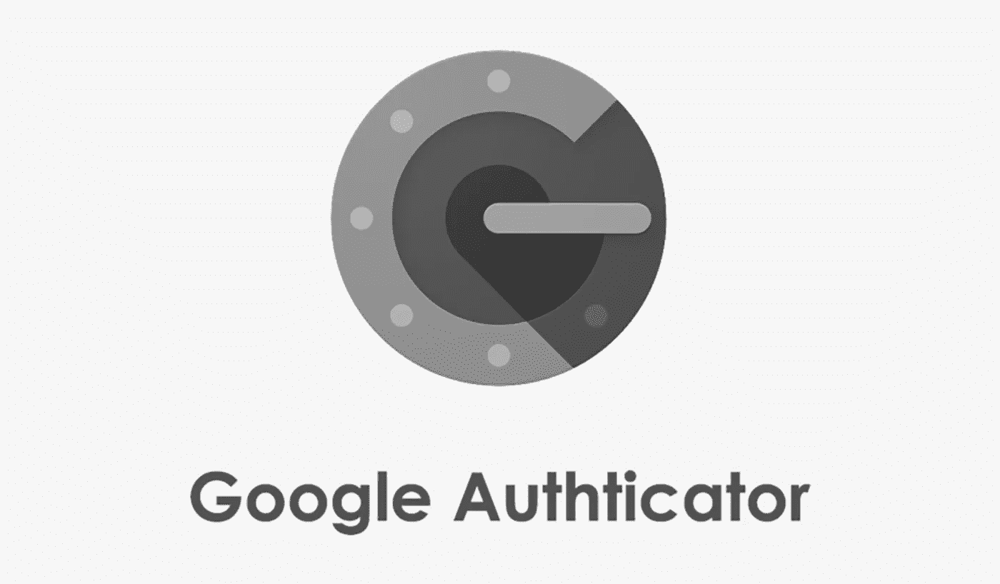
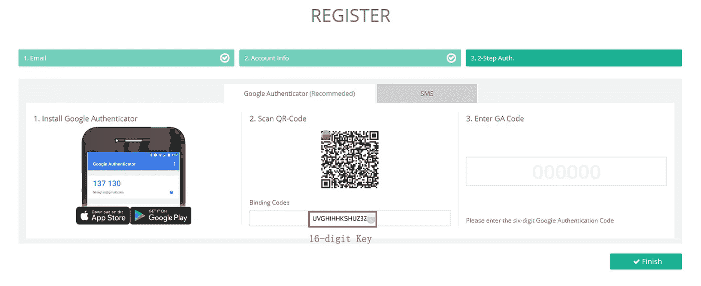
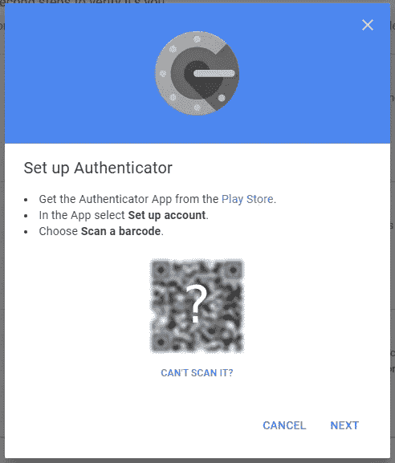
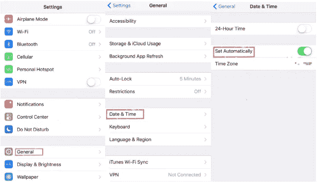

# 保护你的钱包:在 Hotbit 钱包上设置 2FA 的终极指南

> 原文：<https://medium.com/coinmonks/secure-your-wallet-ultimate-guide-on-setting-up-2fa-on-hotbit-wallet-c03ab8daea?source=collection_archive---------8----------------------->

Google 2FA 验证将用于登录和退出。

在 hotbit 中设置 Google authenticator 的两个关键步骤:

1.首先从 play store 应用程序下载手机上的 Google authenticator。

对于 Android 或 IOS 用户，在“Google Play”或浏览器中搜索“Google Authenticator”。

2.请登录 Hotbit 账号 www.hotbit.io，从手机打开 Google Authenticator 扫描二维码，或者输入你的邮箱地址和出现在 hotbit 网站上的密钥(保存秘钥，16 位密钥)。

2FA 绑定完成后，你的手机上会生成一个六位数的验证码。请输入验证码并提交。

> 交易新手？试试[加密交易机器人](/coinmonks/crypto-trading-bot-c2ffce8acb2a)或者[复制交易](/coinmonks/top-10-crypto-copy-trading-platforms-for-beginners-d0c37c7d698c)

每次你登录到你的 hotbit 帐户，总会有一个要求你的 6 位数代码验证。

问答

1.如果遇到“绑定失败”问题，如何解决该问题？

回答:

确保手机上安装了“谷歌认证器”App

请确保您手机的日期/时间设置是自动的；

iPhone:请确保日期和时间设置“自动设置”已打开；

确保输入正确的密码和 2FA 码；

2.如果手机丢了或者换了，如何重新创建 Google Auth。如果我有备份的 2FA 密钥，请在新手机中输入代码。

回答:

在新手机上安装 Google Authenticator App

打开 Google Auth。移动乐手机 App 重新创建账户，点击“+”扫描二维码或手动录入 2FA 备份密钥，由您保管。

点击这里，关注我们的更多故事[。](http://t.me/etellworld)