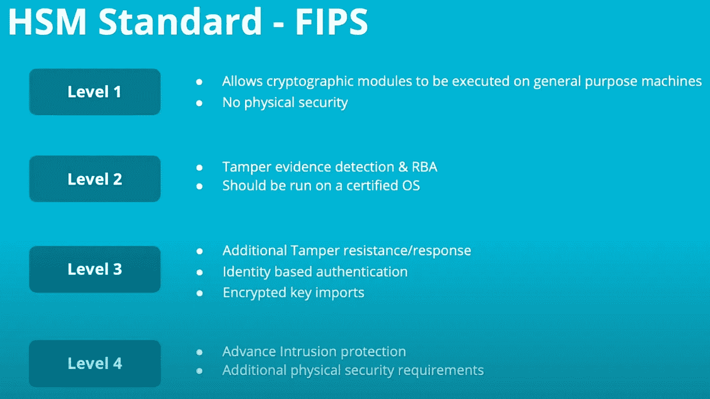

# 使用 HSMs(硬件安全模块)保护密钥

> 原文：<https://medium.com/coinmonks/securing-keys-with-hsms-hardware-secure-module-d4015a9bdc5?source=collection_archive---------0----------------------->

> HSM(硬件安全模块)是专门的硬件设备，可以防止篡改，用于存储密钥。规则是所有的密钥永远留在 HSM 设备中。
> 
> 当我们需要使用它们时，我们在 HSM 的安全执行环境中进行操作。

# 主要 HSM 供应商

HSM 供应商需要通过 NIST 的认证程序。一些已经存在一段时间的主要供应商有金雅拓(由 Thales 拥有)、SafeNet(由金雅拓拥有)、Thales、nCipher(由 EnTrust 拥有)、FutureX 和 Utimaco。这些解决方案的管理费用很高，金雅拓 HSM 公司大约为 29，000 美元，泰雷兹公司大约为 9，500 美元，而 Utimaco 公司大约为 15，000 美元。此外，您需要将这些 HSM 设备存放在安全的地方，这可能会花费一大笔钱，甚至更多。

有人不需要高昂的开销来使用 HSM，你可以轻松地租赁云提供商的 HSM 来完成这项工作。近年来，云提供商也成为主要竞争者，如 AWS、Google 和 Azure，提供云 HSM。使用云 HSM 没有开销成本，但有云成本，这取决于您使用它们的时间和方式，例如，AWS 每月花费约 1，058 美元(1 HSM x 每月 730 小时 x 1.45 美元= 1，058.50 美元)。云 HSM 提供商的另一个主要区别是，物理设备位于云提供商的站点，而不是您的站点。您最有可能使用云提供商提供的服务(密钥管理服务— KMS)来与他们站点上的 HSM 设备进行交互。

当找到 HSM 供应商时，请使用以下网站验证由 NIST 颁发的供应商证书:

 [## 搜索-加密模块验证计划|中国证监会|中国证监会

### 使用此表单搜索已验证加密模块的信息。选择要搜索的基本搜索类型…

csrc.nist.gov](https://csrc.nist.gov/projects/cryptographic-module-validation-program/validated-modules/search?SearchMode=Basic&ModuleName=hsm&CertificateStatus=Active&ValidationYear=0) 

# HSM 用例

## 公开密钥基础设施

所有证书颁发机构(ca)都需要使用 HSMs。证书颁发机构使用 HSM 设备来签署证书，因此应用程序可以相信颁发的证书是合法的，并且得到了 CA 的认可。

Source: [https://www.ravenswoodtechnology.com/components-of-a-pki-part-5/](https://www.ravenswoodtechnology.com/components-of-a-pki-part-5/)

我们需要 HSM 来签署证书，以防止坏人使用被劫持的证书。如果黑客获得了客户端证书，他们将无法通过签名来验证自己，因为 HSM 中的私钥只能对证书进行签名。

Source: [https://www.ravenswoodtechnology.com/components-of-a-pki-part-5/](https://www.ravenswoodtechnology.com/components-of-a-pki-part-5/)

以下是 CA/B 论坛的基本要求:

> CA 应保护其系统或设备中的私钥，该系统或设备至少满足 FIPS 140 第 3 级或适当的通用标准保护配置文件或安全目标 EAL 4(或更高)，其中包括保护私钥和其他资产免受已知威胁的要求。

## 自动取款机的借记卡密码

HSM 用于保护借记卡 PIN，银行不能公开 PIN，因为有人会用它来抢劫客户，所以他们使用 HSM 设备来验证 PIN。

Source: [https://www.emv-connection.com/downloads/2015/03/PIN-Change-at-the-ATM-FINAL-033015.pdf](https://www.emv-connection.com/downloads/2015/03/PIN-Change-at-the-ATM-FINAL-033015.pdf)

## 保护加密货币

随着加密货币的出现，HSM 变得越来越流行。加密货币本质上是公钥和私钥对，由于 HSM 是为了保护密钥而构建的，因此非常适合这项工作。

在加密领域，HSM 是交易的签名者。因为私钥总是在 HSM 中，所以事务被发送到 HSM 进行签名。

下面是 Kaleido 如何使用 Azure、AWS 或 HashiCorp cloud HSM 来签署交易。

Source: [https://www.kaleido.io/blockchain-platform/aws-cloudhsm-signer](https://www.kaleido.io/blockchain-platform/aws-cloudhsm-signer)

# HSM 里面有什么？

HSMs 设备通常作为 PCIe 卡和网络附加设备提供。PCIe 卡可以安装到服务器中，网络附加设备是它的硬件。

下图是一台 Linux 机器上的 HSM·PCIe 设备。通常，这种 Linux 服务器运行在 Intel E5500 服务器上，具有 4gb 的 RAM 和 500 GBs 的硬盘。

下图是 PCIe·HSM；这张 PCIe 卡位于服务器上，是所有奇迹发生的地方。它有传感器，可以检测温度、电压、电源的变化，以及保护箔的篡改。物理保护层和电池有助于在 HSM 断电时擦除内存中的内容。

## **PCIe·HSM 有什么？**

*   德州仪器 TMS320C64x DSP，执行密码运算。
*   真随机数生成器(TRNG)和确定性随机位生成器(DRBG)来帮助它提供熵
*   包含加密所有密钥的设备密钥的密钥 RAM

## **什么是设备密钥？打开所有钥匙的钥匙。**

设备密钥在 HSM 投入运行时创建。最重要的是，它加密所有的密钥和安全参数。HSMs 中的密钥不能提取、导出、导入或操作。

## 主备份密钥(MBK)

主备份密钥，顾名思义，备份密钥。它们是用于加密备份的 256 位 AES 密钥，可以使用 n/m 方案分割成许多份。

## **支持的按键**

大多数 HSM 设备支持 RSA、DSA、ECDSA (NIST 和 Brainpool
曲线)、DH、ECDH、AES、DES、3DES、SHA1、SHA2、SHA3、RIPEMD 等。

# PKCS 11 号——克里托基

PKCS#11 是一种加密令牌接口标准，也称为 Crytoki，具有一套用于加密、解密、签名生成、签名验证和密钥存储的加密服务。

PKCS#11 是加密硬件设备之间的互操作性标准，它通过统一的 API 函数抽象出设备差异。并非所有设备都必须使用所有 PKCS#11 功能，只要不与 PKCS#11 冲突，它们可以具有附加功能。

基于这个标准，公司创造了他们的功能。以下是 AWS 生成 AES 密钥的功能示例:

## PKCS#11 中使用的对象

PKCS#11 使用三种类型的对象:密钥(秘密、公开和私有)、证书和数据(DSA/ECDSA 参数等)。).Cryptoki 不直接操纵这些对象。相反，它使用对象的句柄。

以下是 PKCS#11 中签名密钥对象的属性:

Source: [https://i.blackhat.com/USA-19/Thursday/us-19-Campana-Everybody-Be-Cool-This-Is-A-Robbery.pdf](https://i.blackhat.com/USA-19/Thursday/us-19-Campana-Everybody-Be-Cool-This-Is-A-Robbery.pdf)

每个对象都可以访问一个令牌，在令牌内部，它们得到一个插槽(“插件位置”)。该插槽包含加密对象并防止未经授权的访问。如果用户有权访问令牌，则他们只能访问与该令牌相关联的对象。

Source: [https://i.blackhat.com/USA-19/Thursday/us-19-Campana-Everybody-Be-Cool-This-Is-A-Robbery.pdf](https://i.blackhat.com/USA-19/Thursday/us-19-Campana-Everybody-Be-Cool-This-Is-A-Robbery.pdf)

## 储存；储备

永久数据存储在 PCIe 卡上用环氧树脂覆盖的闪存中。它包含一个 Linux 映像、定制模块、日志和 PKCS#11 对象。闪存被分区，PKCS#11 对象被分开存储。加密密钥存储在外部存储器中。

Source: [https://i.blackhat.com/USA-19/Thursday/us-19-Campana-Everybody-Be-Cool-This-Is-A-Robbery.pdf](https://i.blackhat.com/USA-19/Thursday/us-19-Campana-Everybody-Be-Cool-This-Is-A-Robbery.pdf)

# HSM 的优势

HSM 是弹性设备，可以在极端天气条件、火灾或有人想要篡改您的设备时保护您的密钥。因为它们是硬件解决方案并且具有最高的安全等级，所以没有多少解决方案具有 NIST FIPS 130 2 级(一些在特定领域具有更高的等级，例如物理安全)。下面是一个标准的快照，告诉我们什么是 FIPS 水平的 HSM 合格。

Source: [https://www.youtube.com/watch?v=pKOfiKthalo](https://www.youtube.com/watch?v=pKOfiKthalo)

另一个积极的方面是 HSM 已经存在了几十年。因此，有大量关于 HSM 最佳实践的知识和几项关于 HSM 安全性的研究。

# HSM 的漏洞

尽管 HSM 有很多优点，但没有什么是牢不可破的。

## **安全网 HSM 密钥提取漏洞**

2015 年 1 月 30 日，Gemini 正在评估 AWS 使用的 Luna G5 HSM，这时他们发现了一个允许提取密钥的漏洞。问题出在露娜的 PCIe 卡和 AWS 的云 HSM 使用的网络设备上。

Safenet 的问题是，他们使用了几个不可靠的 PKCS#11 函数，尤其是从密钥中提取密钥(密钥派生)和 XOR-base-and-data 函数。

**从密钥中提取密钥(密钥派生)**

密钥派生函数将一个密钥创建为另一个密钥的函数。一个例子是 BIP-32，其中一个比特币高清钱包由一个单一种子短语衍生的一系列地址组成。

Source: [https://www.cryptsoft.com/pkcs11doc/STANDARD/pkcs-11v2-30m1-d7.pdf](https://www.cryptsoft.com/pkcs11doc/STANDARD/pkcs-11v2-30m1-d7.pdf)

该方案通过从现有密钥中获取一个偏移量和长度的连续比特序列来生成新密钥；它基本上提取一个子串。

**攻击！**

我们首先从最高有效位开始，提取 2 个字节。现在，我们可以使用派生的密钥 HMAC 选择的消息。给定这个原语，可以用蛮力进行攻击，我们可以通过尝试已知消息/HMAC 对的所有可能性来发现短密钥。

现在，我们可以重复，在不同的偏移量处导出另一个短密钥，使用选择的消息攻击进行强力攻击，然后重复，直到所有密钥字节都被恢复。这是全自动的，Luna G5 只需要几秒钟，而 CloudHSM 中使用的更强大的 SA7000 则需要更少的时间。

**椭圆曲线密钥**

这种攻击适用于 AES、通用 HMAC 秘密和椭圆曲线私钥，但不适用于 RSA、普通 DSA 和 Diffie Hellman。

对于椭圆曲线密钥，截断的字节数组是密钥的秘密标量部分。比特币 ECDSA 密钥的“秘密”部分的一个例子是 secp256k1 中的离散对数。在内部，这些离散对数只是存储为一个 32 字节的标量值，从密钥中提取密钥的方案可用于连续显示该标量值的块。

有关该漏洞的更多信息可在下面找到:

 [## 关于 Safenet HSM 密钥提取漏洞 CVE-2015-5464(上)

### 这一系列的文章对我们发现的密钥提取漏洞提供了更深入的解释…

randomoracle.wordpress.com](https://randomoracle.wordpress.com/2015/08/13/safenet-hsm-key-extraction-vulnerability-part-i/) 

以下是 Gemini 针对该漏洞发布的公告:

 [## 你的比特币钱包可能面临风险:Safenet HSM 密钥提取漏洞| Gemini

### 作为下一代比特币交易所，确保比特币在存款上的安全性是双子的重中之重。也许…

www.gemini.com](https://www.gemini.com/blog/your-bitcoin-wallet-may-be-at-risk-safenet-hsm-key-extraction-vulnerability) 

## 莱杰对 HSM 弱点的分析

**莱杰如何使用 HSMs？**

硬件钱包 Ledger 使用 HSMs 来确保客户收到的 ledger 设备是合法的。莱杰必须这样做，因为已经发生了几次黑客攻击，向客户发送虚假设备来窃取他们的加密货币。

 [## 网络诈骗者正在向用户邮寄伪造的账本设备，窃取他们的加密货币

### 莱杰的硬件钱包是一种非常受欢迎的安全存储加密货币的方式。如此受欢迎，事实上，以至于…

www.forbes.com](https://www.forbes.com/sites/leemathews/2021/06/18/cybercrooks-are-mailing-users-fake-ledger-devices-to-steal-their-cryptocurrency/?sh=275258e4dbad) 

验证设备的过程称为证明。每次设置或更新账本设备时，连接到 HSM 的服务器都会向客户的设备发送一个挑战(来自 HSM 的随机生成的号码),以证明其合法性。如果服务器可以验证签名，它就是有效的。

Source: [https://www.ledger.com/a-closer-look-into-ledger-security-the-root-of-trust](https://www.ledger.com/a-closer-look-into-ledger-security-the-root-of-trust)

 [## 深入了解分类帐安全性:信任的根源|分类帐

### 在之前的文章中，我们已经仔细研究了安全元素和我们的定制操作系统——BOLOS。这个…

www.ledger.com](https://www.ledger.com/a-closer-look-into-ledger-security-the-root-of-trust) 

**莱杰对 HSM 漏洞的研究(大家冷静这是抢劫)**

2019 年 8 月 8 日，莱杰在美国 BlackHat 会议上发表了关于 HSM 设备漏洞的演讲。通过他们的研究，他们发现了 14 个内存损坏漏洞，这些漏洞允许他们远程执行代码，最终泄露设备中的每个密钥。

他们用于这项研究的 HSM 设备允许开发人员开发可以在 HSM 上执行的自定义模块，因此他们创建了一个安装了自定义外壳和调试器的模块。为了使他们的研究自动化，他们使用了一个模糊器，从宿主向 HSM 发送变异信息。变异的消息导致内核模块崩溃和内存不足问题，从而导致 HSM DDoS，因此他们必须过滤消息。

他们发现的一个漏洞非常接近心脏出血。

> **什么是 Heartbleed？**
> 
> Heartbleed 是一个缓冲区溢出问题，在心跳消息中泄漏了额外的信息，因此得名 heartbleed。
> 
> 心跳请求需要下面的命令，其中 **bp** 是它要复制到的位置， **pl** 是它要复制的位置，**有效负载**是被复制数据的长度。有效载荷代表有效载荷的存储长度，通常是 16 位整数。
> 
> `memcpy(bp, pl, payload);`
> 
> 在提供信息之前，应该有一个边界检查来验证输入请求并返回所请求的确切有效负载长度。如果没有进行边界检查，心跳机制会分配一个内存缓冲区，而不进行验证检查。
> 
> 内存缓冲区是传输中的数据的临时存储，可以包含敏感信息和财务信息、凭证、cookies 等。如果分配不当，它可能会在心跳消息中暴露敏感数据。

Source: [https://www.malwarebytes.com/blog/news/2019/09/everything-you-need-to-know-about-the-heartbleed-vulnerability](https://www.malwarebytes.com/blog/news/2019/09/everything-you-need-to-know-about-the-heartbleed-vulnerability)

 [## 心脏出血虫，解释说

### 2014 年，安全研究人员发现了保护网络安全的加密技术 SSL 的一个严重缺陷。的…

www.vox.com](https://www.vox.com/2014/6/19/18076318/heartbleed) 

下面是设置属性值的 HSM 模块代码。他们在这里发现了一种类似心脏出血的细菌。注意下面传递给 malloc 的大小和传递给 memcpy 的大小是不同的。不同的大小会导致复制到属性值的部分数据无法完全初始化。

利用该漏洞，他们能够暴露 HSM 的内存缓冲区，下面的输出显示了泄露的管理员密码。

Source: [https://i.blackhat.com/USA-19/Thursday/us-19-Campana-Everybody-Be-Cool-This-Is-A-Robbery.pdf](https://i.blackhat.com/USA-19/Thursday/us-19-Campana-Everybody-Be-Cool-This-Is-A-Robbery.pdf)

演讲中讨论了更多的漏洞，我强烈建议您查看 Ledger 在 BlackHat 上对 HSM 漏洞的分析。

[https://I . black hat . com/USA-19/Thursday/us-19-坎帕纳-every one-Be-Cool-This-Is-A-robbing . pdf](https://i.blackhat.com/USA-19/Thursday/us-19-Campana-Everybody-Be-Cool-This-Is-A-Robbery.pdf)

# 这个故事的寓意

HSM 设备高度安全，目前被全球一些最大的机构所使用。但是世界在发展，黑客变得越来越聪明，最终，HSM 将不再是牢不可破的。

我们需要停止将 HSMs 视为密钥管理的解决方案，而更像是管理密钥的工具。未来，组织将需要开发分层的方法和流程来更好地保护其 HSM 设备。

# 如果你喜欢这个帖子，那么你可以请我喝咖啡，先谢谢你了！

# 痴迷？潜得更深

## 云 HSM 最佳实践—谷歌

## 让 HSM 变得经济实惠的开放项目— CrypTech Alpha

 [## 密码技术阿尔法

### 安全和隐私 CrypTech Alpha 是一个独立的原型密钥存储和硬件加密平台…

www.crowdsupply.com](https://www.crowdsupply.com/cryptech/open-hardware-security-module) 

## HSM 用例—密码数学

 [## HSMs 的关键管理和使用案例

### 电子商务的兴起使企业组织和银行能够更容易地扩展其业务和服务…

www.cryptomathic.com](https://www.cryptomathic.com/news-events/blog/key-management-and-use-cases-for-hsms) 

## 加密密钥管理基础知识权威指南— Townsend Security

 [## 加密密钥管理基础的权威指南

### 回到顶部 NIST 将加密密钥生命周期定义为运行前、运行中、运行后…

info.townsendsecurity.com](https://info.townsendsecurity.com/definitive-guide-to-encryption-key-management-fundamentals) 

## 关于逆转和利用 FIPS 140–2 HSM 固件的演示——BRX 侦察 2017 (Fotis Loukos)

## 棒极了 PKI

 [## GitHub - viralpoetry/awesome-pki:文章、手册、研究论文、博客、视频的集合…

### 与公钥相关的文章、手册、研究论文、博客、视频和软件的集合…

github.com](https://github.com/viralpoetry/awesome-pki) 

> 交易新手？试试[加密交易机器人](/coinmonks/crypto-trading-bot-c2ffce8acb2a)或者[复制交易](/coinmonks/top-10-crypto-copy-trading-platforms-for-beginners-d0c37c7d698c)