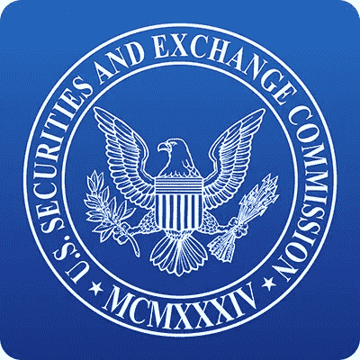

# 证券交易委员会成立新的密码办公室

> 原文：<https://medium.com/coinmonks/securities-and-exchange-commission-forms-new-crypto-office-fbe2d0e92517?source=collection_archive---------34----------------------->

关于加密货币和数字资产的政府法规从一开始就一直在讨论，今天也不例外。

美国证券交易委员会(SEC)在公司金融部内设立了一个新的现场办公室，专门负责加密货币备案，并将在该办公室内设立两个不同的分支机构。一…