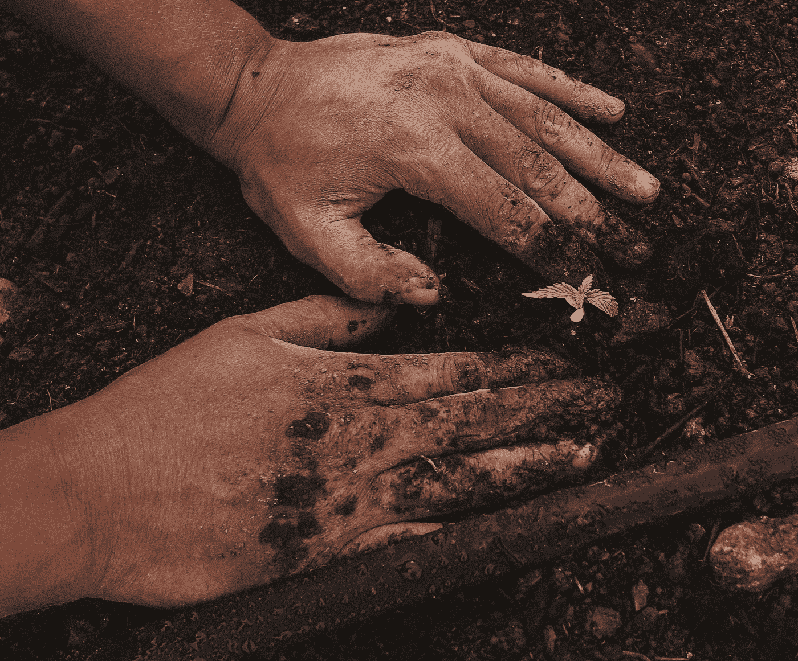

# 播种时间和收获时间——在快节奏的科技世界中，大自然可以教给我们什么……再一次。

> 原文：<https://medium.com/coinmonks/seed-time-and-harvest-time-what-nature-can-teach-us-in-a-fast-paced-technological-world-again-b21767026d90?source=collection_archive---------67----------------------->

source: [GreenForce Staffing](https://unsplash.com/@greenforce_staffing)

## 即时满足感——没有这种东西

农民们知道这是一门科学。播种时间和收获时间是我们都知道的事情，但不知何故忘记了我们生活在这个即时满足的世界中的重要性和现实性。我们是“我想要它…