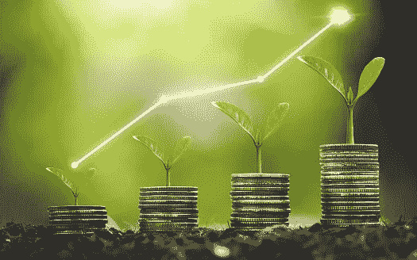

# 寻求拒绝、失败和尴尬，以获得真正的生活复合财富

> 原文：<https://medium.com/coinmonks/seek-rejection-failure-and-embarrassment-to-attain-true-compounded-wealth-for-life-ebe36cbcfad1?source=collection_archive---------52----------------------->

正如伟大的韦恩·格雷兹基所说，“你不出手的时候，你百分之百会失手”。

如果你从不尝试，你注定会失败。好的一面是，比起我们做过的事情，我们更后悔我们没有做的事情，所以去吧，看看你能做什么！