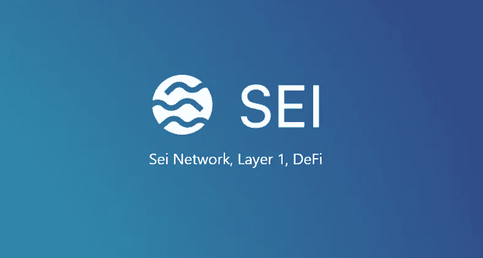
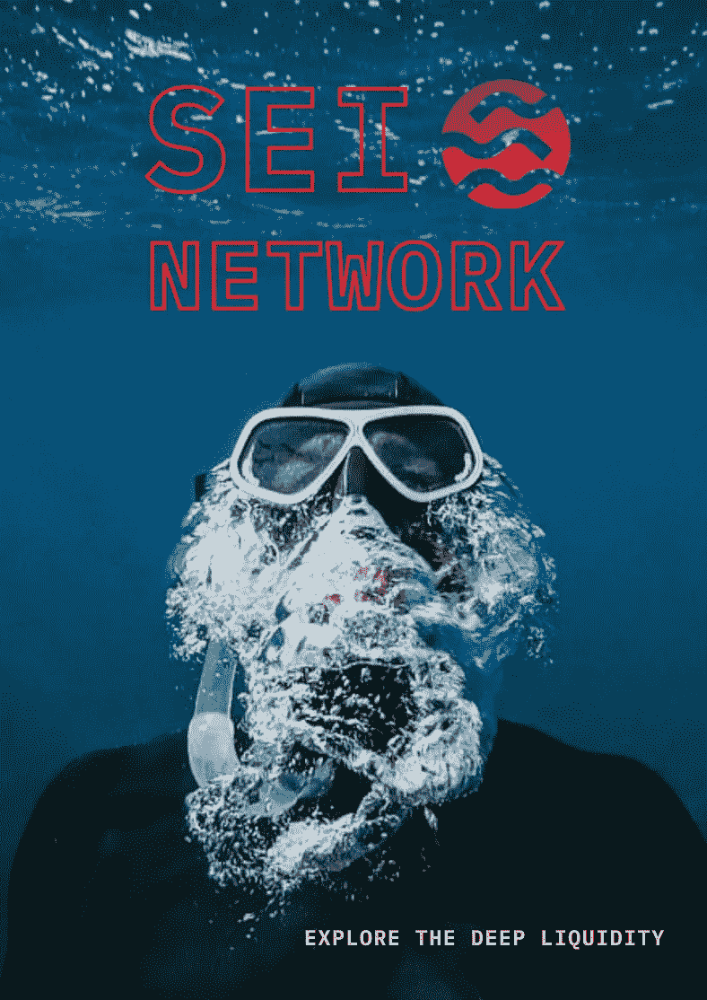
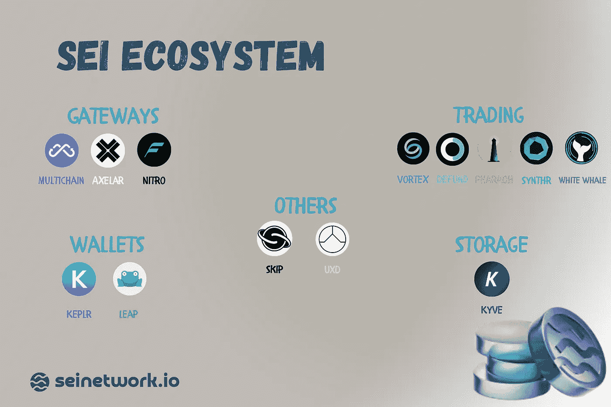

# Sei 作为一个先进的平台，开启了 DeFi 的新时代。项目生态系统。

> 原文：<https://medium.com/coinmonks/sei-as-an-advanced-platform-to-launch-the-new-era-of-defi-project-ecosystem-9981be77a0b5?source=collection_archive---------9----------------------->

朋友们，大家好，我很高兴在我的媒体中再次见到你们，我建议你们继续前往有趣的 DeFi 世界。我们已经非常熟悉 [Sei](/tag/sei-network) 项目，它是一个基础的第一层区块链，专门为分散的交易所和交易应用程序而创建。项目希望成为最好的连锁解决方案。

考虑到 Sei 是一个部署新的分散式应用程序的平台，今天我们将仔细看看这个项目的基础，它对开发人员的便利性。我们还将关注已经在生态系统中工作的团队，对最有趣的团队进行简要概述，总体而言，我们将评估新 DeFi 梯队的进一步发展前景。

**为什么是宇宙？**

Sei 基于 Cosmos SDK 和 Tendermint 核心引擎构建，并使用 wasmd 模块来大大简化开发。程序员可以使用**基于 Rust 的 CosmWasm 库**在 Sei 之上构建他们自己的分散式应用程序。这提供了显著的好处:

*   CosmWasm 在许多区块链使用。它是一个非常稳定的、经过时间考验的、没有 bug 的库，拥有广泛的开发者生态系统
*   CosmWasm 的创建是为了解决其他生态系统面临的许多问题。这个库使得开发比在相同的 Solana 上容易一个数量级，并且提供了比 Solidity 更可靠的安全性。

## 内置的 DEX 模块和中央 CLOB 订单簿是解决老问题的最佳捆绑包。

Sei 创建了一个新的 DEX 模块，允许 Cosmwasm 智能合约使用底层 CLOB(中央订单簿)来提供高流动性。除此之外，Oracle 还用于支持资产汇率定价。在分析订单数据时，需要 Oracle 的参与，以确保对资产进行最可靠、最准确的评估，并将必要的信息传递给其他模块和合同。

Sei 提供低费用，并与做市商合作，以吸引大量流动性。因此，它可以提供基于订单簿的分散式交易方式。因此，Sei 成为生态系统所有主体的共同中心。任何应用程序都可以轻松地连接到 Sei 基础设施上的交易，并请求访问汇集的流动性。所有这些都伴随着难以置信的吞吐量、更好的事务执行速度、可靠性以及我在过去的[文章](/@elnazik/is-sei-the-dark-horse-of-the-next-bullrun-373b93613369)中提到的许多其他优势。

**Sei 推出生态系统并投资 5000 万美元。**

就在一周前，Sei 宣布成立一只基金和一个流动性生态系统，以支持新应用的开发。这一消息引起了密码界的极大兴趣。

已经与 Sei 合作的合作伙伴和团队。短评。

通过其基础设施，Sei 正在迅速获得知名度，吸引新的合作伙伴和项目进入其生态系统。已经有超过 50 个团队在积极地用 Sei 开发和提升他们的产品。让我们来了解其中的一些。

1.  [**Axelar**](https://axelar.network/) —这是一个新级别的跨链桥，事实上它是一个易于扩展的跨链通信平台，将所有现有的区块链连接到一个单一的生态系统中
2.  [**KYVE**](https://www.kyve.network/) —这是一种去中心化的数据归档协议。标准化、验证和存储数据流的下一代协议。
3.  [**Vortex Protocol**](https://twitter.com/VortexProtocol)—是一个建立在 Sei 网络上的 IBC 链的分散式衍生品交易所。Vortex 提供了许多与集中式交易所相同的功能(借贷、交叉抵押和交叉保证金)，但采用了一种无许可、分散的协议。
4.  [**Keplr**](https://www.keplr.app/)**——**它是一个开源的浏览器扩展钱包，为宇宙链间生态系统提供动力。它基于 Cosmos-SDK 为所有区块链提供帐户和钱包管理功能。
5.  [**SYNTHR**](https://www.synthr.io/) —这是一种合成资产协议，允许用户制造各种金融资产的衍生品，并使用不可信的金融合同在线交易。
6.  [**DeFund**](https://www.defund.app/) —这是一个分散的交易所交易基金(DETF)跨链协议，使用 Cosmos SDK 构建，允许用户创建多样化的自治基金，并跨链交换他们的基金令牌，本机使用 IBC。
7.  [**硝基**](https://www.nitro.technology/)**——**它是第一个索拉纳 VM 网络。建造在太空中。作为索拉纳和宇宙之间的通道。

这不是 Sei 上正在积极开发的酷项目的全部列表，我相信在不久的将来会有许多新的有前途的团队加入进来。在我们看来，一些非常大规模和有趣的东西正在被建造，因为在这一行动中涉及了完全不同种类的项目。这是新的分散式 Web-3 吗？

**总结:**根据我们今天所了解的一切，可以肯定地说，Sei 是扩展 DeFi 和向 it 部门注入新资源的先锋。多亏了 Cosmos 的开发和正确的工具，Sei 成为了一个很好的基础设施，并为在其上部署新项目提供了最大的便利。这反过来又为生态系统的发展开辟了令人难以置信的前景。Sei 已经有了像 Axelar、Kyve、Keplr 这样的强大团队。这艘船已经准备好航行在最偏远的加密之地，在 DeFi 世界开启一个新时代。系好安全带，先生们！

项目的所有资源你都可以在这里找到[。](https://linktr.ee/seinetwork)

**谢谢大家的关注，后会有期:)**

> 交易新手？尝试[加密交易机器人](/coinmonks/crypto-trading-bot-c2ffce8acb2a)或[复制交易](/coinmonks/top-10-crypto-copy-trading-platforms-for-beginners-d0c37c7d698c)