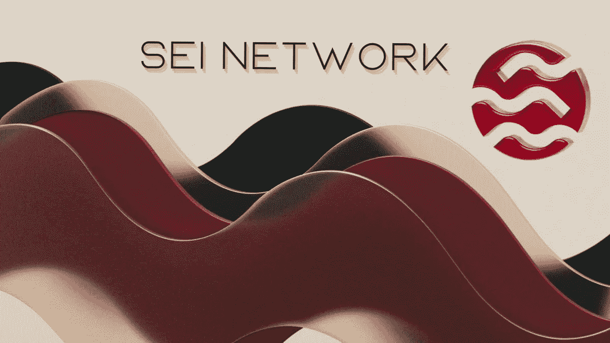
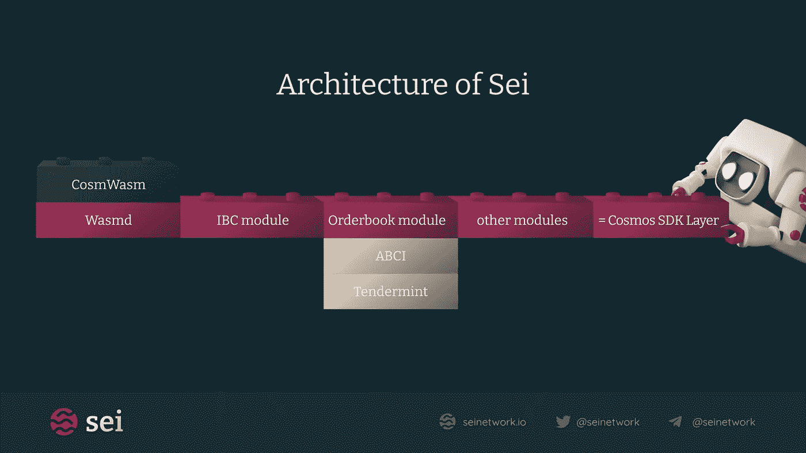
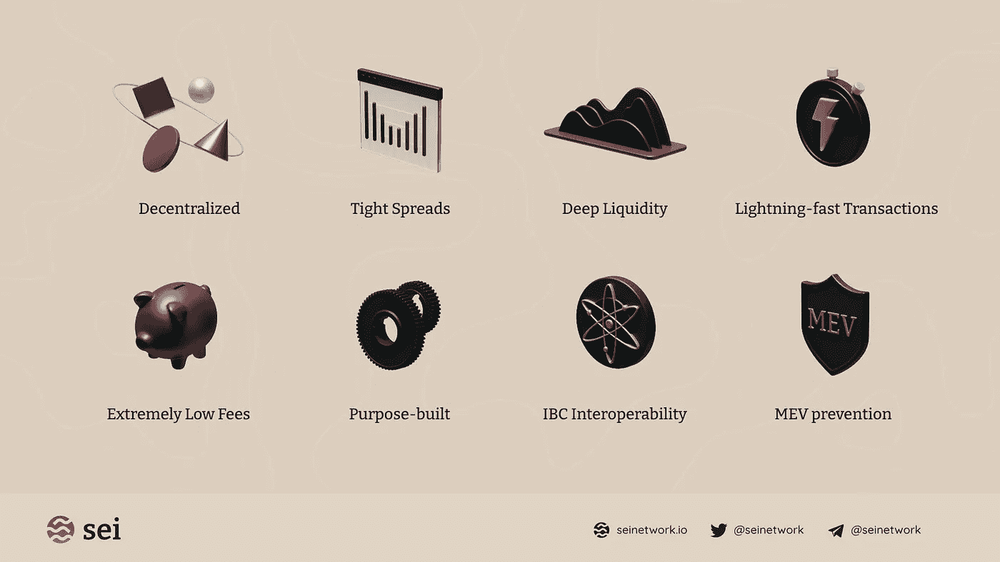

# Sei 网络，有看起来那么好？

> 原文：<https://medium.com/coinmonks/sei-network-as-good-as-it-looks-4cb4d5600fc7?source=collection_archive---------6----------------------->

非常好的读者，在这篇文章中，我们将尝试提供一个即将进入加密空间“Sei 网络”的下一个区块链的摘要，这是一个区块链，它被谈论得很多，似乎有很大的 DeFi 潜力，我们将尝试不进入太多的技术细节，使它变得简单，我希望你喜欢阅读，让我们去那里！

Sei 是一个致力于成为 Cosmos 和 all Crypto 的金融应用和机构的基础层的项目。他们最近从投资者那里筹集了 500 万美元，投资者包括[multiconcap](https://twitter.com/multicoincap)、[比特币基地](https://twitter.com/coinbase)和[德尔福数码。](https://twitter.com/Delphi_Digital)

Sei 正努力成为 DeFi 应用程序的最佳第 1 层。这意味着他们正在将订单匹配引擎构建到链本身中，并且构建在其上的每个应用程序都可以使用它。Sei 正在使用 Cosmos SDK，这意味着它将与 IBC 兼容。Sei 将以三种主要方式帮助分散金融(DeFi)应用程序:

➖ B y 有一个内置的订单簿。

➖的速度快得令人难以置信。

*➖ H* 带超速保护。

集中限价订单簿(CLOB)是 Sei 独有的，允许 dApps 在其基础上进行构建。这将是 AMM 模式的有益替代。其他 L1 连锁店一次处理一个 DeFi 订单，这使得它们很慢，Sei 的 DeFi 应用程序更快，因为它们将订单捆绑在一起，可以同时处理大量交易，这有利于交易体育博彩和期权等交易。现在，没有一个好的地方可以开发需要订单簿的应用程序，Sei 可以满足这种需求。

Sei 还有一个系统，可以帮助防止最好的 DeFi 应用程序上的抢注和 MEV(市场执行价值)中断，这是通过频繁的批量拍卖来完成的，这使得 MEV 和抢注很难发生。通过使 MEV 和 frontrunning 难以发生，Sei 使 DeFi 应用程序能够扩展并在传统金融市场中发挥有意义的作用。

他们的团队包括参与过[宇宙](https://twitter.com/cosmos?s=20&t=vSLWuslMbphWle93FWm-7w)开发的成员，以及来自[高盛](https://twitter.com/GoldmanSachs?s=20&t=zdv3JBXrQhk_yfyenPN9RA)的企业成员。

> 概括起来
> 
> Sei 将成为一个基于 Cosmos 的 L1，专注于为金融应用和机构建立一个平台。通过在基础设施中构建订单簿，dApps 将拥有其他 L1 无法提供的 DeFi 所需的内置速度和可扩展性。dApps 可能会加入 Sei 在宇宙中建造而不需要他们自己的链。

> 交易新手？试试[加密交易机器人](/coinmonks/crypto-trading-bot-c2ffce8acb2a)或者[复制交易](/coinmonks/top-10-crypto-copy-trading-platforms-for-beginners-d0c37c7d698c)