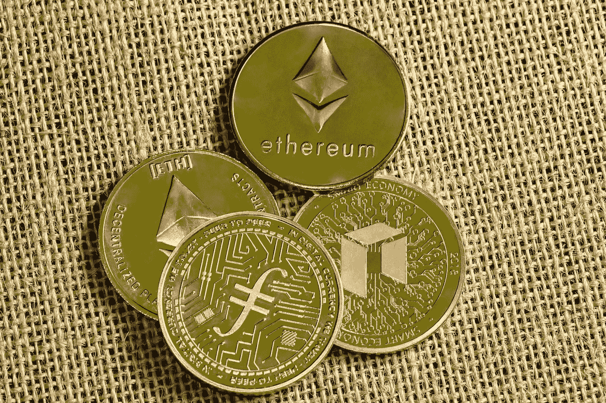
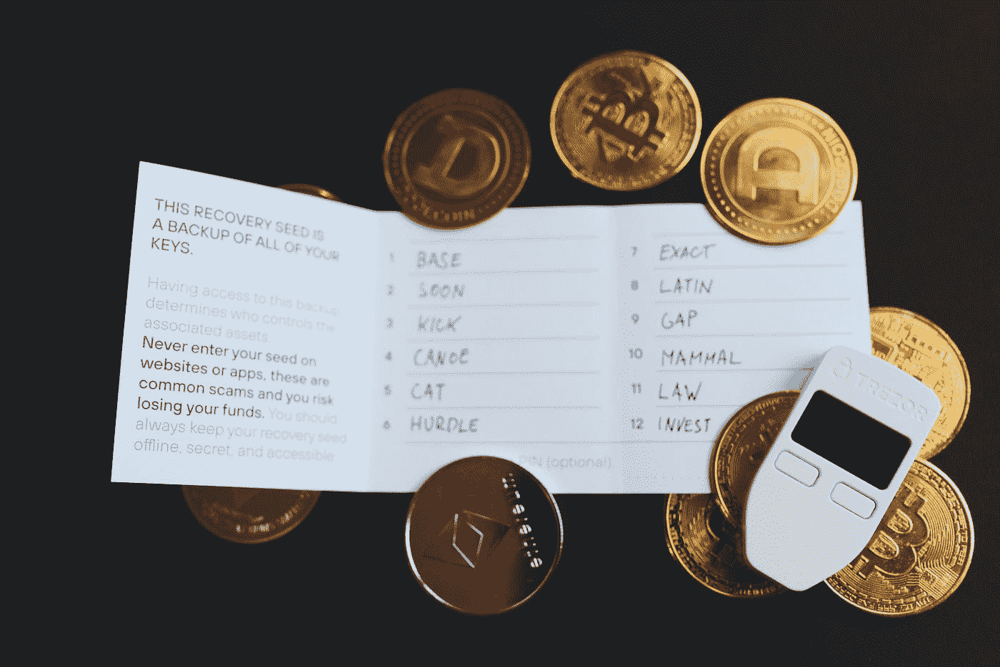

# 自我监护；密码的未来

> 原文：<https://medium.com/coinmonks/self-custody-the-future-of-crypto-ddeedb2d216c?source=collection_archive---------25----------------------->

Photo by [Traxer](https://unsplash.com/@traxer?utm_source=medium&utm_medium=referral) on [Unsplash](https://unsplash.com?utm_source=medium&utm_medium=referral)

最初，加密行业是建立在无缝的点对点交易和自我保管的基础上的。Satoshi 设想了一个世界，在这个世界中，个人可以在世界任何地方处理和传输支付，而无需任何形式的中介。这个系统将在节点上运行，并由一个被称为密码术的加密系统保护。

> 从顶级交易者那里复制交易机器人。免费试用。

然而，随着行业的发展，我们见证了集中式交易所的激增。这些平台有助于推动加密在世界各地的采用，因为它们具有易于使用的客户界面、持续的流动性等特性。

> **亦见:** [**Web3 熊市中的社区建设。**](/geekculture/web3-community-building-in-a-bear-market-69f999b14f58)

# **集中化的成本**

集中式密码交易所为消费者提供了一种方便且有吸引力的密码投资方式。然而，这些平台的使用使行业消费者保护付出了代价，并对近期影响许多行业参与者的大规模崩溃负有责任，使他们损失了数十亿美元。这些交易所的监管和 KYC 要求也与加密货币的分散性质相冲突。

FTX 和 AAX 等交易所的内爆让用户开始质疑加密行业所谓的去中心化。

一个适当实施和维护的分散金融经济(DeFi)将符合客户和运营商的利益，更不用说提供监管机构试图实现的成文消费者保护了。

然而，需要注意的是，尽管许多加密货币所基于的区块链技术可能是分散的，但加密货币行业本身并没有摆脱集中化。

例如，某些交易所或矿池可能对市场或网络具有不成比例的影响力。此外，一些加密货币的开发可能更加集中，一小部分个人或组织对项目的方向有很大的控制权。

该行业的参与者开始将自我托管视为加密货币的前进方向和未来。

> **另见:**[**web 3 目前是否被过度炒作？入门指南。**](/@ilekeairende/is-web3-currently-overhyped-an-introductory-guide-61ec197c96e6)

# 什么是自我监护？

Photo by [regularguy.eth](https://unsplash.com/@moneyphotos?utm_source=medium&utm_medium=referral) on [Unsplash](https://unsplash.com?utm_source=medium&utm_medium=referral)

自我托管是指持有和管理自己的加密货币资产，而不是委托给第三方，如加密货币交易所或在线钱包服务。

自保管被视为加密货币行业当前面临的许多问题的解决方案有几个原因:

1.  **安全性**:持有加密货币的一个主要担忧是被盗或丢失的风险。通过持有和管理您自己的资产，您可以完全控制自己的安全措施，并采取措施保护您的资产免受黑客或其他威胁。
2.  **控制:**当你持有自己的资产，你就拥有了对自己资金的完全控制权。您可以进行交易和决策，而无需寻求第三方的批准。
3.  **去中心化:**加密货币的主要目标之一是创建一个不受任何单一实体控制的去中心化系统。通过持有你的资产，系统的去中心化得以维持。
4.  隐私:大多数人更喜欢自我保管，因为这可以让他们保持财务交易和财产的私密性。当您使用第三方服务时，您可能需要提供个人信息，并且您的交易可能会被其他人看到。
5.  **成本:**自我托管通常比第三方服务便宜，因为你不需要支付费用来为你保管和管理你的资产。

总体而言，自保管是加密货币生态系统的关键组成部分，有助于解决该行业面临的许多挑战。

值得注意的是，自我监护也伴随着一些责任和风险。例如，您需要安全地存储您的资产，这可能需要硬件钱包或其他安全措施。您还需要积极主动地保护您的资产安全，因为如果出现问题，您将没有第三方的保护。

> **参见:** [**在加密熊市中赚钱的其他方法。**](/coinmonks/other-ways-to-make-money-in-a-crypto-bear-market-4832bd276176)

# 结论

我们再次处于一个转折点，密码行业必须挑战集中化。我们必须挑战腐败的首席执行官、商业秘密，并追溯加密货币的根源，让人们能够掌控理应属于他们的东西。

区块链意味着摆脱通货膨胀、暴政和集权，我们必须通过支持促进自我监管和个人对个人贸易的系统来实现这一目标。

> 加入 Coinmonks [电报频道](https://t.me/coincodecap)和 [Youtube 频道](https://www.youtube.com/c/coinmonks/videos)了解加密交易和投资

# 另外，阅读

*   [OKEx vs KuCoin](https://coincodecap.com/okex-kucoin) | [摄氏替代度](https://coincodecap.com/celsius-alternatives) | [如何购买 VeChain](https://coincodecap.com/buy-vechain)
*   [ProfitFarmers 回顾](https://coincodecap.com/profitfarmers-review) | [如何使用 Cornix 交易机器人](https://coincodecap.com/cornix-trading-bot)
*   [如何匿名购买比特币](https://coincodecap.com/buy-bitcoin-anonymously) | [比特币现金钱包](https://coincodecap.com/bitcoin-cash-wallets)
*   [瓦济里克斯 NFT 评论](https://coincodecap.com/wazirx-nft-review)|[Bitsgap vs Pionex](https://coincodecap.com/bitsgap-vs-pionex)|[Tangem 评论](https://coincodecap.com/tangem-wallet-review)
*   如何使用 Solidity 在以太坊上创建 DApp？