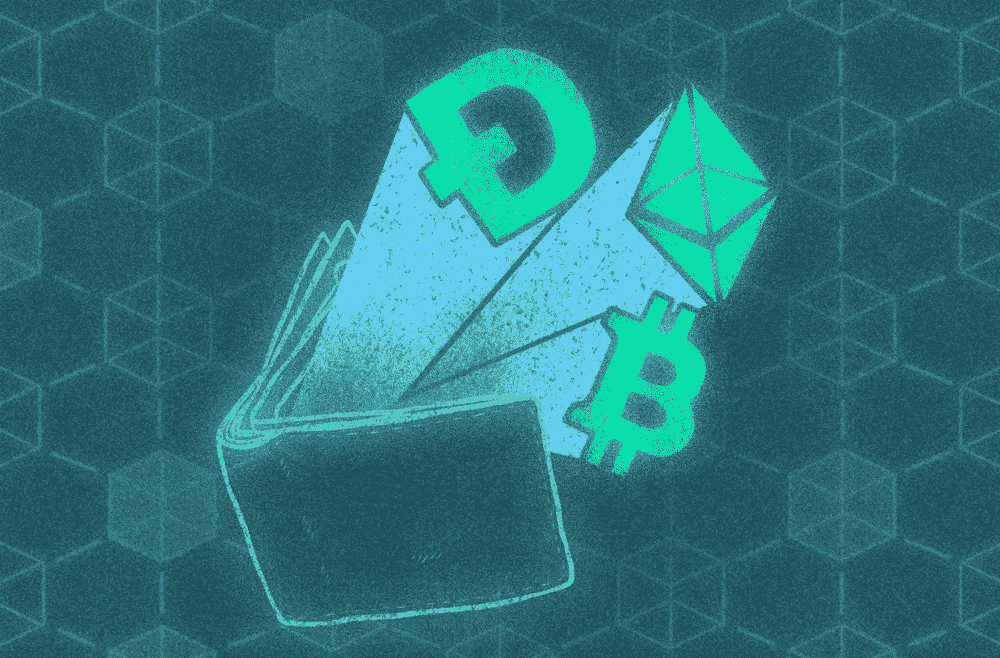

# 自我保管钱包，保护你的钱安全的最好方法

> 原文：<https://medium.com/coinmonks/self-custody-wallets-the-best-way-to-keep-your-money-secure-a4220f8137ae?source=collection_archive---------20----------------------->

FTX 最近的破产，以及更有可能的 BlockFi 的破产、Gemini 的暂停提款和 Celcius 不久前的破产，给许多加密投资者上了痛苦的一课。“不是你的钥匙，不是你的密码。”这不仅仅是一个简单的口号，因为它证明了一个伟大的现实，加密货币存在于…