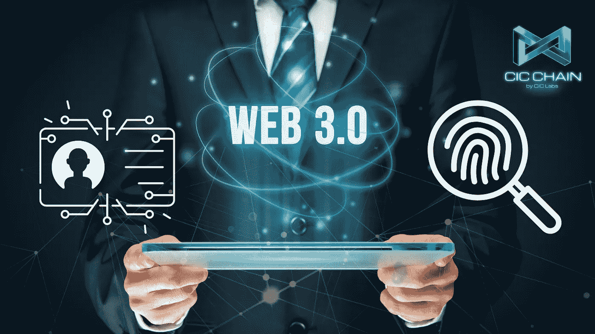

# 自我主权身份&区块链技术

> 原文：<https://medium.com/coinmonks/self-sovereign-identity-blockchain-technology-ae4a761c4ebc?source=collection_archive---------12----------------------->

有没有可能生活在一个你可以掌控自己私人信息的世界里？自我主权的概念是可能的吗？区块链科技如何融入其中？首先让我们分解一下什么是自我主权。把它看作是自我所有权，以及控制你个人、财产和生活的能力。主权的最初概念来自政治世界，然而与我们所有人直接相关。让我们来看几个例子，看看自我主权对你的在线和离线数字足迹的直接影响。

当您访问一个网站时，您会得到一个提示，让您知道该网站接受 cookies，它会问您是接受还是拒绝，这是一个您可以选择您的数据是否将用于研究目的或发送给各种实体的例子。如果每个人都花一点时间阅读免责声明，我们就会确切地知道他们打算用我们的数据做什么。这与日常生活没有什么不同，以某种方式或形式，有一个集中的权威来管理我们的数据。

我们都随身携带的一个普通物品是钱包。信用卡或个人身份证明是我们都携带的一些常用物品。如果你去商店试图购买酒类产品，你必须向收银员出示你的身份证明，以证明你达到了法定年龄。如果你不必向一个陌生人透露你所有敏感的私人信息，那不是很好吗？无论你是否达到法定年龄，一个简单的是或否就足够了。

在今天的现代社会中，集权导致通过官僚体系的控制，它也不会止于政府。任何时候你使用互联网或任何在线的东西，你的数据都会被跟踪。关于你的零碎信息正在被跟踪、保存和使用。有没有这样的经历:当你在谷歌上搜索某样东西时，你正在使用脸书，并注意到你在谷歌上搜索的某样东西的广告？这是你最初进行谷歌搜索时使用的数据。它不会就此停止，你的数据在一个循环中不断被出售、被转移、被使用。也许你在商店里，你需要出示你的身份证明，就像上面的例子一样。当你的身份证被扫描时，你真的知道你的个人信息被做了什么，或者谁在查看它吗？

Web 2.0 (web2)或更广为人知的社交网络，指的是网站拥有由其他用户创建的内容。允许每个人参与使用这些网站。这些网站与其他系统或设备兼容，如游戏设备或手机。它们旨在简单易用，适用于所有人，包括企业。网上有几种不同类别或类型的内容。这些不同的组织使用从其网站生成的数据进行有针对性的营销。这些实体或集中管理机构可以包括不同的……

*   政府机构
*   零售企业
*   任何提供商品和服务的企业
*   新闻媒体
*   社交媒体渠道
*   金融机构
*   教育机构

他们都跟踪我们在网上的一举一动，这剥夺了我们对个人数据的控制权。因此，保持匿名几乎是不可能的。这是我们在线足迹的直接含义。这也包括我们与当地企业、杂货店的面对面互动，甚至是在贷款买车或买房时。你的数字指纹基本上到处都在使用。

一个新的激进的万维网的想法，带来了像去中心化和区块链技术这样的新概念。web 2.0 的继任者是 web 3.0 (web3)，它的存在在世界各地都能感受到。相比之下，对于 web2，内容和数据由大型科技公司等实体集中，而对于 web3，分散化等想法正在实施，这正好相反。分散化意味着从这些大组织中重新分配决策或计划，并取消中央权力的控制。将区块链加入这个疯狂的概念，你会得到一个分散的区块链网络。

在一个分散的区块链网络中，所有成员都是匿名的，没有人互相认识。这是一个不信任的环境。分布式分类帐包含所有数据，并且网络上的每个成员都可以平等地访问分类帐中包含的相同数据。由于数据的维护方式，信任在传统意义上并不是一个必要的组成部分。即使数据被更改或损坏，它也会被网络上的大多数成员拒绝，这是因为每个人都可以访问相同的数据。本质上，这就是当你听到术语“不变的”或者说“区块链是不变的”时的意思。这意味着数据不能被修改，一旦处理完毕，它就是最终的。每个人都可以平等地访问数据的实时共享视图。

想象一下，拥有自己的数据，而不是受制于你的个性化信息分布在整个万维网。拥有一种无需出示身份证明就能证明你是谁的身份证明手段，比如一个数字钱包或与你相关的身份证明，而不显示你的个人信息，保持假名。在全球范围内被接受的东西，可以被商品和服务接受，或者作为一种身份证明。试着想象完全控制你的在线数据，你的数字身份，并且是选择发布什么信息和向谁发布的人。借助区块链技术的力量，这是可能的。您可以安全可靠地存储您的身份。你可以完全控制你的个人隐私信息。这个概念被称为自我主权身份(SSI)。

现在你知道自主意味着什么了。提到的例子是我们都可以涉及的常见例子。我们已经了解了 web2 的领域，以及集中化的公司如何在一个永无止境的循环中不仅收获而且使用你的数据。我们已经了解了 web3 以及区块链技术将如何融入 SSI 的概念。存在许多不同的区块链，但是它们缺乏必要的基本要素。SSI 的这一新思想需要建立在一个区块链上，它能够提供最高级别的企业级安全性，能够处理全球的高需求，并保持最高级别的分散化和速度而不打折扣。疯狂互联网币拥有支持 SSI 所需的技术和架构框架。[中投链](https://medium.com/u/f3354b7470ef?source=post_page-----ae4a761c4ebc--------------------------------)

“你建了，他们就来了。”金塞拉公司

如果你想了解更多关于 CIC 链，请查看他们的官方媒体帐户…..

[中投连锁](https://medium.com/u/f3354b7470ef?source=post_page-----ae4a761c4ebc--------------------------------)

以下是他们白皮书和网站的官方链接。

[中投白皮书](http://cicchain.gitbook.io/)

[中投网站](https://cicchain.net/)

[中投链接树](https://linktr.ee/cicchain)

*任何书面材料都不构成财务建议，也不应被误解为财务建议。在购买或投资之前，请务必咨询财务顾问。本文中的信息仅供参考，不得误解。*

*   如果你喜欢这篇文章，请考虑关注我，留下一个好的评论和一些掌声。谢谢你的时间。

> 交易新手？试试[加密交易机器人](/coinmonks/crypto-trading-bot-c2ffce8acb2a)或者[复制交易](/coinmonks/top-10-crypto-copy-trading-platforms-for-beginners-d0c37c7d698c)