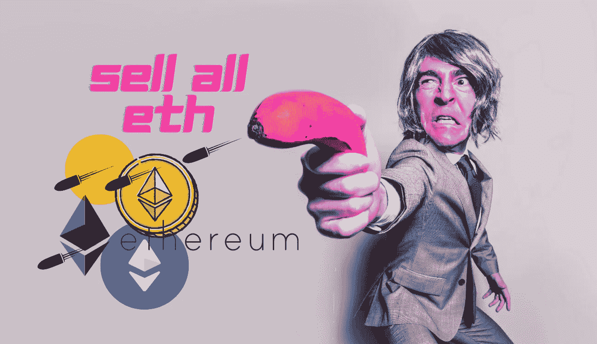

# 卖掉我的以太坊，买比特币。$200.000 ?？

> 原文：<https://medium.com/coinmonks/selling-my-ethereum-and-buying-bitcoin-200-000-e1e0cf0eb3b8?source=collection_archive---------5----------------------->

最近，市场上充满了恐惧。FTX 崩溃后，大量个人宣布加密货币已死。然而，比特币和其他加密货币一直保持着价值。然而现在，以太坊已经是垃圾了。我意识到有很多以太坊的乐观主义者，我会解释为什么以太坊特别不值钱。