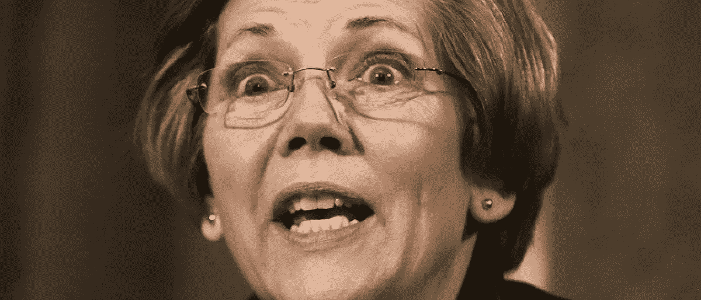

# 沃伦参议员的自我监护权之战

> 原文：<https://medium.com/coinmonks/sen-warrens-war-on-self-custody-d0007bafeeb9?source=collection_archive---------14----------------------->

# 新法案针对钱包、自动取款机等

她回来了。

美国参议员伊丽莎白·沃伦(D-MA)是参议院银行和金融委员会的资深成员，他提出了一项新法案，旨在“数字资产洗钱”

**“2022 年数字资产反洗钱法案”**由沃伦参议员的同事罗杰·马歇尔参议员(R-KS)共同发起。

Sen. Elizabeth Warren (D-MA)