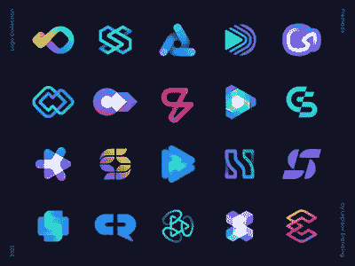
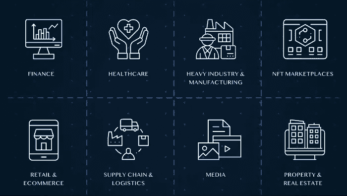

# 把小麦从谷壳中分离出来——对加密白皮书的研究

> 原文：<https://medium.com/coinmonks/separating-the-wheat-from-the-chaff-8bc5ae30deb?source=collection_archive---------44----------------------->

随着加密货币市场的不断发展和成熟，投资者在投资新项目之前进行尽职调查非常重要。这个过程的一个关键方面是检查项目的白皮书，它概述了项目的技术细节和路线图。

以下是评估加密货币白皮书时需要考虑的一些要点:

**清晰和透明**——一份高质量的白皮书应该清晰简明地解释项目试图解决的问题，以及它提出的解决方案。它的目标、资金和团队成员也应该是透明的。

白皮书还应概述项目的目标，包括任何长期愿景或使命陈述。这有助于给出项目的背景，并帮助投资者理解团队的动机。白皮书应该透明地说明项目的资金来源，包括任何计划中的 ICO 或其他筹资活动。它还应该提供资金将如何使用的细节，包括对开发团队的任何分配或其他费用。白皮书应该清楚地表明，该项目打算如何度过漫长的熊市。

白皮书应提供项目团队成员的信息，包括他们的资格和相关经验。这有助于建立团队的信誉和专业知识，并让投资者对他们执行项目目标的能力充满信心。

**技术可行性** —白皮书应以技术和非技术读者易于理解的方式概述项目的技术细节。它还应该解决任何潜在的可伸缩性或安全性问题。技术可行性强的加密货币是指具有设计良好、可靠的技术平台，并能够有效实施和使用的加密货币。以下是在技术可行性很强的加密中需要注意的一些关键特征:

1.  可伸缩性:技术应该能够处理大量的事务，而不会遇到延迟或技术问题。这对于旨在被广泛采用并用于大量交易的加密货币来说尤其重要。
2.  安全性:技术应该是安全的，有可靠的措施来防止黑客或其他类型的网络攻击。这对于维持对加密货币的信任和确保用户资金安全至关重要。
3.  易用性:该技术应该易于使用和理解，具有用户友好的界面和清晰的文档。这有助于增加加密货币的采用和使用。
4.  集成:该技术应该能够轻松地与其他系统和技术集成，如钱包或交易所。这有助于提高加密货币的可访问性和实用性。

通过考虑这些因素，投资者可以更好地了解加密货币的技术可行性，以及它是否有可能成功实施和使用。

**用例** -一份强有力的白皮书应该清楚地展示加密货币的实际用例，以及它将如何为用户的生活增加价值。加密货币有广泛的潜在使用案例，包括:

1.  交易:加密货币最常见的用途之一是作为交易的交换媒介。加密货币可以用于在线或亲自购买商品和服务，并且可以快速轻松地发送和接收。
2.  价值储存:一些加密货币，如比特币，被视为价值储存，类似于黄金。它们可以作为一种长期保值的方式，因为它们的价值不与任何特定的国家或货币挂钩。
3.  分散金融(DeFi):加密货币也可以用于分散金融(DeFi)应用，这是建立在区块链上的金融服务。这些平台包括没有中央权威的借贷和交易平台。
4.  身份验证:一些加密货币，如 Civic，旨在用作身份验证的一种形式。这些可以用来安全地和秘密地验证个人的身份，而不需要集中的权威机构。
5.  供应链管理:加密货币可以用来跟踪和验证供应链中货物和材料的移动。这有助于提高效率，降低欺诈或错误的风险。

这些只是加密货币潜在用例的几个例子。随着技术的不断发展，加密货币可能会出现新的创新用途。

**路线图**——加密货币路线图是一份文件，概述了一个项目在一段时间内的发展计划。它通常包括关键里程碑和交付成果的时间表，以及任何计划的合作伙伴关系或协作。

以下是加密路线图应该包括的一些关键要素:

1.  里程碑:路线图应该清楚地定义项目团队要实现的关键里程碑，并提供预期完成的时间表。这些里程碑可能包括 mainnet 的启动、新特性或产品的发布，或者特定采用或使用目标的实现。
2.  可交付成果:路线图还应该概述项目团队将负责的具体可交付成果，例如代码发布或技术文档。这有助于让投资者和用户清楚地了解随着时间的推移可以从项目中得到什么。
3.  伙伴关系和协作:路线图还应提及任何计划中的与其他公司或组织的伙伴关系或协作。这些有助于增加项目的可信度，并有可能增加项目的覆盖面和采用率。
4.  调整和更新:路线图应包括根据需要调整和更新计划的过程。这有助于确保项目保持在正轨上，并对市场或行业的变化做出响应。

总的来说，一个高质量的加密路线图应该为一个项目的开发计划提供一个清晰而详细的概述，并有助于让投资者和用户对团队实现其目标的能力充满信心。

**法律和法规考虑事项** -白皮书应解决可能影响项目的任何法律或法规问题，例如遵守证券法或数据隐私法规。这些可能会因您所在的司法管辖区以及您正在考虑的加密货币的具体特征而异。以下是一些需要考虑的要点:

1.  许可和注册:一些国家可能要求加密货币交易所或加密货币市场中涉及的其他企业获得许可或注册。确保您使用的平台经过适当的许可和注册非常重要，因为这可以提供一定程度的保护和监督。
2.  证券法:根据加密货币的具体特征，它可能被监管机构视为一种证券。这可能会产生重大的法律和监管影响，包括需要遵守证券法并在相关监管机构注册。
3.  税收:加密货币通常需要纳税，具体的税务处理可能会因司法管辖区和具体情况而异。了解购买和持有加密货币的税务影响，并根据需要寻求专业建议非常重要。
4.  消费者保护:一些国家的消费者保护法适用于加密货币的销售和购买。了解这些法律以及它们如何影响你作为消费者的权利是很重要的。

监管和法律考虑事项应在白皮书中说明，并应与您所在的司法管辖区相关。

通过考虑这些因素，投资者可以更好地了解加密货币项目的可行性和潜力，并做出更明智的投资决策。

总体而言，高质量的加密货币白皮书应该清晰、透明、技术上可行，并为项目提供令人信服的用例和路线图。通过仔细评估这些因素，投资者可以就是否投资某个特定项目做出更明智的决定。

> *交易新手？试试* [*密码交易机器人*](/coinmonks/crypto-trading-bot-c2ffce8acb2a) *或* [*复制交易*](/coinmonks/top-10-crypto-copy-trading-platforms-for-beginners-d0c37c7d698c)
> 
> *分散密码持有量，了解* [*币安替代品*](https://coincodecap.com/binance-alternatives)
> 
> *加入 Coinmonks* [*电报频道*](https://t.me/coincodecap) *和* [*Youtube 频道*](https://www.youtube.com/c/coinmonks/videos) *获取每日* [*加密新闻*](http://coincodecap.com/)

# 另外，阅读

*   [复制交易](/coinmonks/top-10-crypto-copy-trading-platforms-for-beginners-d0c37c7d698c) | [加密税务软件](/coinmonks/crypto-tax-software-ed4b4810e338)
*   [网格交易](https://coincodecap.com/grid-trading) | [加密硬件钱包](/coinmonks/the-best-cryptocurrency-hardware-wallets-of-2020-e28b1c124069)
*   [密码电报信号](/coinmonks/top-3-telegram-channels-for-crypto-traders-in-2021-8385f4411ff4) | [密码交易机器人](/coinmonks/crypto-trading-bot-c2ffce8acb2a)
*   [最佳加密交易所](/coinmonks/crypto-exchange-dd2f9d6f3769) | [印度最佳加密交易所](/coinmonks/bitcoin-exchange-in-india-7f1fe79715c9)
*   [面向开发者的最佳加密 API](/coinmonks/best-crypto-apis-for-developers-5efe3a597a9f)
*   最佳[密码借贷平台](/coinmonks/top-5-crypto-lending-platforms-in-2020-that-you-need-to-know-a1b675cec3fa)
*   [免费加密信号](/coinmonks/free-crypto-signals-48b25e61a8da) | [加密交易机器人](/coinmonks/crypto-trading-bot-c2ffce8acb2a)
*   杠杆代币的终极指南