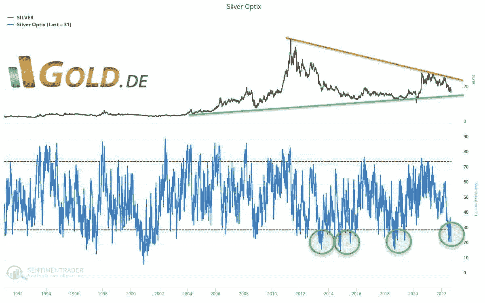
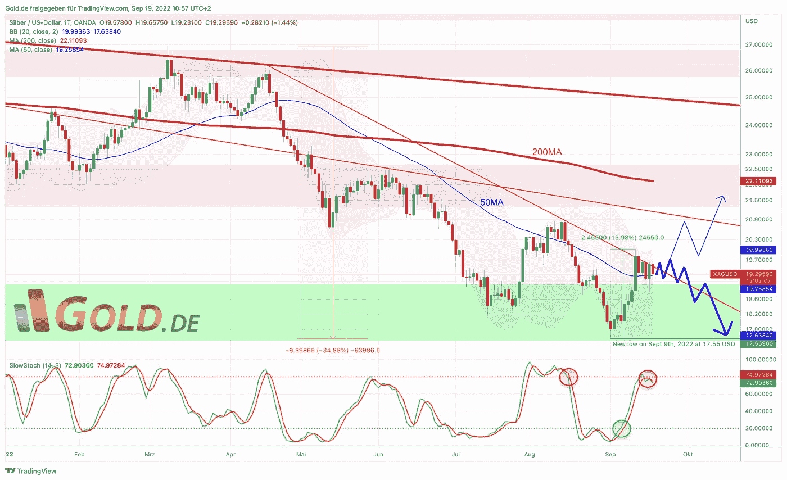
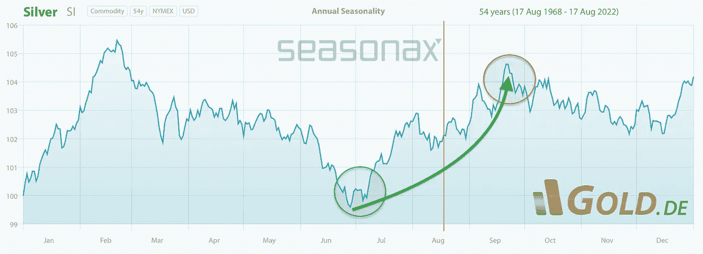

# 2022 年 9 月 19 日，白银——相对实力值得怀疑

> 原文：<https://medium.com/coinmonks/september-19th-2022-silver-questionable-relative-strength-c97af24d0f75?source=collection_archive---------38----------------------->

金融市场被熊市牢牢地束缚住了。显然，贵金属价格也无法逃脱这一点。尽管在仲夏，整个行业出现了可观的复苏，但自 8 月 15 日以来，黄金和白银价格承受了巨大压力，而股市又开始暴跌。

然而，从 9 月 1 日 17.55 美元的 20 个月新低开始，白银表现出惊人的“相对强势”。因此，本周收于 19.56 美元，略低于 20 美元的心理价位，比本月初高出近 11%。然而，这种相对强势很可能只是一种暂时现象。尽管白银多头正试图突破自 4 月份以来确立的下降趋势线，但正如预期的那样，黄金一直在突破 1，680 美元左右的关键支撑。如果黄金继续走弱，白银的相对优势可能会再次迅速消失。

*Silver longterm sentiment as of September 15th, 2022\. ©*[*Midas Touch Consulting*](https://www.tradingview.com/?aff_id=1321)

从大的方面来看，白银多年来一直未能站稳脚跟。上一次接近 50 美元左右的历史高点发生在 11.5 年前。自 3 月初接近 27 美元的高点以来，到 8 月底，白银已经下跌了近 35%。与此同时，白银市场严重超卖，暴跌的市场形势基本上提供了一个反向操作的机会。情绪低落，大多数投机者已经认输。因此，剩余的价格下行风险应该不会太大。因此，如果空头继续控制局面，他们的下跌只会缓慢而顽强地进行。

## **不利的前景，直到美联储转向**

**总体而言，鉴于当前金融市场的流动性危机，白银的中短期前景仍然非常不利。现在一切都围绕着这样一个问题:美国美联储将加息多少，以及由此对金融市场和实体经济造成的损害实际上会有多大。**

> “随着美元流动性枯竭，市场、经济和生活方式也会枯竭。记住:从根本上讲，所有市场危机都只是流动性危机。”

**只有当信贷市场或主要金融机构开始出现问题时，这种限制性的央行政策才会发生逆转。根据形势恶化的速度，美国美联储可能会在未来 6 到 12 个月内被迫做出重大改变..然后，贵金属价格将能够从可预见的新印钞狂欢中大幅获利。在此之前，必须保持耐心、冷静和高流动性头寸(最好是美元和瑞士法郎)。对下跌的贵金属价格进行反向但逐渐的实物积累也是非常合理的。**

## 美元白银价格，日线图——只是昙花一现还是看涨信号？

*Silver in US-Dollar, daily chart as of September 19th, 2022\. ©*[*Midas Touch Consulting*](https://www.tradingview.com/?aff_id=1321)

从 17.55 美元的 20 个月新低开始，白银在两周内大幅反弹了 14%。目前，在近几个月的下降趋势线上，这种陡峭的反向运动可能会以看涨旗的形式得到巩固。鉴于随机振荡器的新卖出信号以及布林带上轨(20.01 美元)的强大阻力，白银的价格行为应该暂时被更好地归类为昙花一现。只有当白银多头可持续地夺回 20 美元水平时，进一步的上行目标才会解锁。这将是 21.10 美元附近的下一个下降趋势线，以及下降的 200 天移动平均线(22.11 美元)。

*Silver seasonality as of August 18th, 2022 © Seasonax and Gold.de*

与此同时，有利的季节性窗口正在关闭，从统计数据来看，白银在 12 月中旬之前应该会继续承压。

总而言之，白银的相对强势令人惊讶。鉴于艰难的大局，其是否能由此发展出更多值得怀疑。显然，只有时间能证明一切，但在熊市中，大幅反弹是很典型的。如果没有更坚挺的金价，白银肯定会再次陷入困境。从长远来看，贵金属是不可避免的。因此，疲软的价格提供了更好的进入机会。然而，过于激进的定位目前没有任何意义。因此，金融市场和贵金属价格都深陷于修正和熊市之中。

## 欧元白银的下一个买入机会在 18，00 欧元以下

我们最后的买入上限 18.75 欧元让我们在八月和九月初以非常有利的低价买入白银。目前，白银交易价格为 19.40 美元。根据我们的分析，我们认为下一个买入上限应该在 18.00 欧元以下。

*分析最初发表于 2022 年 9 月 15 日，作者*[*www . gold . de*](https://www.gold.de/artikel/gold-sommerrally-startet-mit-vielversprechendem-momentum/)*。2022 年 9 月 19 日翻译成英文并部分更新。*

*随时加入我们的* [*我们的免费电报频道*](https://t.me/MidasTouchConsulting) *获取每日实时数据和一个伟大的社区。如果您喜欢获得我们的黄金模型、贵金属和加密货币的定期更新，您还可以订阅我们的* [*免费简讯*](http://bit.ly/1EUdt2K) *。*

*声明:本文及其内容仅供参考，不包含投资建议或推荐。每一次投资和交易都有风险，读者在做决定时应该进行自己的研究。此处表达的观点、想法和意见仅属于作者个人。它们不一定反映或代表 Midas Touch Consulting 的观点和意见。*

> 交易新手？试试[密码交易机器人](/coinmonks/crypto-trading-bot-c2ffce8acb2a)或者[复制交易](/coinmonks/top-10-crypto-copy-trading-platforms-for-beginners-d0c37c7d698c)