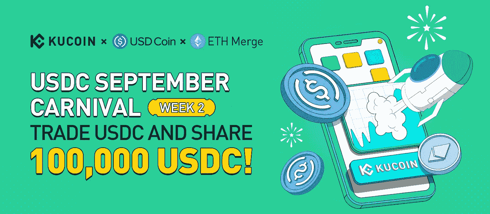

# 九月狂欢节:KuCoin 空投

> 原文：<https://medium.com/coinmonks/september-carnival-kucoin-airdrop-3b9c49c76a8c?source=collection_archive---------18----------------------->

第二周:用 USDC 换 10 万 USDC！

[KuCoin](https://www.kucoin.com/ucenter/signup?rcode=rPA1V32) 是一家全球性的加密货币交易所，旨在为用户提供便捷、安全的数字资产交易和兑换服务。 [KuCoin](https://www.kucoin.com/ucenter/signup?rcode=rPA1V32) 被全球四分之一的加密货币持有者使用。

[KuCoin](https://www.kucoin.com/ucenter/signup?rcode=rPA1V32) 为其用户举办了许多交易比赛和赠品活动。

> 创建一个 [KuCoin](https://www.kucoin.com/ucenter/signup?rcode=rPA1V32) 帐户，参加下列活动，赢取奖励、注册奖金和其他福利。

## 逐步说明:

## 活动 1:交易美元并分享 10 万美元

创建一个 [KuCoin](https://www.kucoin.com/ucenter/signup?rcode=rPA1V32) 账户。

如果用户在 [KuCoin](https://www.kucoin.com/ucenter/signup?rcode=rPA1V32) 上的净存款金额至少为 100 USDC，他们将被视为有资格在活动期间利用以下奖金池:
Pool 1:一笔 8000 USDC 奖金将在所有有资格的参与者之间平均分配。池 2:合格的用户可以参加幸运奖金抽奖，如果他们交易至少 500 USDC 的额外金额。200 名幸运用户将平分 7000 USDC。每人将获得 USDC 35。

此外，参加其他活动以获得更多奖励。

## 活动 2:交易比赛，COV 的 50，000 美元任你挑选！

创建一个 [KuCoin](https://www.kucoin.com/ucenter/signup?rcode=rPA1V32) 账户。

累计交易 500 COV 或以上(买入+卖出)的用户将被 [KuCoin](https://www.kucoin.com/ucenter/signup?rcode=rPA1V32) 纳入幸运抽奖。5000 美元的 COV 奖金将在 500 名幸运用户中平均分配。每个幸运的用户将在 COV 获得 10 美元！

在活动期间购买和销售 COV 最多的前 100 个帐户将分别获得 35，000 美元的 COV 奖金池！

将 COV/USDT、COV/BTC 和 COV/瑞士联邦交易所交易对添加到他们的收藏夹列表中，并且 COV 交易量(买入+卖出)达到 800 COV 的用户将平分价值 10，000 美元的 COV 奖金池！

## 活动 3:分享 50，000 美元的 CMP，用 Caduceus 推广元宇宙！

创建一个 [KuCoin](https://www.kucoin.com/ucenter/signup?rcode=rPA1V32) 账户。

在活动期间， [KuCoin](https://www.kucoin.com/ucenter/signup?rcode=rPA1V32) 的净存款至少达到 350 CMP(少于 90 美元)的用户将按其净存款总额的比例分享 10，000 美元的 CMP 奖池。

在他们的[库币](https://www.kucoin.com/ucenter/signup?rcode=rPA1V32)交易余额中至少有 1,000 CMP(少于 250 美元)的用户将分享 30000 美元的 CMP 奖励池！

成功完成 Gleam 任务的用户将平分 10，000 美元的 CMP 奖金池。尝试了解更多关于卡德鲁斯的知识，以便有资格获得大师奖！

> 交易新手？试试[密码交易机器人](/coinmonks/crypto-trading-bot-c2ffce8acb2a)或[复制交易](/coinmonks/top-10-crypto-copy-trading-platforms-for-beginners-d0c37c7d698c)