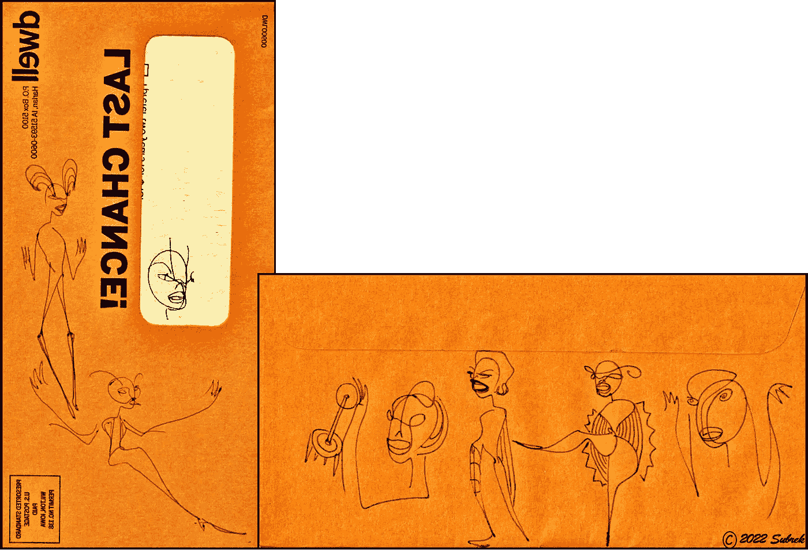

# 九月/秋季加密矿工电子表格

> 原文：<https://medium.com/coinmonks/september-fall-crypto-miner-spreadsheet-fead21ee4873?source=collection_archive---------7----------------------->

四种被动收入投资值得关注…

At 1st glance, it’s not a very sexy spreadsheet (dancers were added to spice things up). However, dig a little deeper, below…

> 秋天到了…是时候转向长期发展了…

> *我喜欢探索&解剖新——通常是* ***高风险！*** *—口袋改变加密赌注协议。我要么把他们分开，要么决定投资这个项目，鼓励他们的可持续性发展。这些项目中很少会上升到顶端；那些是我正在寻找的。*

九月已经成为一个非常不同的月份。我笑得很开心……不是因为我赚了大钱，在投资我的加密零钱上赚了一大笔——从数学上来说，我这个月做得很好。

> 我笑了，因为随着我的投资活动进入更好的位置，我对这个秘密空间的信心也随之提高；这种感觉在这里很棒。

## 进化的，逐步发展

这个月，我把我在 dresser-top 的大部分投资基金转移到了更稳定/可持续、更长期的 DeFi 投资社区，如 Furio、滴滴网络和动物农场。

为了获得更高风险的乐趣，我还投资了滴滴花园和巴士健康。我们稍后会讲到可怜的侏罗纪农夫，在底部…

**电子表格:**注意上面的电子表格中 **Return** 栏下耀眼的空白区域——它实际上是空的。今年 9 月，对我来说，投资并不指望立即获得回报。这些是长期的被动收入投资。他们仍然要求每天花一点时间将每日回报复合到系统中；不过，这没什么大不了的，期望每天能取得 1%或 5%的回报。

> 九月份的投资额是 1250 美元。了解自己的这一点很棒:我对可能减掉那么多体重没什么意见。当然，我肯定会很难过，因为小房子的建设计划将会被推迟到更远的将来。然而，我愿意冒这个 1250 美元的险。

## 我的潜在回报是什么？

一个小房子——也许比预期的要早。更多的微笑。

但说真的，用这些投资协议，我能在 6 个月内赚多少钱？明年我的投资会是什么样的？

**跳跃到不可能的未来 6 个月，在纸上，**下面是我 9 月份在币安投资的电子表格——2022 年 3 月。让我们想象一下，我每天都在复利，在这 6 个月里没有收集任何回报。

此外，请注意，高额的出入境税是滴滴、Furio 和动物农场平台运作的一部分，也是不可或缺的一部分。我的数字已经包括支付 10%的入境税。为了简单起见，从下面的最终数字中减去 10%的出境税。

> 电子表格 2023 年 3 月>>

By March, expect plenty more beings at the party — all are welcome. In a perfect world, in 6 months the figures in red will come to pass for this happy long-term investor. Note that these figures are before the 10% exit tax…

> ***注:*** *当我成功地从一个协议中赚到钱时——不一定是我的全部投资回报，只是现在——我会写下我的经历。如果你喜欢这个协议，决定投资进去，那是我的目标，我很激动。投资于该议定书有助于其可持续性。*
> 
> 使用这篇文章中的推荐链接将会给我一点补偿&这是一个让我知道这些对话是有益的极好方式。如果你使用我的推荐链接，谢谢！

## 都在外面了

关于 Furio、Drip Network 和动物农场社区，有许多令人难以置信的信息来源，在这次对话中没有必要重复其他人的仔细研究。现在我投资了这些平台，我过着我所读到的生活，这让我非常开心。从这里开始，自己去阅读它们吧…

以下是我正在密切关注的 4 个秋季投资。当然，2023 年 3 月我会在这里看到结果。*😎跟着我直到那时…*

## [Furio.io](https://app.furio.io/team/0x024ee915c2BF9d12F98b750119051A752e18CAa0)

<< [Furio 白皮书](https://furio.io/whitepaper)T27>

*投资 Furio &前 28 天获得 1.75%的日收益率，之后调整至 2.5%。有&出可持续税收的费用，团队建设推荐有助于增加社区支持，复利显然是核心，通货紧缩象征性政策保护后期投资者，有可变%奖励系统，&惩罚反倾销机制进一步保护合同。咻！*

我有三个带 Furio 的钱包。我的目标是每天复利&在 3 月 22 日之前不要收集，把我的回报推到上面表格中的 3 个数字。

## Furio 有趣的事实:

浮利欧是一只幼犬——大约只有 100 多天大。由于新投资者是这些平台的(许多)可持续性方面之一，我一直很好奇有多少人在投资一个项目。下图中的绿线表明了这一点。图表从六月中旬开始，到现在。

Sunday, Sept 25th, there were 3770 Unique Incoming Addresses — new investors — into Furio.io. Sweet.

<<[读我潜入 Furio.io](/@jebalucas/finding-my-way-to-furio-ddf85c6a6318) > >

你不会是我的伙伴吗？我的好友推荐链接在下面。Thx！

[0x 66 ab 1c 0978 df 3 AC 4c 9 CFA 0 b 9 E8 BD 6 ECE 4b 57 ee 9d](https://app.furio.io/team/0x024ee915c2BF9d12F98b750119051A752e18CAa0)

## [滴滴网](http://drip.community/faucet?buddy=0x66ab1C0978Df3AC4c9cfa0b9e8bd6EcE4B57Ee9d)

<<[滴滴网白皮书](https://drip.community/docs/DRIP_LIGHTPAPER_v0.8_Lit_Version.pdf) > >

*滴滴网络的水龙头是一种低风险、高回报的合同，其运作方式类似于高收益存单，每天支付 1%的投资回报率，最高可达 365%。投资者可以通过存款、复利回报以及基于团队的推荐来扩展他们的收益。*

我有两个滴滴钱包——我的[主钱包&好友钱包](/coinmonks/i-usually-play-by-the-rules-however-fdaf77d191b2)。请注意电子表格右侧用红色圈出的**$ 10.00**。那次提款很早，所以我可以确保该协议在请求时确实按设计交付了资金。确实如此。

## 有趣的点滴事实:

滴滴网络至今已为 432+美好的日子提供 1%的日复利回报。我坐在场边看了一年的滴滴社区，直到我终于觉得足够舒服可以投资了。当我在投资前检查社区中有多少投资者时，有 124，000 个唯一的钱包地址注册。现在有 13 万多；两个是我的...也甜。

<<[阅读我的滴滴网文章](/@jebalucas/ethereum-merge-i-want-my-crypto-back-939ad582cadf) > >

## [动物庄园的滴水花园](https://theanimal.farm/referrals/0x66ab1C0978Df3AC4c9cfa0b9e8bd6EcE4B57Ee9d)

<<[滴滴花园白皮书](https://theanimal.farm/docs/The_Animal_Farm_Whitepaper.pdf) > >

一个人可以写这么多关于新的和改进的动物农场，很难找到一个地方开始。跟[滴滴园](https://theanimal.farm/referrals/0x66ab1C0978Df3AC4c9cfa0b9e8bd6EcE4B57Ee9d)怎么样。与上面的两个投资平台相比，滴滴花园更像是一个零花钱加密矿工。

也就是说，这是一个与滴滴网络合作的奇妙的动物农场，以增加两种协议的效用。滴滴将成为农场的主要宣传工具。滴滴网络使农场立即暴露给成千上万的投资者，他们得到保证，拥有良好记录的知名开发商参与其中。

“随着新用例的引入以及共享推广，滴滴应该会看到需求的激增。该农场将激励农民为滴滴出行增加 BUSD 流动性，从而提高滴滴出行的价格以及更深层次的去中心化和稳定性。”来自白皮书。

## 有趣的滴水花园事实:

最近一次调查显示，《滴水花园》的 TVL 高达 480 万美元

[动物庄园转诊](https://theanimal.farm/referrals/0x66ab1C0978Df3AC4c9cfa0b9e8bd6EcE4B57Ee9d)

我的好友链接:[0x 66 ab 1c 0978 df 3 AC 4c 9 CFA 0 b 9 e 8 BD 6 ECE 4b 57 ee 9d](https://theanimal.farm/referrals/0x66ab1C0978Df3AC4c9cfa0b9e8bd6EcE4B57Ee9d)

## 重要的电子表格注释:

有了 Furio、Drip & Animal Farm 的 Drip Garden 投资，人们对**的期望不再是**2022 年 3 月我会从我的主要 Furio 钱包里取出 42，000 美元。这是一个缓慢的过程。我会收到我所有的资金。然而慢慢的，随着时间的推移。方法如下:

> 使用 Drip 时每天 1%，使用 Furio 时每天 2.5%，使用 Drip Garden 时每天 3%。
> 
> 长期投资不是今天的事。它是关于等待在耐心的未来某个时候建造的小房子…

## [BUSD 财富](https://busdwealth.com?ref=0x66ab1C0978Df3AC4c9cfa0b9e8bd6EcE4B57Ee9d)

<< [BUSD 财富白皮书](https://busdwealth.com/BUSDWealth.pdf)T30>

这是一个缓慢增长的加密袖珍矿工，可能不会在 2022 年 3 月左右。然而，现在它每天产生 5%，TVL 稳步上升，我们离我的第一次撤退测试还有几天。对于这个努力工作的小矿工来说，这些都是好消息。

更多:*入股 BUSD 获得分红。根据你持有 BUSD 股份的时间长短，从你的存款中赚取 1%-5%的固定日回报率；有 5 个级别可供选择。日利率从 1%开始，每 10 天增加到 5%。最低存款额是 10 BUSD。每笔存款都有 5%的入场费。每次回报都有 5%的退出费。* ***复利不征税，在这个空间很少见。*** *有 3%的介绍费&那些收入只能回注到合同里。您可以随时取消堆叠。*

<<[我的 BUSD 财富](/@jebalucas/busd-wealth-new-passive-income-pocket-change-crypto-miner-9745c5aaaa16) > >

为了长期的成功，这里提到的两个口袋改变协议——BUSD 财富和滴水花园——需要新的贡献者来投资这个项目。**考虑:** w **如果没有新的投资者，合同锁定的总价值最终将降至零，&剩余的投资者将得不到支付。**

## 这正是发生在:

**侏罗纪农作物农夫**此处不挂钩。持续了令人失望的 35 天&今天——就在刚才——TVL 在零度左右摇摆。请不要投资。有趣的是看到了什么:

<<[下面是一个深入研究侏罗纪农作物的农夫](/coinmonks/sweet-ownership-renounced-3bce652e9610) > >

感谢你走到这一步。我希望你能在这篇关于我们生活的疯狂密码世界的评论文章中找到一些有价值的东西。我不是财务顾问；我只是喜欢研究密码…

*如果你喜欢这次谈话，*👉 ***跟着*******拍手👏*** *和* ***合用*** 👐*它！**

*我鼓励朋友只玩你不需要的东西。又是 Thx。*

**

*Borrowed from @shamelesslyplugged*

## *不要脸塞:*

*我的朋友什么都画。我称之为他的账本系列。我喜欢下图。*

**

> *交易新手？尝试[加密交易机器人](/coinmonks/crypto-trading-bot-c2ffce8acb2a)或[复制交易](/coinmonks/top-10-crypto-copy-trading-platforms-for-beginners-d0c37c7d698c)*