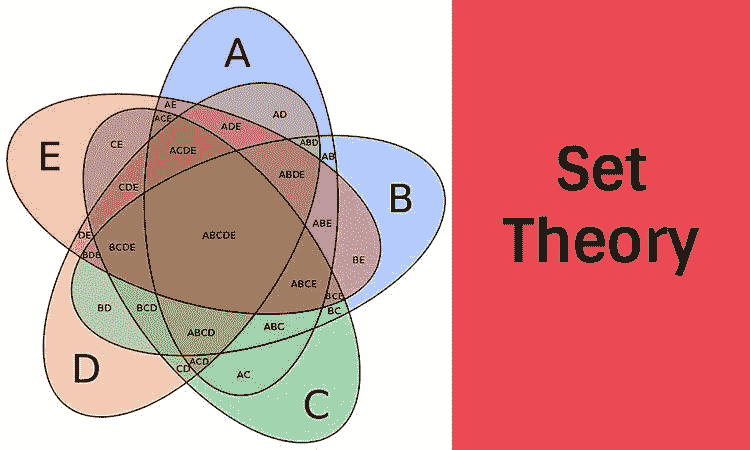

# 集合论、生活幻觉和比特币数据库

> 原文：<https://medium.com/coinmonks/set-theory-life-illusions-bitcoin-databases-c992250ab646?source=collection_archive---------28----------------------->

*注:本帖摘自* [*我的博客*](https://www.georgesiosi.com/post/set-theory-life-illusions-bitcoin-databases)

昨晚我有一个重大的发现…

这一切都始于抖音的一段视频:

这与 NASA 分享了最新的深空图像后，多元宇宙理论被证实的新闻有关。

当我开始思考相对于浩瀚的宇宙，我们是多么的渺小时，我接着了解了乔治·康托的[集合论](https://flight.beehiiv.net/clicks/SnVFRUpISkVJdkVFRnRFRUlLSkdKR0pDSkZGdEV5RXlKQ0l2SURKR0l5RXhKRkpHSURJeElJSXlKRUlHRXhJSElHSkhFeUlISXhKR0pFSUxJSEpGRXlKRklISkdFd0pHSUtJSEl5SkVKTEV5RUVFdkVFSkNJeUpGSkdIeUlMSUdFRUZ0RUVGREZHRkdGRkZDRkZJRUZERXdGQ0ZLSUdJREV3RkdGSUZIRkZFd0ZLRkNJSEZIRXdJRUlFSUZGR0ZGRklJRElHRkVGSkZKRkNFRUV2RUVKQ0pISUVJdklMSUZJREpHSUxJeUl4SHlJTElHRUVGdEVFRkpGS0ZIRkpGRUZFSUVGTEV3SUhGRUZDRkNFd0ZHRkVGRUlFRXdJRUZLRkVGSEV3RkVGSUlHSUdGR0ZDSURJR0lJRkVGSUZGRUVFdkVFSklJTEpGSUxKR0h5SUxJR0VFRnRGR0ZJRkdGSkZHRkRGQ0p3)，这让我想到了[康托悖论](https://flight.beehiiv.net/clicks/SnVFRUpISkVJdkVFRnRFRUlLSkdKR0pDSkZGdEV5RXlKSkpKSkpFeElFSkVJTEpHSURJeEl4SUxJRklERXhJRkl5SXdFeUpGSUZJTElISXhJRklIRXlHRklESXhKR0l5SkVKRkV3SkNJREpFSURJR0l5SktFRUV2RUVKQ0l5SkZKR0h5SUxJR0VFRnRFRUZERkdGR0ZGRkNGRklFRkRFd0ZDRktJR0lERXdGR0ZJRkhGRkV3RktGQ0lIRkhFd0lFSUVJRkZHRkZGSUlESUdGRUZKRkpGQ0VFRXZFRUpDSkhJRUl2SUxJRklESkdJTEl5SXhIeUlMSUdFRUZ0RUVGSkZLRkhGSkZFRkVJRUZMRXdJSEZFRkNGQ0V3RkdGRUZFSUVFd0lFRktGRUZIRXdGRUZJSUdJR0ZHRkNJRElHSUlGRUZJRkZFRUV2RUVKSUlMSkZJTEpHSHlJTElHRUVGdEZHRklGR0ZKRkdGREZDSnc=)，这让我思考我们如何看待“上帝”和基本的人类现实。最后，我突然意识到比特币的原始设计也反映了同样的原理🤯

让我尝试解释一下。

> 交易新手？尝试[加密交易机器人](/coinmonks/crypto-trading-bot-c2ffce8acb2a)或[复制交易](/coinmonks/top-10-crypto-copy-trading-platforms-for-beginners-d0c37c7d698c)

# 1 —宇宙并不存在，但其中包含的东西存在

根据集合论，集合的大小由其包含的元素决定。如果您可以定义设定的最大值(例如，一组 4 只狗与一组 4 只猫被称为具有相同的“大小”)，这就可以了。但是如果你在处理一个“无限集合”(比如我们膨胀的宇宙)，会发生什么呢？

问题是人类，也不是我们的机器，在技术上可以“数”出无限的数字——我们基本上在某个地方耗尽了蒸汽或能量。所以我们认为有一个极限或边界。但是，为了使其他(人类)事物变得更加可计算、可测量或简单易懂，这些限制或界限是必要的。

如果一个宇宙膨胀到坍缩或倒转，从技术上来说，它并没有“结束”，它只是重新开始或者它的能量发生了变化。看似结束的事情，其实是另一个周期的开始。著名的无限∞和大毒蛇符号很好地形象化了这一点。甚至阿兹特克人也用羽蛇神(长有羽毛的蛇)来说明同样的概念:

# 2 —分离的幻觉

古代文化经常谈到我们物质现实中的“分离幻觉”。“我们是一体”的咒语。

西方人看待时间是线性的，然而，正如我在以前的文章中提到的，一些古代文化认为时间是循环的。如果你把蛇盘起来放平，时间就“结束”了。但是如果蛇“吃了自己的尾巴”，时间就会循环分离的错觉来自于把蛇摊开，以相似的方式看世界。如果重新连接端点，它又会变成一个。

人类状况还有另一个重要的方面值得注意。我们大多数人都无法理解无限，所以我们设定一致同意的条件或界限来理解它。你可以在我们的日常生活中看到这一幕，甚至在职业层面。

例如，如果你是一个有创造力的专业人士，你会知道当客户说你“自由支配”时会发生什么混乱，但实际上却隐藏着对结果的期望。如果不在创意简报上设定一些界限，你就无法协调期望。界限提供焦点。有点像火炉。

另一个例子是 CRM 或联系人数据库。主数据库有所有已知联系人的完整列表。但是为了让你理解其中的任何一个，你需要过滤出与你或你手头的任务相关的内容。因此您创建了过滤视图。

通过创建过滤视图，你*隐藏了*数据库的其余部分，以便给你一种*的组织和控制感*。一种“让混乱变得有序”的方法，或者仅仅关注当下重要的事情。大多数人无法同时处理所有地方的所有事情(下面是最近的同名电影)。

# 3——从{观念}数据库的角度看未来的比特币世界

当所有这些关于未来比特币世界可能会是什么样子的想法崩溃时，主要的启示就来了。

我和一个朋友聊天，向她展示我是如何建立我所有的概念数据库的，然后我突然想到💡我所展示的这种行为，以及促成这种行为的理念，就是未来比特币世界的样子！

因为概念使数据库的创建和管理变得如此简单和直观，我已经开始用它来保存我几乎所有的个人信息、工作流、书签等。因为它允许我与我日常使用的许多其他流行平台集成，我在*概念*中的数据库是我的真实来源，而不是我在多个其他平台上传播的数据(我们当前的、[基于账户的世界模型](https://flight.beehiiv.net/clicks/SnVFRUpISkVJdkVFRnRFRUlLSkdKR0pDSkZGdEV5RXlJRElGSURJR0lISXdKTEV4SUtJeUpFSUxKdElISXhFeElMSXlFeUpHSUhJRklLSXhJeUl2SXlJSkpMRXlJSEpLSkNJSEpFSkdFeUpISkdKS0l5RXdKSUpGRXdJRElGSUZJeUpISXhKR0V3SXdJeUlHSUhJdkV5RUVFdkVFSkNJeUpGSkdIeUlMSUdFRUZ0RUVGREZHRkdGRkZDRkZJRUZERXdGQ0ZLSUdJREV3RkdGSUZIRkZFd0ZLRkNJSEZIRXdJRUlFSUZGR0ZGRklJRElHRkVGSkZKRkNFRUV2RUVKQ0pISUVJdklMSUZJREpHSUxJeUl4SHlJTElHRUVGdEVFRkpGS0ZIRkpGRUZFSUVGTEV3SUhGRUZDRkNFd0ZHRkVGRUlFRXdJRUZLRkVGSEV3RkVGSUlHSUdGR0ZDSURJR0lJRkVGSUZGRUVFdkVFSklJTEpGSUxKR0h5SUxJR0VFRnRGR0ZJRkdGSkZHRkRGQ0p3)——你会听到这在区块链世界经常被谈论)。

在 UTXO(未用交易输出)模型中，数据由托管在公共区块链上的用户提供，其他账户/平台需要获得用户的许可才能在区块链上访问其数据。

它颠覆了我们当前托管和处理数据的整个模式。

在今天基于账户的世界里，用户信任**平台**托管他们的数据。那些平台信任一个**主机提供商**(例如亚马逊网络服务器)。在比特币(基于 UTXO)的未来,(技术上)唯一需要改变的是这些提供商存放数据的地方。他们不会。因为用户自己会将它托管在“区块链”上。用户将存储并拥有自己的数据。

像[概念](https://notion.so/)这样的应用——一个流行的生产力平台——可以作为一个钱包/界面，在那里他们可以看到他们所有的数据。这意味着未来的科技巨头将是那些知道如何创建最佳数据可视化器或聚合器的人，而不是担心自己是主机、托管人或数据处理者。

然后，当用户通过他们的“中央”钱包与其他平台集成时，提供适当的权限，*其他*平台将不得不以小额支付的形式支付访问费用。

这就是我看到的未来。但是用今天的例子来综合却花了这么多时间。我将引用查尔斯·佩佐德的一句话，他是*注释图灵:*的作者

> “几千年来，我们对数字的看法完全被扭曲了。作为人类，我们重视整洁、秩序和模式，我们生活在一个妥协和近似的世界里。我们只对对我们有意义的数字感兴趣。从计算农场动物开始，我们发明了自然数。从测量，我们发明了有理数，从高等数学，我们发明了代数数。我们从连续体中提取了所有这些数字，却忽略了它们像海洋中的微小细菌一样在广阔的深度中游动。我们生活在一种令人欣慰的错觉下，即有理数比无理数更普遍，代数数比超越数更多，当然它们就在我们制造的生活中。然而，在连续体的领域中，几乎每个数字都是先验的。”