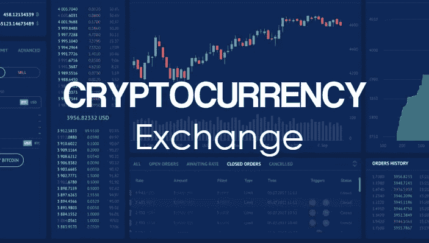

# 只需几个步骤即可设置您的加密货币兑换帐户—初学者指南— 36Crypto

> 原文：<https://medium.com/coinmonks/set-up-your-cryptocurrency-exchange-account-in-just-a-few-steps-a-beginners-guide-36crypto-ff74d4f47c9e?source=collection_archive---------26----------------------->

作为一个加密货币初学者，你可能想到的一个问题是**如何购买你的第一个加密货币，在哪里购买加密货币？什么是加密货币交易所？如何设置加密货币兑换账户？**请注意，第一次获得加密货币有不同的方式，但最常见的方式是使用加密货币交易所。

不管你想购买什么样的加密技术，使用加密货币交易平台将是最简单和最方便用户的方式，也是加入加密空间的一种方式。

使用适合您需求的正确的交换平台是首要任务，您需要知道如何正确设置它们。这是一个简单的过程，只需要遵循几个步骤，在这篇文章中，我以一种简单易懂的方式记录了这些步骤。

在我们开始之前，如果您还不知道什么是加密货币交易所，我们先来简单了解一下这个概念的定义:

# 什么是加密货币交易所？

加密货币交易所是一个在线市场，你可以在这里购买、出售或交易加密货币。平台作为买方和卖方之间的中间人或中介。

因为这是一个市场，你可以在市场上找到这么多密码的价格。你还可以看到硬币的[市值](https://36crypto.com/understanding-crypto-market-cap-how-is-it-calculated/)和交易量。这些交易所大多数都有内置的钱包，通常是保管式的(意味着你不能控制你的私钥，但交易所可以)，不像其他类型的钱包，你可以完全控制你的私钥。

要了解更多关于 [**什么是**](https://36crypto.com/what-is-a-cryptocurrency-exchange/) 加密货币交易所，查看详细帖子[这里](https://36crypto.com/what-is-a-cryptocurrency-exchange/)！

有这么多可用的密码交换。虽然它们通常都服务于相同的目的，但它们也可能具有一些独特的功能。有些在更多国家有售，有些交易费用比其他国家高，有些加密选项比其他国家多，有些对初学者更友好。所以你应该寻找一个适合你的需要。

查看 [**初学者最佳密码交流**](https://36crypto.com/the-best-cryptocurrency-exchanges-for-beginners/) [这里](https://36crypto.com/the-best-cryptocurrency-exchanges-for-beginners/)！

# 如何设置您的加密货币兑换账户

就像我们之前说的，虽然它们通常服务于相同的目的，但是在交易所之间可能会有细微的差别，建立账户就是其中之一。虽然并非所有的加密货币交易都有相同的设置流程，但有一些通用流程与所有的流程相似。

例如，[币安](https://36crypto.com/how-to-buy-bitcoin-on-binance-using-p2p-step-by-step-guide/)是一个非常受欢迎和神奇的平台，但它并不完全适合初学者，它的设置将需要 KYC(了解你的客户)过程的一些额外信息。来看看我们 2022 年 最佳加密货币交易所 [**的详细名单吧。**](https://36crypto.com/the-best-cryptocurrency-exchanges-in-2022/)

要设置加密交换，请按照下列步骤操作:

*   从 app store 下载应用程序或访问他们的网站
*   提供个人信息
*   确认您的电子邮件地址
*   添加付款方式
*   完成 KYC(了解你的客户)过程

# 从 App Store 下载应用程序或访问他们的网站

选择要使用的交换平台后，您要做的第一件事是从 Android 用户的 Play Store 或 iOS 用户的 App Store 下载应用程序。你也可以选择直接访问他们的网站，在那里注册。

# 提供个人信息

下载应用程序或访问网站后，您现在可以开始注册了。您需要提供一些个人信息，如您的姓名、手机号码和电子邮件地址，然后设置一个密码。

# 确认您的电子邮件地址

与其他平台一样，我们会向您提供的电子邮件地址发送一封确认邮件，您需要打开收件箱，然后点击邮件中提供的链接。该链接会将您重定向到显示成功消息的平台。

# 添加付款方式

一旦您验证了您的电子邮件，您必须使用您的电子邮件和您刚刚设置的新密码登录。找到您的个人资料，然后寻找添加“付款方式”选项。

根据您选择的交易所，您将能够添加平台支持的支付方式。支付选项可能包括信用卡/借记卡、当地银行转账和电汇等。

# 完成 KYC(了解你的客户)过程

对于某些交易所，上述四个步骤足以完成设置，但根据您选择的平台，您可能需要通过一个额外的注册层，即“了解您的客户”流程。

这一过程需要你上传额外的信息，如政府颁发的身份证和你的家庭地址，有时会提示你制作视频或自拍以确认。整个 KYC 过程只是为了身份验证。

# 入门所需的信息

正如我们正确指出的那样，不同的交易所有不同的要求。有些可能允许您在旅途中完成设置，而有些则需要额外的信息。以下是您需要提供的所有信息列表，以完成您在所有加密交换中的注册。

*   完整的法定姓名(名和姓)
*   出生日期
*   您的电子邮件地址
*   你的电话号码
*   个人地址
*   一份公用事业账单的复印件寄到那个地址
*   你的社会保险号
*   驾照、护照或其他政府颁发的身份证明
*   你拿着政府身份证的自拍或视频

# 最受欢迎的加密货币交易所列表

以下是最受欢迎的加密交换平台列表，供您选择:

查看这篇关于如何在币安 上购买比特币的 [**帖子，以及如何在比特币基地**](https://36crypto.com/how-to-buy-bitcoin-on-binance-using-p2p-step-by-step-guide/) 上购买比特币的 [**分步指南。**](https://36crypto.com/tutorial-how-to-buy-bitcoin-on-coinbase-step-by-step-guide/)

*我希望你在这篇内容中发现了价值。分享是关爱，请在你的社交媒体上帮助分享，也与可能对这样的帖子感兴趣的朋友分享。感谢阅读。*

*原载于 2022 年 9 月 12 日 https://36crypto.com***。**

> *交易新手？试试[加密交易机器人](/coinmonks/crypto-trading-bot-c2ffce8acb2a)或者[复制交易](/coinmonks/top-10-crypto-copy-trading-platforms-for-beginners-d0c37c7d698c)*