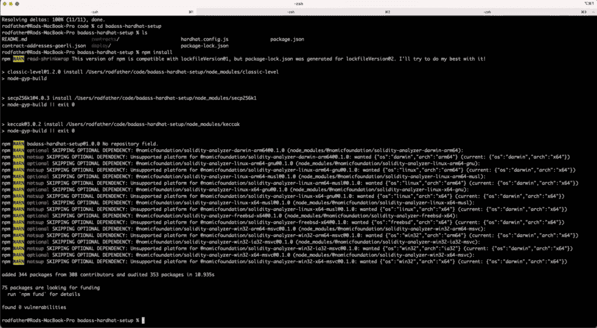
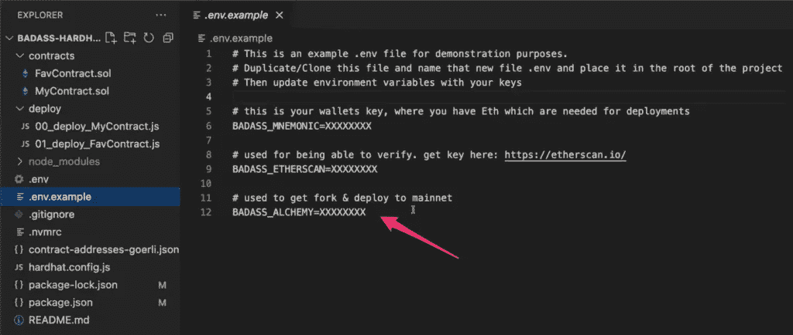
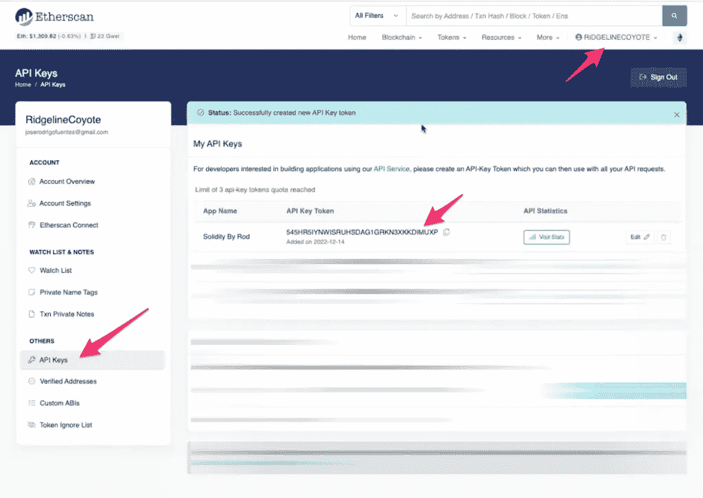
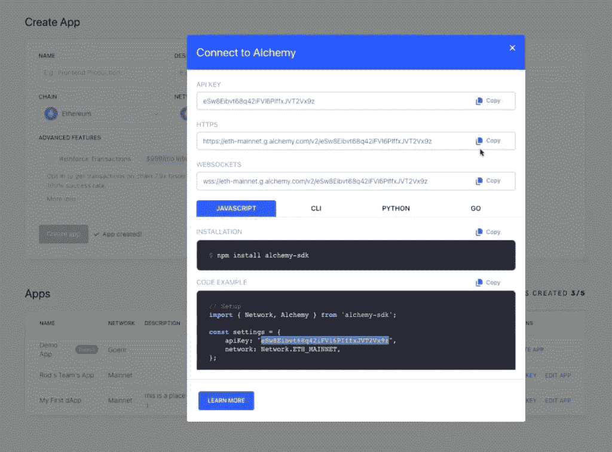
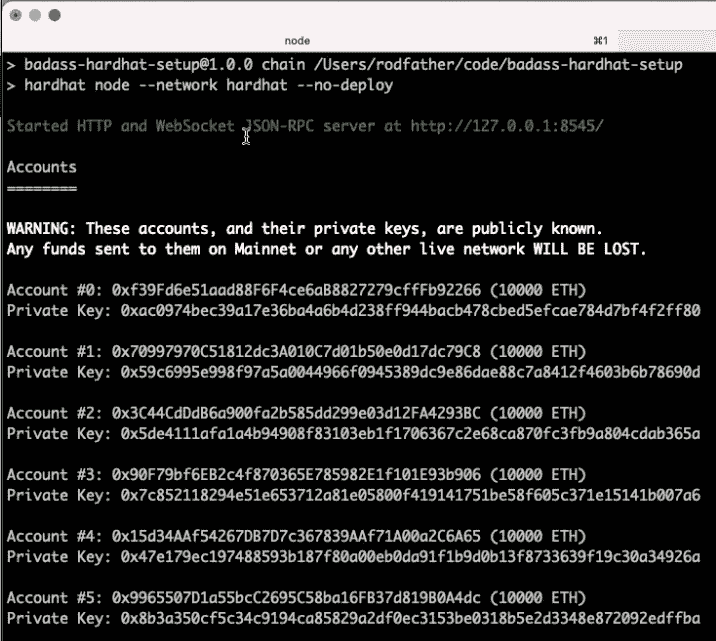
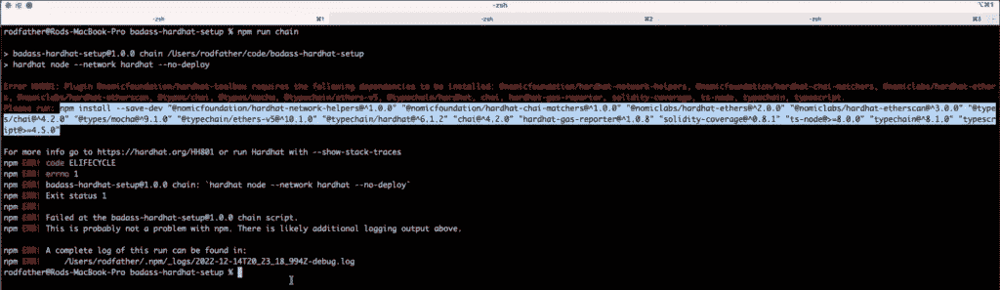
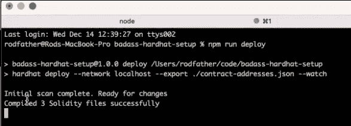
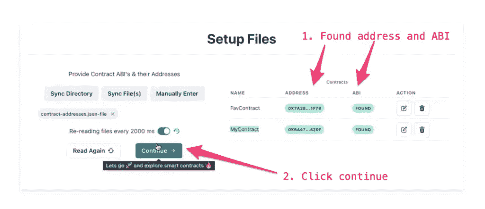
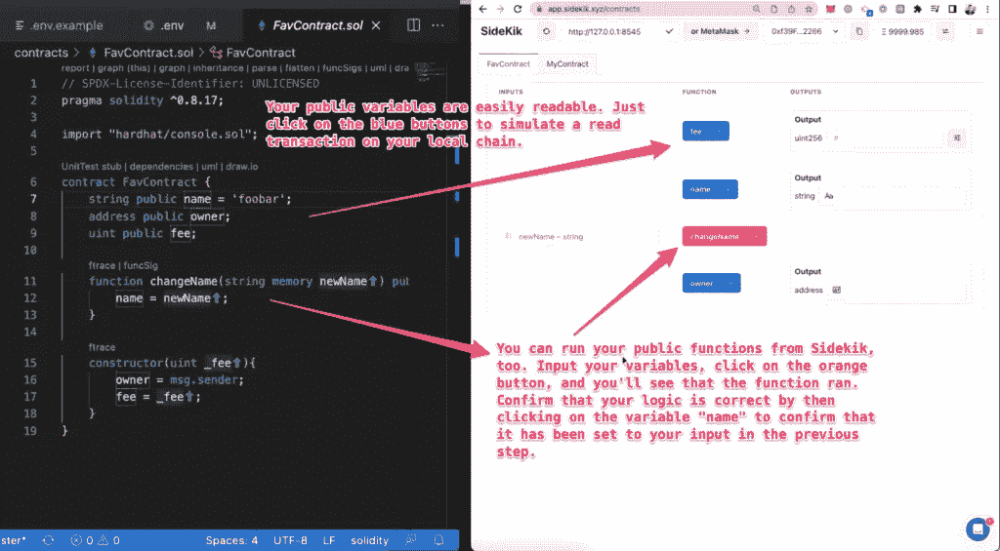

# 设置您的本地环境

> 原文：<https://medium.com/coinmonks/setting-up-your-local-environment-2e629d5e37ea?source=collection_archive---------9----------------------->

## Solidity 简介:面向初学者的以太坊开发者教程

在本帖中，我们将向您展示如何设置 Solidity 编程环境，以便您为区块链开发打下坚实的基础。

# 安全帽是给专业人士戴的

我向认真构建智能契约的 Solidity 程序员推荐 Hardhat。许多教程推荐 Remix，这是一个很好的修补环境。但是如果你和专业开发人员交谈，你会发现他们在实际工作中要么使用 Hardhat，要么使用 Foundry。

让我们从一个坚实的基础开始，深入到坚实的领域。您需要花 5-10 分钟来设置我们的安全帽环境。

# 安装安全帽

你可以通过在终端控制台运行`npm install --save-dev hardhat`来直接安装 Hardhat。但是我强烈建议你通过克隆[坏蛋安全帽回购](https://github.com/mistersingh179/badass-hardhat-setup)来加速你的设置。它是预先配置好的，可以帮助你跑得更快。例如，它被配置为在每次文件更改后自动编译和部署，并将您的 ABI 和合同地址写入一个 JSON 文件以便于参考。

打开你的终端，运行`git clone git@github.com:mistersingh179/badass-hardhat-setup.git`。接下来，运行`npm install`下载必要的包和依赖项。

打开你选择的 IDE，(我喜欢 VScode，但是*你做你的*)并探索 repo。您会注意到一个带有*的合同文件夹。sol 文件和带有*的部署文件夹。js Javascript 文件。

# 设置本地环境变量

这个 repo 使用三个环境变量来帮助加速您的智能合约开发过程:助记符、Etherscan API 密钥和 Alchemy API 密钥。

助记符是“BIP39 定义的 12 或 24 个单词的助记短语。”其默认值为“测试测试测试测试测试测试测试测试测试垃圾”。因为我们只是在我们当地的环境中发展，这个记忆术会起作用。然而，在生产环境中，您将使用您的钱包的 12 或 24 个种子短语(私钥)，这将是在目标区块链上部署合同的 gas 源。

您需要的第二项是 Etherscan API 密钥。这是免费且容易获得的。导航到 Etherscan.io，创建一个帐户，然后访问左侧的“API 密钥”选项卡。创建一个新的密钥，并将其复制粘贴到您的。环境文件。来自 Etherscan 的这个 API 密钥对于上传 ABI 和验证您已经部署到 testnet 或 mainnet 的合同非常有用。

最后，你会想要得到一个炼金术 API 密匙。Alchemy 是一个区块链扩展平台，为某些区块链提供 devs 网络连接和节点管理端点。在`badass-hardhat-setup`中，每当你运行本地链时，炼金术被用来创建 mainnet 的分叉。这种方法的优势在于，您可以获得当时链上所有设备的快照，以便您的本地环境可以与外部合同(例如，USDC、Uniswap 路由器等)进行交互。).

# 运行本地区块链

与运行本地服务器来测试和调试代码非常相似，Hardhat 使您能够运行区块链的本地副本。为此，在您的终端中运行`npm run chain`。`badass-hardhat-setup` repo 被配置为运行本地链，并通过 HTTP 和 Websocket JSON-RPC 服务器在 [http://127.0.0.1:8545/访问它。](http://127.0.0.1:8545/.)

根据您的 NPM 版本、节点和其他因素，您可能会得到一个关于丢失软件包的错误。如果发生这种情况，请按照错误消息中的说明解决缺少的依赖关系:

在上面的例子中，我丢失了不同的包。我在终端中运行了以下命令:

`npm install --save-dev "@nomicfoundation/hardhat-network-helpers@^1.0.0" "@nomicfoundation/hardhat-chai-matchers@^1.0.0" "@nomiclabs/hardhat-ethers@^2.0.0" "@nomiclabs/hardhat-etherscan@^3.0.0" "@types/chai@^4.2.0" "@types/mocha@^9.1.0" "@typechain/ethers-v5@^10.1.0" "@typechain/hardhat@^6.1.2" "chai@^4.2.0" "hardhat-gas-reporter@^1.0.8" "solidity-coverage@^0.8.1" "ts-node@>=8.0.0" "typechain@^8.1.0" "typescript@>=4.5.0"`

这解决了我的问题。不要只是复制粘贴上面的；如果遇到这个问题，请查看特定的错误消息。

# 编译和部署您的智能合同

在您的本地链运行之后，您将编译您的契约并将其部署到该链。在您的终端中执行`npm run deploy`:

恭喜，您刚刚设置了您的 Hardhat 环境，运行了一个本地链，并在其中部署了您的智能合同。现在你如何看待你的劳动成果？简单:将 Sidekik 连接到您的环境，以便轻松地与您的代码交互，并检查它是否按预期工作。

# 使用 Sidekik 与您的智能合同进行交互

导航到位于[https://app.sidekik.xyz/](https://app.sidekik.xyz/)的客户端 web 应用程序。首先，验证您的本地链正在运行并已连接。其次，单击同步文件，并选择包含您的 ABI 和部署合同地址的 JSON 文件。(如果您使用的是`badass-hardhat-setup` repo，那么您已经将您的 ABI 和部署合同地址输出到一个 JSON 文件中，`contract-addresses.json-file`😎如果您没有使用我们推荐的 repo，[这里有关于如何将 ABI 和地址写入 JSON 文件的文档](https://docs.sidekik.xyz/setup/overview/how-to-save-contract-addresses-to-disk)。)当 Sidekik 显示您部署的合同(`FavContract`和`MyContract`)、它们的地址和 ABIs 时，您就知道它已经准备好了:

点按“继续”后，Sidekik 为您提供了一种可视化的方式来与您的智能合约进行交互。例如，您的公共变量可以通过单击蓝色按钮来读取，这模拟了本地链上的读取事务。您也可以运行公共函数。只需输入您的变量，点击橙色按钮，您将看到该函数的输出。

例如，在运行`changeName`函数来演示您的代码将`name`变量从“foobar”更改为您的输入之后，通过单击变量`name`来确认您的智能合约逻辑是正确的。

再次祝贺你完成了进入 Solidity 编程语言之旅的第一步。如有任何问题，欢迎在 [Twitter](https://twitter.com/sidekik_xyz) 、 [Discord](https://discord.gg/yjYSbyapkg) 或评论中提出！

> 交易新手？尝试[加密交易机器人](/coinmonks/crypto-trading-bot-c2ffce8acb2a)或[复制交易](/coinmonks/top-10-crypto-copy-trading-platforms-for-beginners-d0c37c7d698c)