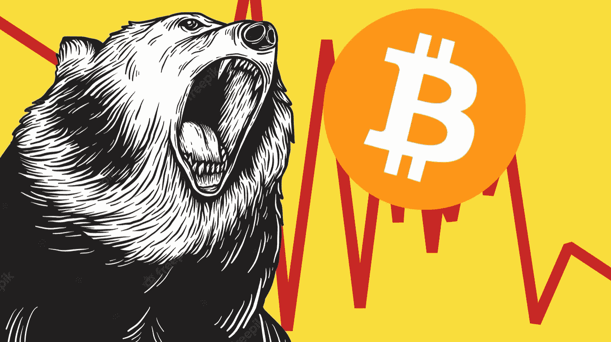

# 在比特币熊市中为自己的成功做好准备

> 原文：<https://medium.com/coinmonks/setting-yourself-up-for-success-during-bitcoin-bear-markets-40751cf54897?source=collection_archive---------3----------------------->

大多数人认为，人们在牛市中通过做出正确的决定而变得富有。进入正确的硬币，拥有完美的时机，进行完美的交易，这样的例子不胜枚举。但是，对加密感兴趣有一段时间的人，以及一般的投资者，总是会告诉你，这是你投入的工作，是你在熊市期间做出的决定…