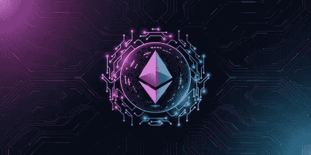
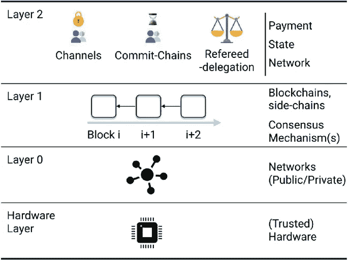
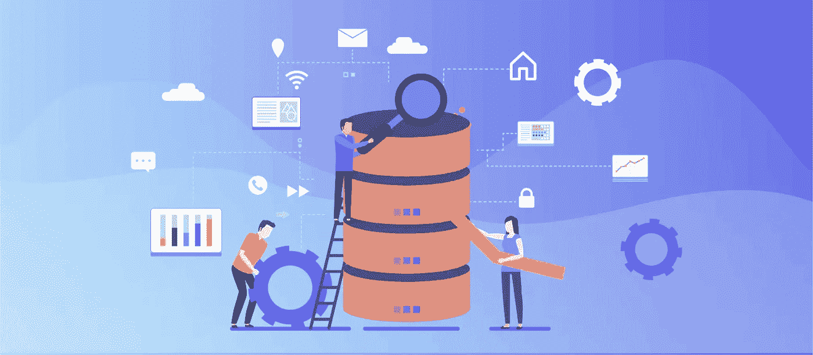
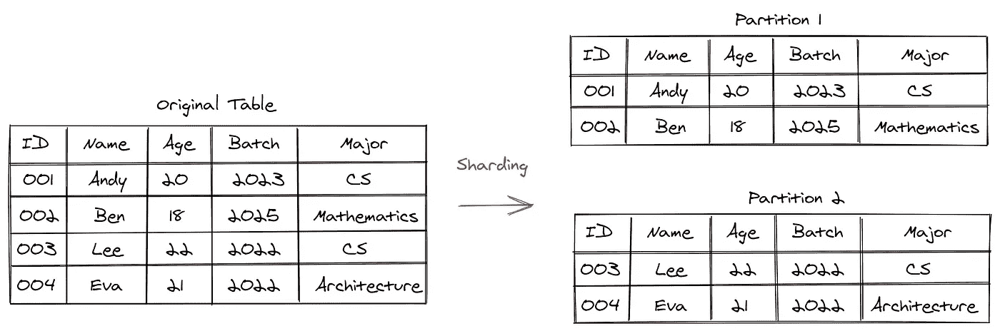
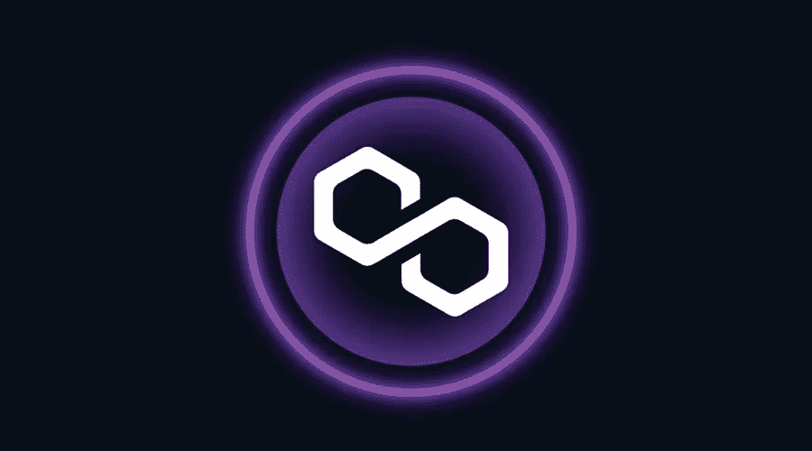
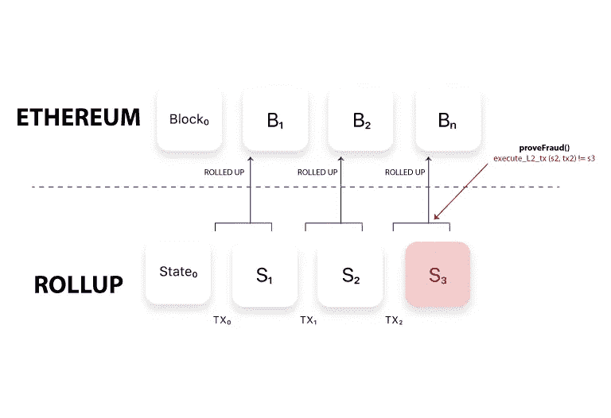

# 碎片。第二层(L2s)的对手还是朋友？

> 原文：<https://medium.com/coinmonks/sharding-an-adversary-or-friend-to-layer-2s-l2s-fa72452a2815?source=collection_archive---------23----------------------->

我被问了很多关于以太坊及其第二层或侧链的未来的问题，尤其是 Polygon (Matic)。随着对 ETH2.0 无限期延迟的不安，有关于延迟的原因以及它的延迟最终是否值得的问题。

在伦敦叉事件发生后，可以理解为什么 Vitalik 和他的团队在 ETH2.0 上花费时间。

伦敦叉发生了什么事？

London Fork 或 London Hard Fork 是走向 ETH 合并的第一步(移至 PoS)。EIP 1559，确切地说，是为了使 ETH 通货紧缩，其天然气费用可预测，波动较小。许多人还期待更低的汽油费。

为了应对不断上升的通货膨胀，他们不得不烧掉大量的 ETH，加上区块链的压力，ETH 的价格飙升。汽油费也上涨了，这导致了大批人从联邦理工学院涌向其他交易费用更低的区块链，比如索拉纳。

我将对什么是第 2 层协议和汇总进行快速分析，以帮助那些对这些概念感到困惑的人。

> 交易新手？在[最佳密码交易所](/coinmonks/crypto-exchange-dd2f9d6f3769)上尝试[密码交易机器人](/coinmonks/crypto-trading-bot-c2ffce8acb2a)或[复制交易](/coinmonks/top-10-crypto-copy-trading-platforms-for-beginners-d0c37c7d698c)

您可能听说过第 0 层、第 1 层和第 2 层这三个术语。有什么区别？

第 0 层或协议层是所有区块链协议中的第一层，与所有其他协议无缝连接以构建互连的价值链，为智能合约提供了更强大、更先进的替代方案。简而言之，第 0 层允许建立多个区块链或 L1，并独立运行，同时保持相互连接，以解决我们将在后面讨论的一两个方面的技术。波尔卡多特网络就是一个例子。

第 1 层或网络层是区块链平台的基础网络。例如比特币、以太坊和索拉纳。

第 2 层或应用/集成层或侧链是构建在第 1 层之上的一组链外解决方案(独立的区块链),可减少扩展和数据瓶颈。它是通过使用自己的共识机制处理链外交易，同时保持与 L1s 相同的安全网络和稳定性来实现的。多边形就是一个例子。

Rollups 或 Blockchain Rollups 是一种将一堆交易汇总或编译成单个交易的系统，它最大限度地提高了速度并降低了成本。zk 汇总就是一个例子。

如果你想了解更多，我有一篇关于零知识证明的文章。

现在，在介绍了基本概念之后，让我们来看看 ETH2.0 提供的主要东西，它可能会威胁到构建在 ETH 上的 L2，如 Polygon、Arbitrum、optimistry 等。

碎片。

要理解分片，首先必须理解技术的各个方面，尤其是区块链，这些方面总是相互冲突。安全性和可扩展性，或者速度和可扩展性，或者在区块链中，安全性、可扩展性和去中心化的三重困境。安全性或速度的提高意味着可伸缩性的降低，反之亦然。

例如，一个钱包和一个包，你在包里装的东西比钱包多，但它比钱包更难隐藏或移动而不被人发现。

但是，分片试图通过扩展和保持其安全级别来提供两个世界的最佳选择。

分片是一种数据分区，它将大数据分成更小、更快、更易于管理的部分。这些较小的部分被称为数据碎片。

ETH 2.0 已经声明，他们将把网络负载分散到 64 个独立的分片上。这可能会对高额的汽油费和它的 TPS 产生奇迹。

那么，对于像 Polygon 这样在新项目和一般用途方面取得惊人成功的 L2 来说，这意味着什么呢？还有，像 Validium 和 zk 这样的汇总在所有这些中扮演什么角色？

单位 Today 报道称，Polygon 网络上的唯一地址数量本周突破了 2 亿个里程碑，达到了 201，024，643 个的历史新高。Polygon 的其他网络指标保持稳定上升趋势。例如，网络上每天活跃的地址数量接近 500，000 个。

Polygon 正在稳步扩大其合作伙伴和支持部门的名单，并宣布正式合作，通过 NFTs 将区块链带入音乐行业。根据官方声明，Polygon、华纳音乐和 LGND 将把音乐 NFTs 带到 Web3 市场。

此外，Loopring 是一种混合加密交换，它使用 zK Rollups 扩展解决方案来提供快速、安全、低成本和私有的链外交易。第二层区块链网络解决了集中式和分散式交换的缺点，结合了它们的优点，消除了它们的缺点，使用户受益。

Loopring 使订单执行非常高效，并增加了 dex 上的可用流动性。它有一个低成本的本地令牌，用于支付网络费用，并在平台上获得回报。Loopring token 是 2021 年大幅增长的加密资产之一，但其下滑幅度同样巨大。但考虑到 FTX 事件后对 CEx 的不信任，我们可能会看到未来的复苏。

Sidechains 和 Rollups 被称为扩展解决方案，简单地说，它们提供更便宜的汽油费和更快的交易。这也是 ETH 2.0 的目标。

但任何对 ETH 的推动都是对其侧链和卷装的推动。换句话说，如果侧链处理数据的速度比 ETH 快 5 倍。而 ETH2.0 计划让 ETH 快 10 倍。这意味着 sidechain 处理数据的速度将是 ETH2.0 的 5 倍，比 ETH 快 50 倍。上卷也一样。

现在的问题是，一个项目要保持可持续性，到底需要多大的速度，交易费用应该有多低。

这才是真正的威胁所在。而这个问题，只有区块链和 Web3 的采用率，ETH 2.0 以及届时即将面世的其他区块链才能回答。

来自 LinkedIn 时事通讯:[所有这些都汇集在一起。](https://www.linkedin.com/newsletters/7009717988488540161/)