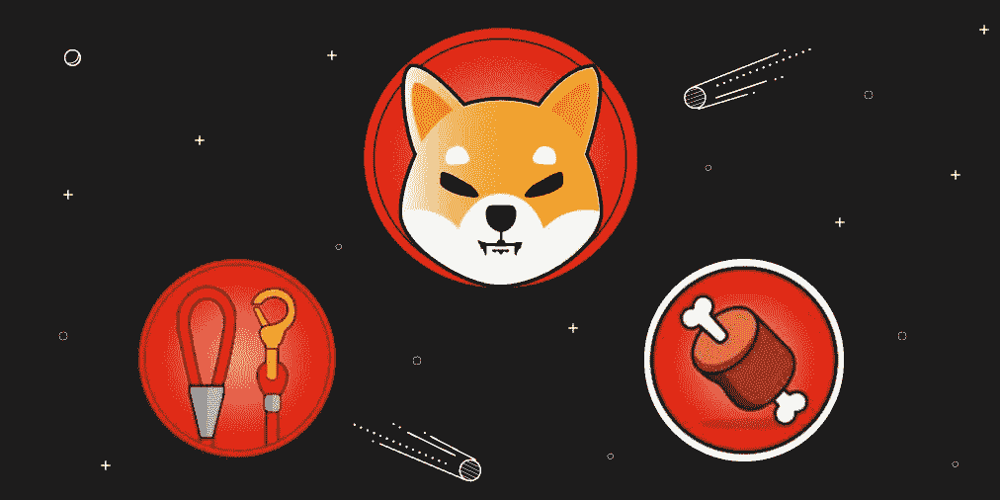
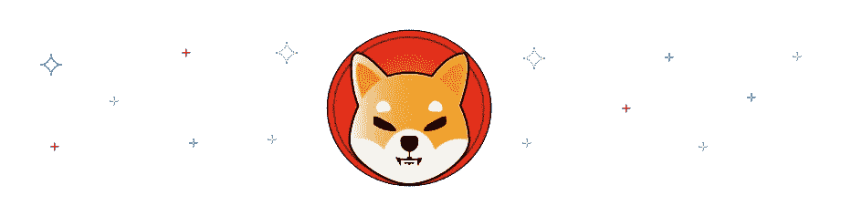
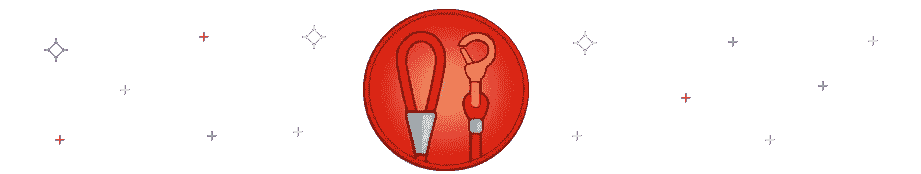
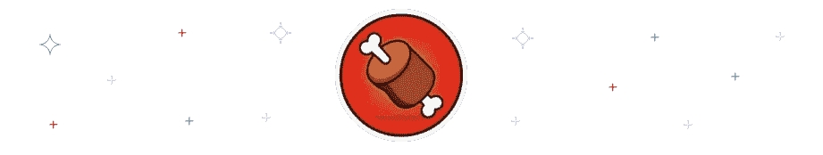
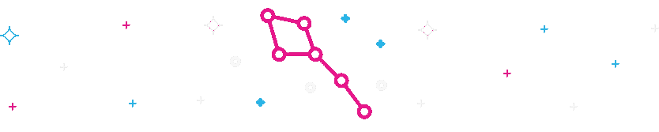
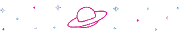

# SHIB，皮带，骨头:三巨头

> 原文：<https://medium.com/coinmonks/shib-leash-bone-the-great-triumvirate-7fe29a18bc83?source=collection_archive---------6----------------------->

像 SHIB 这样的迷因密码可以被描述为经常与一些笑话、主题或流行趋势相关的加密货币。DOGE 是 2013 年创造的第一个迷因硬币。它的名字来源于当时主导互联网的流行的柴犬迷因。这枚硬币开始只是一个笑话，但现在它是最成功的密码之一。

Dogecoin 的爆炸式增长和全球加密应用的增加使得加密市场蓬勃发展，出现了像 [SHIB](https://swapzone.io/currencies/shiba-inu) 、[皮带](https://swapzone.io/currencies/doge-killer)、BONE 这样的模因标志。然而，这些符号已经不仅仅是迷因了。随着大规模采用在各地发生，你可以在交易所看到这三个，并轻松地在商店支付。

然而，一些人声称，memecoins 的兴起是 Elon Musk 对 Dogecoin 的明显从属关系和兴趣的结果。现在，我们建议你去发现 SHIB 生态系统，它之所以广受欢迎，不仅因为它最初的迷因性质，还因为团队和社区所做的大量工作。让我们了解一下 SHIB，皮带，骨头！

# 什么是 SHIB？

[柴犬](https://www.shibatoken.com/)，也被称为 [SHIB](https://swapzone.io/blog/what-is-shiba-inu-and-how-to-exchange-btc-to-shib) 是一种代币，作为 DOGE 的以太坊兼容替代物而开发。与总督不同，SHIB 代币最初的流通供应量约为 1000 亿枚，容易被烧毁，这使其成为通货紧缩的代币。SHIB 的生态系统也支持创新项目，如 NFT 艺术孵化器和分散交易所。

如前所述，柴犬是由一个名叫“Ryoshi”的匿名人士在以太坊网络上开发的 ERC-20 令牌。根据柴犬的网站，该项目被描述为一个迷因令牌成长为一个充满活力的生态系统。SHIB 代币也是柴犬生态系统三巨头的第一枚硬币。

# 什么是皮带？

柴犬生态系统三巨头的第二个令牌是[牵绳令牌](https://swapzone.io/currencies/doge-killer)。皮带也被称为[狗黑仔](https://coinmarketcap.com/currencies/doge-killer/)。

柴犬的皮带令牌最初是作为一个 rebase 令牌推出的，后来改变了它的用例，以加强其生态系统范围。与 SHIB 不同，皮带令牌的限量供应为 100，000 个。这些数字使它对公众更有吸引力，因为部分是由于焚烧皮带令牌造成的稀缺。

用户因拴狗绳而获得 xLEASH 代币奖励。从逻辑上讲，持有 xLEASH 代币的用户是 xLEASH 流动性池的一部分。成为该池的一部分的奖励是每块获得所有骨骼令牌的 0.5%。此外，使用 LEASH tokens 挖掘或提供流动性的用户有权分享 LEASH-ETH SSLP。

# 骨头是什么？

[骨](https://coinmarketcap.com/currencies/bone-shibaswap/)是柴犬生态系统的治理令牌，也是柴犬生态系统三巨头的第三个令牌。有了 BONE，SHIB 社区可以对即将到来的提案和创新进行投票。用户拥有的骨令牌数量决定了用户投票的权重和影响力。

BONE 的开发总共提供了 250，000，000 个令牌。就发行量而言，它还被完善为介于之前的两个令牌 SHIB 和皮带之间。埋骨为用户赚取一定数量的 tBONE。

拥有 tBONE 代币意味着持有者有权成为负责向成员提供每块 1%骨头的池的一部分。另一方面，挖掘具有与皮带令牌相似的功能。最后，挖掘或提供流动资金的用户将获得一部分 BONE-ETH SSLP。

# 这三种密码有什么联系？

除了是更广泛的柴犬生态系统的一部分，另一个将 SHIB、皮带和骨头联系在一起的东西是柴犬。

SHIB token 的目标之一是开发 ShibaSwap(一个柴犬交易平台)。ShibaSwap 作为一个分散的交易所，就像 Uniswap 等其他 DEX 一样，作为一种 p2p 平台运行。

例如，Uniswap 允许用户在没有中介公司支持的情况下交易 SHIB 代币和其他密码。此类功能允许 ShibaSwap 用户提供流动性，并使用 SHIB、皮带和骨头来获得利息。

# 更多关于柴犬生态系统

自从柴犬生态系统启动以来，SHIB 已经接受了一种不同的做事方式。其中一些概念包括 1 千兆的天文供应量，创始人“Ryoshi”在 Uniswap 中锁定 50%。总供应量的一半也被烧毁，交给以太坊的共同创始人“Vitalik Buterin”保管。

据说维塔利克·布特林捐赠了 SHIB 来帮助遏制新冠肺炎教在印度的泛滥。这一事件被认为是密码货币史上最大的密码捐赠。Vitalik Buterin 还确保了死钱包总供应量的 40%被成功烧伤。Ryoshi 发了言，他在发言中说“感谢伍夫梅斯特促成了真正的权力下放。现在我们真正开始了”。

SHIB、皮带、骨的结合创造了 ShibaSwap，这是 DeFi 平台发展的下一步。Shiba Inu 交易所“ShibaSwap”的特征之一是为用户提供 DIG(提供流动性)、BURY(持有股份)和 Swap 令牌以获得 WOOF 回报的能力。

Shiba Inu 交换平台为 Shiba war 社区提供了对即将到来的 NFT 的访问，如[shibosis](https://shytoshikusama.medium.com/shiboshi-salute-f78ada89752a)和其他功能，如投资组合跟踪器，以便在密码世界中轻松导航。Shiboshis NFTs 是 10，000 个可爱的 Shiba Inu NFTs，它们将在即将到来的[shibosis 游戏](https://shytoshikusama.medium.com/the-future-of-gaming-is-shib-6b35b1cae170)中被转换和使用。

# 释诗与释诗

柴犬生态系统并不仅限于我们上面讨论的三种表征，还有更多。Shiba Inu 游戏即将面世，它的第一个版本已经在开发中。游戏代号[Osh verse](https://shytoshikusama.medium.com/the-future-of-gaming-is-shib-6b35b1cae170)，将会容纳 [10，000 个独特的 shibosis 角色](https://shytoshikusama.medium.com/shiboshi-salute-f78ada89752a)，这些角色将会在 shibosis 游戏中播放。发布的 Shiboshi 集可以通过加电来升级，你甚至可以在一定程度上把你的 Shi boshi 从默认名称中重命名。

最初，该游戏将被构建为一个移动游戏。此外，游戏将完全由即将到来的柴犬·区块链主持，名为 Shibarium。这将允许开发团队添加一些分散的特性来改进手机游戏。

# Shibarium

一些令人兴奋的事情正在柴犬生态系统中升温。你知道这是什么吗？好吧，很高兴地通知你，柴犬将有自己的区块链网络，将被称为 Shibarium。这个区块链将是独一无二的，不像中央集权的玛蒂生态系统。所以，抛弃 SHIB·托肯和玛蒂合作建造 Shibarium 的谣言吧。

Shibarium 将使用骨骼令牌作为其主要令牌对。这是为了给每个人一个公平的开始，并休息任何关于鲸鱼袋的担忧，如果使用 SHIB 令牌。然而，好消息是，在 ShibaSwap 推出期间，LEASH 和 SHIB 持有者可以使用他们的持股来产生骨骼令牌。这将被证明对即将到来的区块链展览馆非常有用。一旦柴犬区块链建成，就要由柴犬社区来检查区块链是否很好地去中心化了。

> 交易新手？试试[密码交易机器人](/coinmonks/crypto-trading-bot-c2ffce8acb2a)或者[复制交易](/coinmonks/top-10-crypto-copy-trading-platforms-for-beginners-d0c37c7d698c)

# 如何以最优惠的价格交换 SHIB 和皮带？

你可以在 Swapzone 上购买 [SHIB](https://swapzone.io/currencies/shiba-inu) 和 [LEASH](https://swapzone.io/currencies/doge-killer) crypto，这是一个柴犬交易所聚合器，提供市场上最好的 SHIB 和 LEASH 硬币利率。要在 Swapzone 上购买其中任何一款，请遵循以下详细说明:

1.  进入 [***Swapzone 网站。***](https://swapzone.io/)
2.  选择 **ETH 到 SHIB** 或 **ETH 到皮带配对。**
3.  输入您想要兑换柴犬或皮带加密货币的 ETH 金额。Swapzone 现在将为您带来提供 ETH/SHIB 或 ETH/LEASH 配对的不同交易所的最佳利率，并显示您为您的 ETH 获得的 SHIB/LEASH 数量。
4.  点击***t***he***“交换”*** 按钮，该按钮将要求您提供您希望将您新购买的 SHIB 或牵绳代币发送到的地址。还有退款地址的空间。
5.  点击 ***进行交换*** 按钮。Swapzone 还将向您展示您选择购买的交易网站的评论。
6.  等待兑换服务处理存款，兑换完成。
7.  别忘了给交换伙伴评分并留下评论，这样我们可以为未来的用户收集更多关于交换的信息。

> 加入 Coinmonks [电报频道](https://t.me/coincodecap)和 [Youtube 频道](https://www.youtube.com/c/coinmonks/videos)了解加密交易和投资

# 另外，阅读

*   [Botsfolio vs nap bots vs Mudrex](/coinmonks/botsfolio-vs-napbots-vs-mudrex-c81344970c02)|[gate . io 交流回顾](/coinmonks/gate-io-exchange-review-61bf87b7078f)
*   [CoinFLEX 评论](https://coincodecap.com/coinflex-review) | [AEX 交易所评论](https://coincodecap.com/aex-exchange-review) | [UPbit 评论](https://coincodecap.com/upbit-review)
*   [AscendEx 保证金交易](https://coincodecap.com/ascendex-margin-trading) | [Bitfinex 赌注](https://coincodecap.com/bitfinex-staking) | [bitFlyer 审核](https://coincodecap.com/bitflyer-review)
*   [Bitget 回顾](https://coincodecap.com/bitget-review)|[Gemini vs block fi](https://coincodecap.com/gemini-vs-blockfi)cmd |[OKEx 期货交易](https://coincodecap.com/okex-futures-trading)
*   [AscendEx Staking](https://coincodecap.com/ascendex-staking)|[Bot Ocean Review](https://coincodecap.com/bot-ocean-review)|[最佳比特币钱包](https://coincodecap.com/bitcoin-wallets-india)