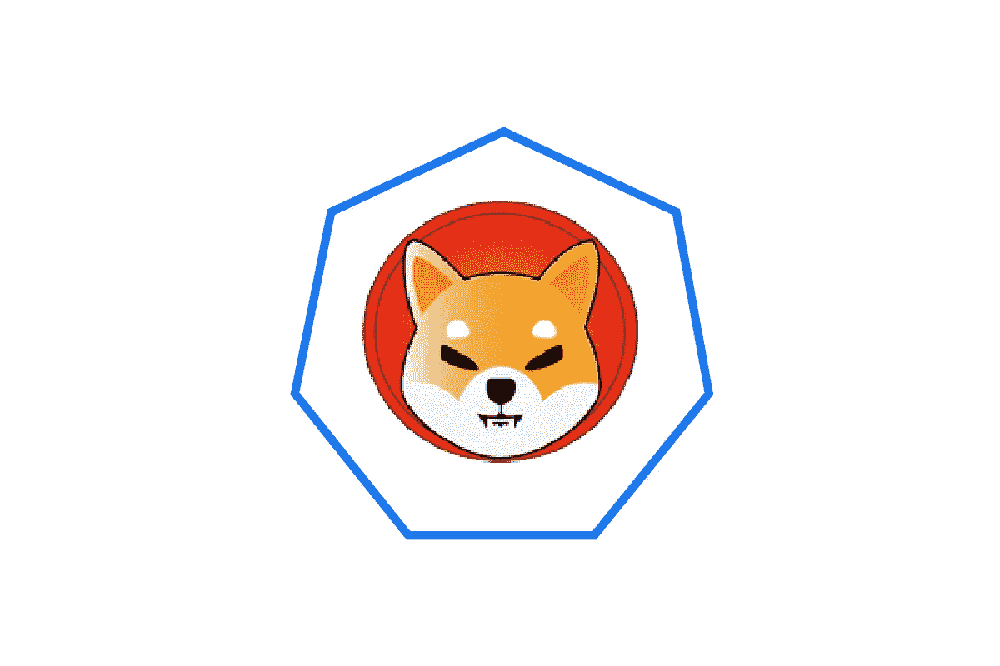
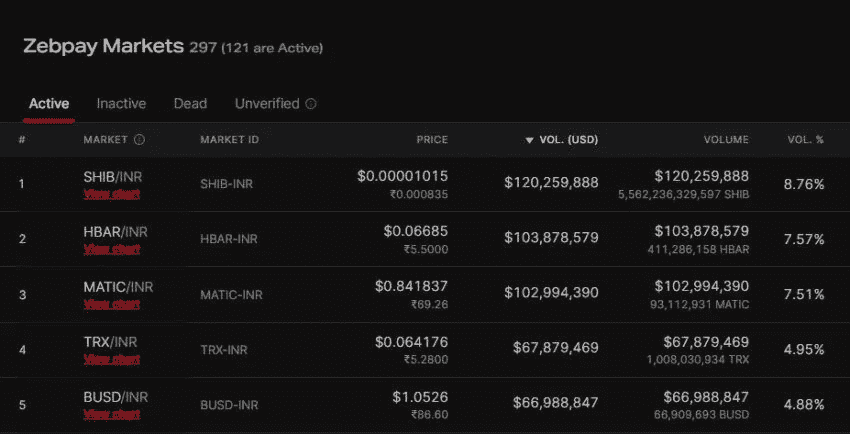
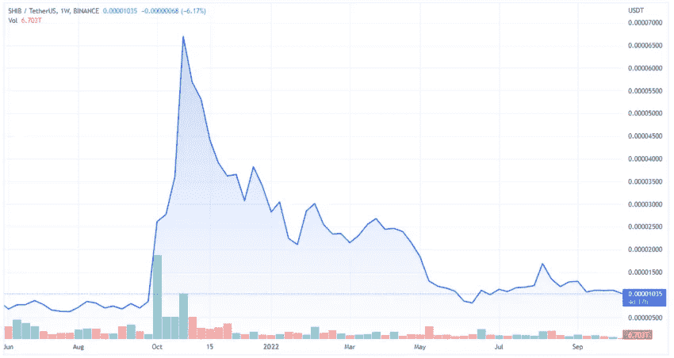

# 柴犬叫唤印度密码交易所

> 原文：<https://medium.com/coinmonks/shiba-inu-barks-up-indian-crypto-exchanges-409a69f0ad6a?source=collection_archive---------46----------------------->

根据市场数据，印度交易员正在避开比特币和以太坊，转而青睐柴犬。尽管 SHIB 的税收制度很苛刻，但该国的交易量相对较高。

印度商人并不热衷于市场上最大的硬币，如比特币或以太坊，而是转向流行的迷因令牌 SHIB。后者是印度顶级加密交易所交易最多的令牌，包括 Zebpay、WazirX 和 CoinDCX。

Nomics 的数据显示，美国 9%的加密交易都包含 SHIB 令牌。自今年年初以来，Zebpay 上的 SHIB 交易员已经交易了近 1.2 亿美元。zeb pay 因印度严苛的税收规定正寻求离开印度。

与此同时，WazirX 的数据显示，超过 10%的交易是通过 meme token 进行的。在过去的十个月里，交易者转移了超过 9.7 亿美元。印度的另一家大型交易所 CoinDCX 发现，SHIB 占其总交易量的 5%以上。

对于一个加密交易因今年早些时候出台的严厉税收计划而遭受重创的国家来说，这一数字相对较高。裁决后，交易量大幅下降，迫使许多加密公司离开美国。至于更普遍的监管，在全球就此达成共识之前，预计印度不会出台此类立法。

# 为什么印度人要买 SHIB？

SHIB 可能出现异常大规模活动的一个原因是，该国有一个强大的 SHIB 社区。投资者甚至在 COVID 疫情期间就一直从代币中获利。他们希望这种情况在未来继续下去。

# 柴犬生态系统正在成长

过去几周，柴犬股票经历了几次发展，包括在知名交易所上市。BitMEX 透露，6 种新的加密货币将于 10 月 10 日上市，SHIB 也包括在内。

> 交易新手？试试[加密交易机器人](/coinmonks/crypto-trading-bot-c2ffce8acb2a)或者[复制交易](/coinmonks/top-10-crypto-copy-trading-platforms-for-beginners-d0c37c7d698c)